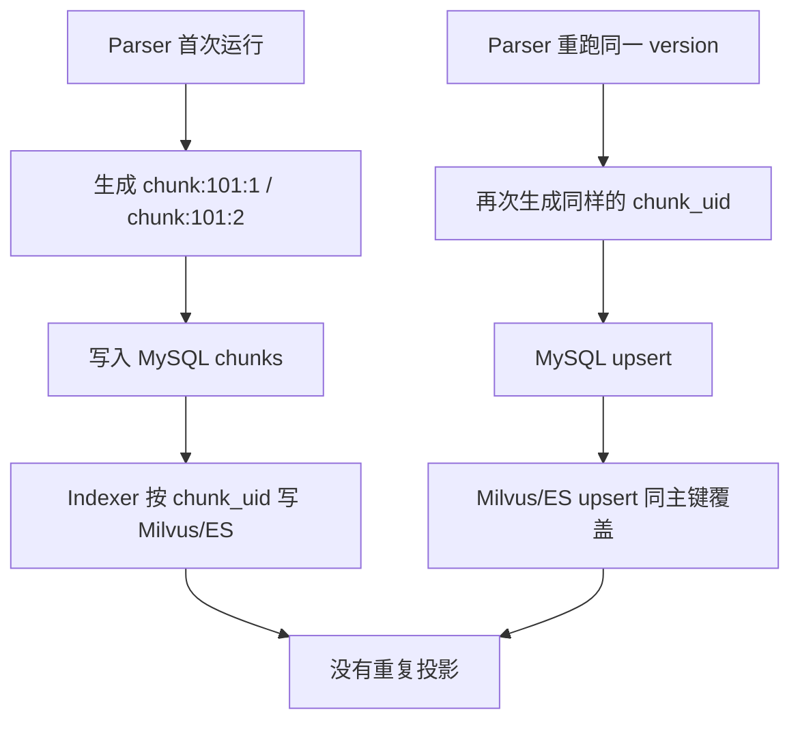
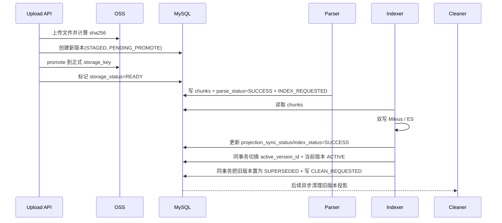
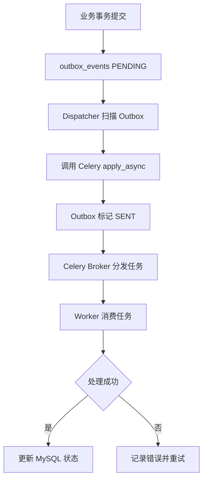
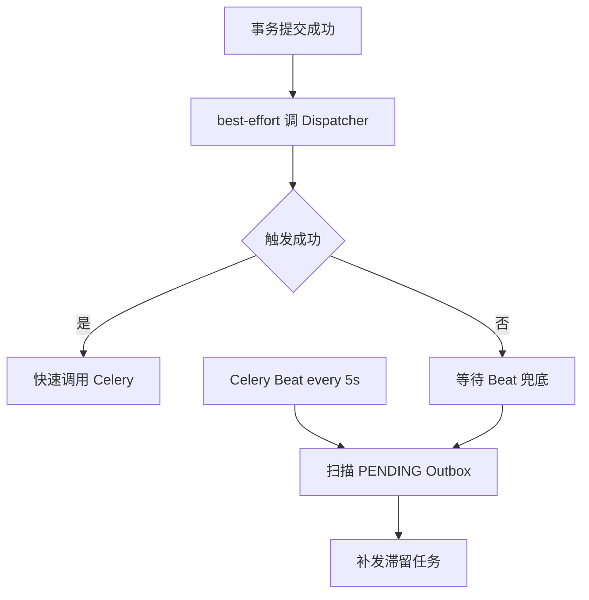
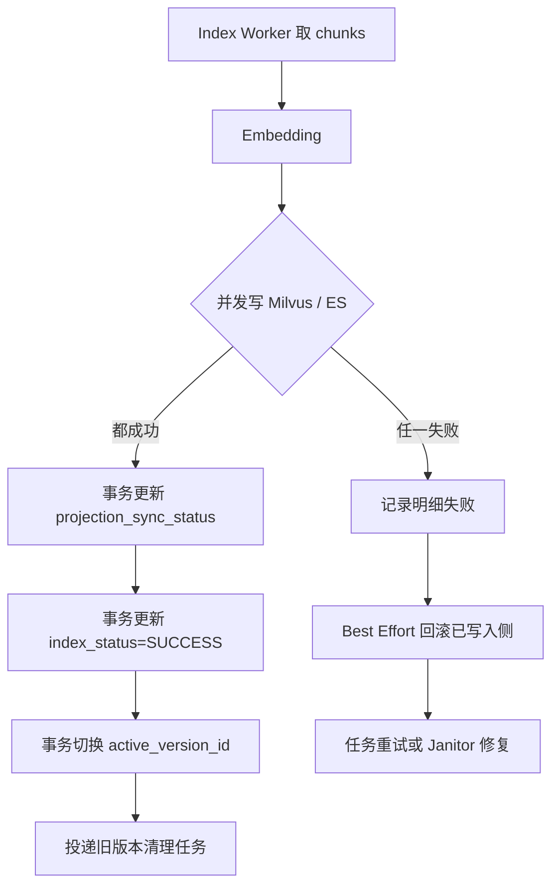
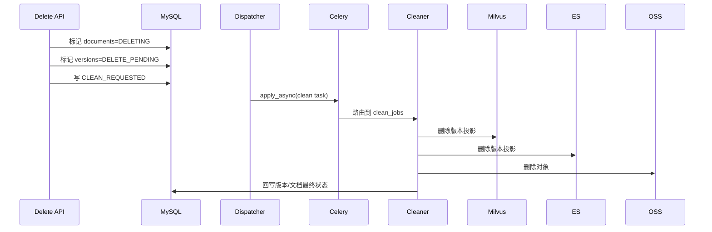
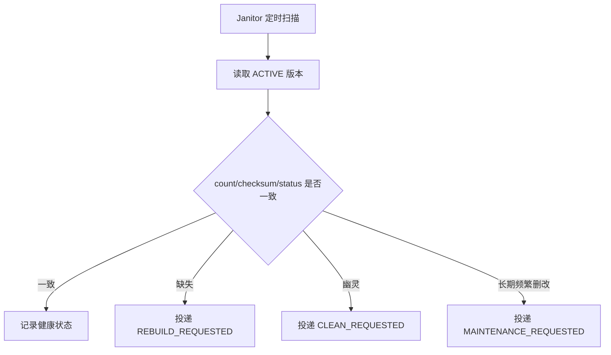

# Agentic RAG 数据库管理技术拆解

本文件用于补充说明 [架构设计规划](./架构设计规划.md) 中最容易在实现阶段出现歧义的模块。规划文档负责给出整体决策和边界，这份技术拆解负责把关键模块展开到“可以直接开始写代码”的粒度。

## 1. 文档定位

建议把两份文档配合阅读：

1. [架构设计规划](./架构设计规划.md)：看整体原则、表设计、状态机、实施顺序。
2. 本文：看关键模块的落地规则、事务边界、幂等策略和流程图。

本文不重复展开所有表字段，而是只解释那些“实现时最容易踩坑”的地方。

## 2. 首版必须固定的工程约束

首版建议直接固定以下约束，不要一开始就保留过多分支：

1. Python 运行环境使用 `Python 3.11`，命令形式统一为 `uv run xxx.py`。
2. MySQL 是唯一真理源，Redis 只承担任务队列和协调锁，不承载最终业务真相。
3. 首版异步任务基座固定为 `Celery + Redis Broker`，周期任务由 `Celery Beat` 调度。
4. OSS / Milvus / ES 首版用内存模拟适配器替代，但调用方式必须按真实服务接口边界设计。
5. 文档更新统一采用“影子构建成功后切换”，禁止“先删旧投影再写新投影”的直接覆盖式更新。
6. 历史版本默认只在 MySQL 中保留审计记录，不长期保留 Milvus / ES 在线投影。
7. 首版不做跨文档对象共享，不做跨文档秒传，不做内容寻址存储。

## 3. 模块总览

建议把首版代码拆成下面这些对象角色：

1. `DocumentCommandService`：负责上传、更新、删除的主写入入口。
2. `OutboxDispatcherService`：负责把 `outbox_events` 转成 Celery `apply_async(...)` 调用。
3. `ParsePipelineService`：负责读取 OSS、解析、切片、写入 MySQL。
4. `IndexPipelineService`：负责读取切片、生成向量、双写 Milvus / ES、切换活动版本。
5. `CleanupService`：负责清理旧版本投影和对象存储。
6. `JanitorService`：负责对账、修复、压实维护任务调度。
7. `LockManager`：负责 Redis 锁封装，向业务暴露统一抢锁接口。
8. `ObjectStoragePort` / `VectorStorePort` / `SearchStorePort` / `TaskQueuePort`：负责抽象外部依赖。
9. `DocumentRepository` / `VersionRepository` / `ChunkRepository` / `OutboxRepository`：负责 MySQL 数据读写。
10. 各模块分别维护自己的抽象基类，例如 `storage/base.py`、`vector_store/base.py`、`repositories/base.py`、`services/base.py`。

建议原则：

1. API 层只调应用服务，不直接拼事务。
2. Worker 只负责“消费任务并调用应用服务”，不直接堆复杂业务逻辑。
3. 业务决策尽量落在应用服务和领域策略中，而不是藏在适配器里。

<a id="chunk-identity"></a>
## 4. `chunk_uid` 与投影幂等

这是首版最需要先定死的地方。

### 4.1 为什么不能用自增 `id` 作为投影主键

如果 `document_chunks.id` 是数据库自增主键，而 Parser 重跑时采用 delete + insert：

1. MySQL 里的旧 chunk 行会被删掉。
2. 新写入的 chunk 会拿到新的自增 `id`。
3. Milvus / ES 如果以旧 `id` 为主键，之前的旧投影并不会自动消失。
4. 最终表现就是“重建索引后反而多出幽灵数据”。

因此必须让 chunk 的跨系统身份是稳定的，而不是依赖数据库生成。

### 4.2 推荐规则

建议直接固定为：

1. `chunk_uid = "chunk:{version_id}:{chunk_no}"`。
2. `chunk_no` 由解析顺序稳定生成，从 `0` 或 `1` 开始都可以，但全项目必须统一。
3. 只要是同一个 `version_id`，无论 Parser 重跑多少次，同一个逻辑切片都必须得到同一个 `chunk_uid`。
4. Milvus / ES 的 upsert、delete、count 逻辑都以 `chunk_uid` 和 `version_id` 为核心键。

### 4.3 Parser / Indexer / Cleaner 的约束

Parser 约束：

1. 对同一 `version_id` 重跑时，优先按 `chunk_uid` 做 upsert。
2. 如果切片策略变化导致 `chunk_no` 序列变化，必须把该版本视为“解析器版本变化后的重建”，由同一版本整体覆盖。

Indexer 约束：

1. 只从 MySQL 读取当前版本最新的 `chunk_uid` 集合。
2. 对 Milvus / ES 执行 upsert，不依赖先全量删除再重建。

Cleaner 约束：

1. 删除旧版本时，优先按 `version_id` 批量删除。
2. 如果底层存储删除接口更适合按主键删除，则使用该版本下的 `chunk_uid` 列表。

<a id="parser-config-rebuild"></a>
### 4.4 `parser_config_hash` 与整版本重建

仅靠 `chunk_uid = version_id + chunk_no` 还不够，必须再补一层“解析配置摘要”的保护。

建议规则：

1. `parser_config_hash` 由 chunk size、overlap、解析器版本、文本清洗规则、分词配置等共同计算。
2. 同一 `version_id` 的重复解析，只允许在 `parser_config_hash` 不变时做幂等 upsert。
3. 如果 `parser_config_hash` 变化，不要假装它还是“同一批 chunks 的重跑”，而应该走整版本重建路径。
4. 整版本重建时，先覆盖 MySQL chunks，再对投影执行整版本覆盖；必要时先清理旧投影再写入。

这条规则的核心目的，是避免“chunk_no 没变但含义已变”的静默覆盖。



<a id="upload-switch"></a>
## 5. 上传、更新与影子切换

### 5.1 上传新文档

建议把“上传文件”和“创建版本记录”拆成两个阶段：

1. API 接收文件流，边写入 OSS staging，边计算 `sha256`。
2. 文件上传成功后，先进入第一个 MySQL 事务。
3. 事务 1 里写 `documents`、`document_versions(storage_status=PENDING_PROMOTE, staging_storage_key=...)`，但**先不写** `PARSE_REQUESTED`。
4. 事务 1 提交后，把 staging object promote/copy 到正式 `storage_key`，并做可读性、大小、哈希校验。
5. promote 成功后，再进入事务 2，更新 `storage_status=READY`、清空 `staging_storage_key`、写入 `outbox_events(PARSE_REQUESTED)`。
6. 如果事务 1 失败，对 staging object 做 best-effort 回收；如果 promote 失败，则把版本标记为 `storage_status=FAILED`，不要提前投递解析任务。

这样做的原因：

1. 关系数据库事务无法覆盖 OSS 写入。
2. 把外部 I/O 放在事务外，能减少持锁时间。
3. `PARSE_REQUESTED` 只能在对象真正可读后发出，否则 Parser 会出现“任务已到、源文件未就绪”的竞态。
4. 事务只负责固化业务状态，不负责承接大文件传输。

### 5.2 更新已有文档

更新已有文档时，首版推荐规则如下：

1. 先锁定 `documents` 行，确认当前 `active_version_id` 和 `latest_version_no`。
2. 计算新文件 `file_hash`。
3. 如果与当前活动版本 `file_hash` 相同，则直接返回“幂等更新，无需处理”。
4. 如果存在未完成的 `STAGED/RUNNING` 版本，首版默认直接返回 `409 VERSION_IN_PROGRESS`。
5. 如果 `file_hash` 不同且不存在在途版本，则新建 `document_versions(version_no + 1)`，初始状态为 `visibility=STAGED`、`storage_status=PENDING_PROMOTE`。
6. 新版本完成解析和索引后，才切换 `documents.active_version_id`。
7. 切换完成后，旧版本只保留 MySQL 记录，异步清理 Milvus / ES 投影。

<a id="inflight-version"></a>
### 5.3 单文档在途版本策略

这里需要非常明确，否则“连续两次快速上传”会把状态机打穿。

首版建议直接固定：

1. 同一 `document_id` 任意时刻只允许一个未完成的新版本处于在途状态。
2. `DocumentCommandService` 在 `SELECT ... FOR UPDATE` 锁住 `documents` 行后，检查是否存在 `parse_status/index_status` 仍未进入终态、且 `visibility_status=STAGED` 的版本。
3. 如果存在在途版本，默认返回 `409 VERSION_IN_PROGRESS`，由前端或调用方稍后重试。
4. 不建议首版就支持多个 `STAGED` 并行，更不建议默认“后来的上传静默覆盖前面的上传”。
5. 如果后续真要支持“强制覆盖”，应该通过显式参数触发，并补独立取消策略，而不是在默认路径里隐式发生。

### 5.4 为什么必须用“影子构建后切换”

如果直接“先删旧版本投影，再写新版本投影”，会有两个问题：

1. 旧投影删掉后，新投影还没写完，在线检索会出现空窗期。
2. 新投影只写入一半时，如果 API 已经把文档状态改成完成，会出现脏读。

影子构建后切换的关键点：

1. 新版本在 `visibility_status=STAGED` 时可以解析、索引，但不能参与在线检索。
2. 只有当 Milvus 和 ES 都成功后，才事务切换 `active_version_id`。
3. 切换后旧版本进入 `SUPERSEDED`，再异步清理。

下图只展示影子构建切换的成功主路径；Outbox 与 Dispatcher 细节见第 6 节。



<a id="file-hash-storage"></a>
### 5.5 `file_hash`、对象 promote 与源文件保留策略

这里专门解决一个很容易被低估的竞态：API 先上传 staging object，版本记录又想用正式 `storage_key`，如果还在事务 1 中直接写 `PARSE_REQUESTED`，Parser 很可能拿到一个尚未准备好的对象地址。

建议把“文件指纹”“对象归属”“对象就绪”拆开看：

1. `file_hash` 只表达上传原始字节流的内容摘要，用于判断同一逻辑文档是否变更；它不是共享对象主键。
2. `staging_storage_key` 只表示临时落点，`storage_key` 才表示版本正式拥有的对象地址。
3. `storage_status=PENDING_PROMOTE` 表示版本记录已创建，但对象还没完成归档；`READY` 才表示 Parser 可以读取。

推荐落地流程：

1. API 流式上传文件到 `staging/{date}/{request_id}`，同步计算 `file_hash`、`file_size`。
2. 事务 1 内创建或锁定文档，并写入版本记录：`storage_status=PENDING_PROMOTE`、记录 `staging_storage_key` 和最终 `storage_key`。
3. 事务 1 提交后，由应用服务执行 `copy -> verify -> delete temp`；如果对象存储没有原子 rename，就直接按这个模型设计，不要假设 rename 可用。
4. 校验通过后，事务 2 更新 `storage_status=READY`、清空 `staging_storage_key`，再写 `PARSE_REQUESTED`。
5. 如果 promote 或校验失败，版本标记为 `storage_status=FAILED`，记录 `last_error_code/last_error_message`；可以由后台重试 promote，但不要让 Parser 硬跑。

源文件保留策略也要提前定死：

1. 活动版本源文件建议长期保留，否则后续排障、重放解析、二次抽检都没有抓手。
2. 历史版本源文件不要默认和投影一起“切换完就秒删”；更稳妥的方式是保留最近 N 版或保留 N 天。
3. Cleaner 删除整个逻辑文档时，除了正式 `storage_key`，也应 best-effort 清理遗留的 `staging_storage_key`，防止异常中断后留下临时垃圾对象。
4. 不同 `document_id` 即使 `file_hash` 相同，也不要共享正式对象；Cleaner 删除必须以版本归属为准，而不是以 hash 推断。

<a id="outbox-queue"></a>
## 6. Outbox 与 Celery

### 6.1 为什么这里更推荐 Celery，而不是直接使用 Redis Stream

如果只是做一个极简消息队列，Redis Stream 的确够用；但你这个场景更偏“企业级任务编排”，Celery 更合适，原因很直接：

1. Celery 自带任务重试、倒计时重试、限流、路由、结果跟踪等成熟能力。
2. Celery 可以按任务类型拆 Worker Lane，比手动封装 Stream 消费模型更省维护成本。
3. Celery Beat 可以直接承担 Janitor、Maintenance 这类周期调度，不用再自己做一套调度器。
4. 当前仓库已经有 Celery 示例，落地路径更短，团队后续理解和迁移成本更低。

因此这里推荐的不是“直接在事务里调用 Celery”，而是“Outbox + Celery”组合。

### 6.2 为什么 Outbox 仍然不能省

如果 API 事务里“先更新 MySQL，再直接发 Celery 任务”，就会有两类经典故障：

1. MySQL 已提交，但 Celery 任务发送失败。
2. Celery 任务已发出，但 MySQL 事务回滚。

Outbox 的目标不是让消息绝对只发一次，而是保证“系统至少知道这件事应该发生”。

### 6.3 推荐职责拆分

建议拆成四类角色：

1. 业务服务：事务内写业务表和 `outbox_events`。
2. Dispatcher：扫描 `publish_status=PENDING` 的 outbox 记录，调用 Celery `apply_async(...)`。
3. Celery Broker：负责分发任务到目标队列。
4. Worker：按队列消费任务，执行业务逻辑。

### 6.4 首版 Celery 队列与 Lane 建议

建议固定如下队列：

1. `parse_jobs`
2. `index_jobs`
3. `clean_jobs`
4. `repair_jobs`
5. `maintenance_jobs`

建议默认部署策略：

1. `parse_jobs`、`clean_jobs`、`repair_jobs` 默认走 `prefork`。
2. `index_jobs` 首版也走 `prefork`，如果后续 Embedding 和外部写入明确是原生异步 IO，再单独拆 aio lane。
3. `maintenance_jobs` 可以单独部署低并发 worker，避免和主链路抢资源。

### 6.5 Celery 配置建议

首版建议把以下参数当成默认工程基线：

1. `acks_late=True`
2. `task_reject_on_worker_lost=True`
3. `task_acks_on_failure_or_timeout=False` 或按具体任务语义明确配置
4. 对可恢复异常统一配置自动重试和指数退避
5. `task_routes` 明确绑定队列，不依赖默认路由

<a id="outbox-publish-ack"></a>
### 6.6 失败与重试

Dispatcher 失败：

1. 保持 outbox 状态为 `PENDING` 或 `FAILED`。
2. 定时扫描重新发布。

这里要明确区分三种完全不同的“确认”：

1. Dispatcher 发布确认：`apply_async(...)` 返回成功，表示 Broker 已接受这次发布请求。
2. Worker 消费确认：Worker 已经取到任务，准备开始执行。
3. Worker 执行 ack：任务执行完成后，Broker/Worker 按消费语义完成 ack。

首版建议规则：

1. Dispatcher 只等待“发布确认”，不等待 Worker 消费，也不等待任务执行完成。
2. `publish_status=SENT` 的含义应固定为“任务已经成功交给 Broker”，而不是“任务已经执行成功”。
3. `apply_async(...)` 本身会有一次同步网络往返，因此会短暂阻塞当前 Dispatcher 线程；这是正常成本，但它不应阻塞到任务执行结束。
4. 如果发布调用报错、超时，或者结果不确定，则不要把 Outbox 直接标记为 `SENT`；保持 `PENDING/FAILED` 并重试。
5. 即使发布阶段拿到了成功返回，也不能把它当成最终业务成功；最终仍以 MySQL 状态机是否推进到成功终态为准。
6. 如果出现“发布结果不确定”，后续重试可能产生重复投递，因此 `dedupe_key`、版本级幂等和状态机防重必须保留。

Worker 失败：

1. 不推进版本状态到成功。
2. 记录 `last_error_message`、重试次数、`celery_task_id`。
3. 由 Celery 重试或由调度器重建任务。

建议补充一条规则：

1. 任务去重由 `dedupe_key` 保证。
2. 任务成功与否的最终判断仍以 MySQL 状态机为准，而不是以“Celery 是否 ack”单独判断。

生产级建议：

1. 如果 Broker 支持 publisher confirm，例如 RabbitMQ，应等待 broker confirm 后再把 Outbox 标成 `SENT`。
2. 如果首版继续使用 `Celery + Redis Broker`，通常只能把“发布调用成功返回”当成弱确认，不能把它理解成强一致持久化确认。
3. 因此生产设计应默认接受 `at-least-once delivery`，把重点放在可重试、可去重、可补偿，而不是追求“绝不重复”。

建议默认重试基线：

1. 默认最大重试 5 次。
2. 退避基线使用指数退避，例如 `60s, 120s, 240s, 480s, 960s`。
3. 可恢复异常走自动重试，不可恢复异常直接落终态失败。
4. 达到重试上限后，把对应版本状态标记为 `FAILED`，由人工重试或 Janitor 后续决定是否重投。



<a id="dispatcher-trigger"></a>
### 6.7 Dispatcher 触发机制

这里只靠定时扫描不够，只靠事务后立刻触发也不够。建议采用双保险：

1. 业务事务提交成功后，立即 best-effort 调用一次 Dispatcher。
2. Celery Beat 每 5 秒兜底扫描一次 `publish_status=PENDING` 且 `available_at <= now()` 的事件。
3. 立即触发失败不回滚主事务，最终一致性仍由 Beat 兜底。

推荐理解方式：

1. 立即触发负责“低延迟”。
2. Beat 扫描负责“高可靠”。
3. Outbox 本身负责“事务内不丢意图”。

补充一条容易被忽略的 housekeeping 规则：

1. `publish_status=SENT` 的历史记录不能无限保留。
2. 建议再加一个低频 Beat 任务，例如每天 1 次，清理 `published_at < now() - 7d` 的历史成功事件。
3. 清理任务只能处理 `SENT` 记录，不能误删 `PENDING/FAILED` 事件。



<a id="index-commit"></a>
## 7. 索引双写、激活切换与补偿

### 7.1 核心原则

这里最容易写错的点是“Milvus 成功了，ES 失败了，系统该怎么看”。

推荐做法：

1. `document_versions.index_status` 只表达整体状态。
2. `projection_sync_status` 分别记录 `MILVUS` 和 `ES` 的明细状态。
3. 只有两个投影都成功，才允许把版本切到 `ACTIVE`。

### 7.2 推荐事务边界

索引阶段分成两个边界：

边界一：事务外执行耗时外部写入

1. 读取 MySQL 中的切片。
2. 调用 EmbeddingProvider。
3. 并发 upsert Milvus。
4. 并发 upsert ES。

边界二：事务内固化状态

1. 更新两个 `projection_sync_status=SUCCESS`。
2. 更新 `document_versions.index_status=SUCCESS`。
3. 切换 `documents.active_version_id`。
4. 把旧版本改为 `SUPERSEDED`。
5. 写入旧版本 `CLEAN_REQUESTED`。

### 7.3 如果一边成功一边失败怎么办

推荐规则：

1. MySQL 整体状态不能标记成功。
2. 明细状态里记录哪一边已成功。
3. 先做 best-effort rollback，删除已经写入的一边。
4. 如果回滚也失败，交给 Janitor 后续修复。

不要追求“应用层假分布式事务”，重点是保证可识别、可重试、可修复。



<a id="mock-resilience"></a>
### 7.4 轻量级熔断与优雅降级

光靠重试还不够。下游持续异常时，如果还在高速重试，只会把队列和外部依赖一起打爆。

首版建议至少补一个轻量级熔断器：

1. 对 `Embedding`、`Milvus`、`ES` 分别维护连续失败计数。
2. 连续失败达到阈值后，打开短时熔断，例如 60 秒。
3. 熔断打开期间，Index Worker 不再继续硬打下游，而是把任务用 `countdown` 延后重试。
4. 熔断恢复后优先处理积压任务，并记录恢复日志。

实现方式不必复杂：

1. 失败计数可以先放 Redis。
2. 熔断状态也可以先放 Redis，key 例如 `rag:circuit:index:embedding`。
3. 不要把熔断结果当成最终真相，它只是保护系统的执行节奏。

<a id="delete-cleanup"></a>
## 8. 删除与清理

这里其实有两类“删除”，不要混在一起：

1. 用户删除整个逻辑文档。
2. 文档更新后，清理旧版本投影。

### 8.1 删除整个逻辑文档

推荐流程：

1. API 事务内把 `documents.lifecycle_status` 改成 `DELETING`。
2. 把活动版本和历史未删版本打上 `visibility_status=DELETE_PENDING`；需要清理源文件时同步设置 `storage_status=DELETE_PENDING`。
3. 写入 `CLEAN_REQUESTED`。
4. Cleaner 异步删除 Milvus、ES、OSS。
5. 成功后把版本改成 `DELETED`，文档改成 `DELETED`。

### 8.2 清理旧版本投影

这是更新流程中的清理，不等于删除文档本身。

推荐策略：

1. 旧版本 MySQL 记录保留。
2. 默认删除旧版本 Milvus / ES 投影。
3. OSS 原文件是否保留取决于审计要求；首版建议默认长期保留当前活动版本源文件，历史版本按“保留最近 N 版”或“保留 N 天”策略清理。
4. 如果版本还残留 `staging_storage_key`，Cleaner 应一并做 best-effort 回收，避免对象存储垃圾累积。

### 8.3 Cleaner 的实现边界

Cleaner 最好只干三类事：

1. 根据版本删除投影。
2. 根据版本和保留策略删除正式对象，并顺手回收遗留 staging object。
3. 回写数据库状态。

Cleaner 不要再去做复杂业务判断，例如“这个版本到底能不能删”，这些判断应该在上游事务里先完成。



<a id="lock-strategy"></a>
## 9. 锁与并发控制

### 9.1 先分清“谁负责正确性，谁负责减少重复执行”

建议直接固定：

1. MySQL 行锁 / 乐观锁负责正确性。
2. Redis 锁负责减少并发重复执行。

如果 Redis 锁偶发失效，理论上仍不能破坏最终状态机；最多导致任务被重复执行一次。

### 9.2 MySQL 应该兜住哪些动作

1. 创建新版本前，锁住 `documents` 行，读取 `latest_version_no`。
2. 抢占任务执行前，用条件更新把 `PENDING -> RUNNING`。
3. 激活切换时，锁住 `documents` 行和目标版本行。
4. 删除文档时，在同一事务内更新文档和版本状态。

### 9.3 Redis 锁该怎么用

建议 key 设计：

1. `rag:parse:version:{version_id}`
2. `rag:index:version:{version_id}`
3. `rag:clean:version:{version_id}`
4. `rag:janitor:leader`

建议规则：

1. 使用 `SET key value NX EX ttl` 这类单 Redis 原语即可。
2. value 使用随机 owner token。
3. 长任务定期续租。
4. 释放锁时必须校验 owner token，不能直接删 key。

### 9.4 不建议首版上 Redlock

原因很简单：

1. 当前不是多 Redis 主节点仲裁场景。
2. 核心正确性已经由 MySQL 兜底。
3. 首版最需要的是可解释和可维护，而不是分布式锁理论上的最强形式。

<a id="janitor"></a>
## 10. Janitor 对账、幽灵数据修复与索引维护

Janitor 不只是“扫一下 count”，它本质上是最终一致性的兜底控制面。

### 10.1 Janitor 负责什么

1. 扫描 `ACTIVE` 版本的投影完整性。
2. 发现 Milvus / ES 缺失数据时，触发 `REBUILD_REQUESTED`。
3. 发现幽灵数据时，触发清理。
4. 在低峰期触发 Compact / Rebuild Index 等维护任务。

### 10.2 推荐扫描策略

不要首版就写成无限制全表扫描。建议：

1. 按 `updated_at` 窗口分页扫描。
2. 对热点知识库提高扫描频率。
3. 对近期失败过的版本单独优先扫描。

### 10.3 对账维度

首版至少做这三层：

1. `count` 对账：MySQL chunk 数和投影数是否一致。
2. `checksum` 对账：同一版本内容摘要是否一致。
3. 状态对账：MySQL 已 `ACTIVE`，但某投影状态仍不是 `SUCCESS`。

### 10.4 索引维护

参考文档中提到的“碎片化”问题不能忽略。即使首版是模拟存储，也应该把维护入口设计出来：

1. Janitor 发现某类版本删改过于频繁时，写入 `MAINTENANCE_REQUESTED` 或等价内部任务。
2. 由专门的 Maintenance Worker 在低峰期执行 Compact / Rebuild。
3. 真实接入 Milvus 后，把具体 SDK 调用放在向量适配器中，而不是写死在 Janitor 里。



<a id="module-layout"></a>
## 11. 代码目录与面向对象热插拔接口

建议的首版目录可以按下面思路展开：

```text
src/learning_common_lib/案例/实现AgenticRAG数据库管理/
├── app/
│   ├── api/
│   ├── application/
│   ├── domain/
│   ├── ports/
│   ├── repositories/
│   ├── infrastructure/
│   ├── workers/

...

```

### 11.1 推荐接口边界

建议至少定义这些 Port：

1. `ObjectStoragePort`
2. `VectorStorePort`
3. `SearchStorePort`
4. `EmbeddingProviderPort`
5. `TaskQueuePort`
6. `DistributedLockPort`
7. `UnitOfWork` 或等价事务边界抽象

### 11.2 模块级基类建议

这里不建议再单独抽一个全局 `app/base/` 去统一管理所有组件基类。更合适的方式是按模块各自维护自己的基类文件。

建议方式：

1. 存储模块在 `ports/storage.py` 内维护自己的 `BaseObjectStorage`
2. 向量模块在 `ports/vector_store.py` 内维护自己的 `BaseVectorStore`
3. 检索模块在 `ports/search_store.py` 内维护自己的 `BaseSearchStore`
4. 队列模块在 `ports/queue.py` 内维护自己的 `BaseTaskQueue`
5. 锁模块在 `ports/locks.py` 内维护自己的 `BaseDistributedLock`
6. 仓储模块维护自己的 `repositories/base.py`
7. 服务模块维护自己的 `application/services/base.py`

推荐公共约束：

1. 每个模块自己的基类只定义本模块真正共用的能力。
2. 不强行让 Repository、Service、Port、Adapter 都继承同一个祖先。
3. 生命周期方法如 `startup()`、`shutdown()`、`healthcheck()` 只在真正需要的模块基类里定义。
4. Mock 实现和真实实现都继承各自模块的基类，而不是继承一个全局组件父类。

推荐写法：

```python
from __future__ import annotations

from abc import ABC, abstractmethod


class BaseObjectStorage(ABC):
    @abstractmethod
    async def put(self, storage_key: str, content: bytes) -> None:
        raise NotImplementedError

    @abstractmethod
    async def get(self, storage_key: str) -> bytes:
        raise NotImplementedError


class BaseVectorStore(ABC):
    @abstractmethod
    async def upsert_chunks(self, version_id: int, records: list[dict]) -> None:
        raise NotImplementedError


class BaseRepository(ABC):
    async def flush(self) -> None:
        return None
```

这样做的好处：

1. 抽象边界更贴近模块职责，不会为了统一而统一。
2. 模块演进时，变更影响只留在本模块内部。
3. 真实适配器和 Mock 适配器仍然有明确继承点，但不会被一个总父类绑死。

### 11.3 推荐服务边界

建议至少有这些服务对象：

1. `DocumentCommandService`
2. `VersionActivationService`
3. `ParsePipelineService`
4. `IndexPipelineService`
5. `CleanupService`
6. `JanitorService`
7. `OutboxDispatcherService`

### 11.4 为什么这种分层适合当前项目

原因很直接：

1. 当前外部依赖大量是 Mock，对象边界清楚，后续替换真实服务时返工最少。
2. 业务重点是状态机和一致性，而不是具体 SDK 调用细节。
3. 后续接入 FastAPI、Celery、真实 Milvus、真实 ES 时，可以把变化尽量限制在适配器层。
4. 模块级基类能把热插拔接口从“口头约定”变成真正可执行的代码约束，同时保持模块边界清晰。

<a id="mock-test-mode"></a>
### 11.5 Mock 并发安全与测试模式

这里需要明确一个很容易踩坑的事实：普通 Python `dict` 只适合单进程内存 mock，不适合 Celery `prefork` 多进程测试。

原因：

1. `prefork` worker 是多进程模型。
2. 主进程里的 `dict` 不会自动和 worker 子进程共享。
3. 结果就是“worker 看起来写成功了，但主进程读不到”。

建议测试策略直接分层：

1. 单元测试：使用 `InMemoryTaskQueueAdapter + dict mock`。
2. 单进程集成测试：使用 Celery eager 模式或 `solo` pool。
3. 多进程集成测试：使用 SQLite / file-backed mock 持久层，不要依赖普通 dict。

如果后续一定要做跨进程内存共享，也应明确这是测试技巧，不应把 `multiprocessing.Manager().dict()` 当成正式架构的一部分。

## 12. 实现优先级建议

如果下一步要开始写代码，建议按这个顺序落：

1. 先定义枚举、异常、ORM 模型、Repository、Port。
2. 再定义模块级基类、`chunk_uid`、Outbox、Celery、LockManager 的核心协议。
3. 再实现上传、解析、索引、激活切换的主链路。
4. 最后补 Cleaner、Janitor、维护任务和更多测试。

这样做能最早验证两个核心前提：

1. 状态机是否真正能自洽。
2. 重试、补偿、重建是否真的不会把数据越修越乱。
