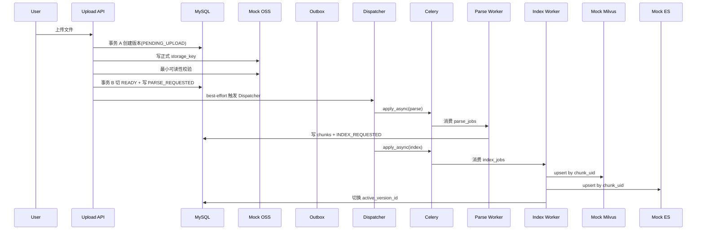
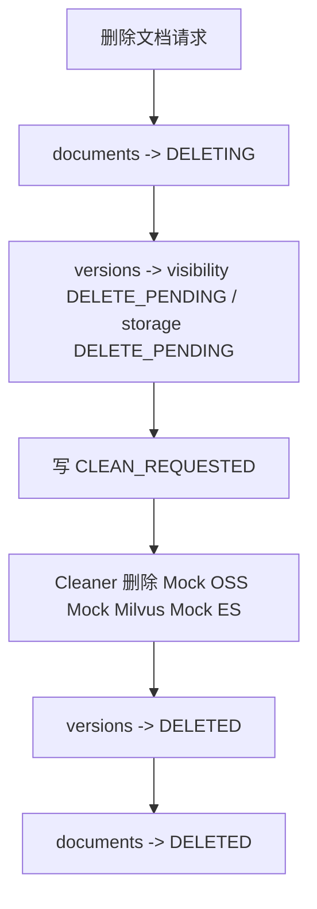

# Agentic RAG 最小可执行 Demo

## 1. 定位

这个目录是 [架构设计规划（缩减版）](../架构设计规划（缩减版）.md) 的代码落地。

它不是“只把逻辑串起来”的玩具样例，而是一个尽量保留企业级关键骨架的最小 demo：

1. `MySQL` 仍然是唯一真理源。
2. `Redis + Celery` 仍然承担异步任务总线与调度。
3. `Outbox` 仍然保留，避免事务里直接发消息。
4. `Mock OSS / Mock Milvus / Mock ES` 仍然按真实外部依赖的接口边界设计。
5. `Parser / Index / Cleaner / Janitor` 仍然拆成独立服务和 Worker。

当前 demo 重点验证的是：

1. 上传 -> 解析 -> 索引 -> 激活
2. 删除 -> 异步清理
3. Janitor 基础 count 对账 -> 触发重建
4. 最小运维/调试接口

## 2. 与缩减版规划的对齐点

当前实现已经对齐下面这些关键规则：

1. `document_versions` 新增 `storage_status`，区分对象是否已经 ready、是否进入删除或失败状态。
2. 上传流程采用“两段式”：先在数据库里预留版本并进入 `PENDING_UPLOAD`，对象写入与校验成功后再切到 `READY` 并写 `PARSE_REQUESTED`。
3. `storage_key` 按 `document_id/version_no/file_name` 命名，不做按 `file_hash` 的对象共享。
4. 在线查询只能看 `documents.active_version_id`，运维接口才允许按 `version_id` 查看单版本状态。
5. demo 自带最小上传保护：MIME 白名单、文件大小上限、失败可见性、手动重建入口、Outbox 滞留查看。

这里保留的一个有意差异是：为了让版本号和正式对象 key 更稳定，demo 使用了 `PENDING_UPLOAD -> READY` 过渡状态。它比缩减版文档最初的“直接 READY”更接近真实系统。

## 3. 目录结构

```text
最小可执行demo/
├── api.py
├── beat_main.py
├── bootstrap.py
├── celery_app.py
├── client_demo.py
├── config.py
├── db.py
├── demo_flow.py
├── embedding.py
├── enums.py
├── errors.py
├── init_db.py
├── locks.py
├── models.py
├── offline_submit_demo.py
├── repositories.py
├── schemas.py
├── search_store.py
├── services/
│   ├── __init__.py
│   ├── cleanup.py
│   ├── common.py
│   ├── document_command.py
│   ├── index_pipeline.py
│   ├── janitor.py
│   ├── outbox_dispatcher.py
│   └── parse_pipeline.py
├── storage.py
├── task_queue.py
├── tasks.py
├── vector_store.py
└── worker_main.py
```

重点文件：

1. `models.py`
说明：4 张核心表的 ORM 定义。

2. `services/document_command.py`
说明：上传、删除、手动重建入口；把业务事务和对象写入拆清楚。

3. `services/outbox_dispatcher.py`
说明：Outbox 派发、best-effort 触发、本地 eager 执行入口。

4. `services/parse_pipeline.py` / `services/index_pipeline.py`
说明：解析和索引主流水线。

5. `api.py`
说明：管理类 API，包含文档、版本、Outbox、统计、Janitor 的最小运维入口。

## 4. 核心数据模型

### 4.1 `documents`

作用：

1. 表示逻辑文档身份。
2. 保存当前对外生效的 `active_version_id`。

关键字段：

1. `external_doc_key`
2. `lifecycle_status`
3. `active_version_id`
4. `latest_version_no`
5. `row_version`

### 4.2 `document_versions`

作用：

1. 表示某个逻辑文档的不可变版本。
2. 是 Parser / Index / Cleaner 的执行主对象。

关键字段：

1. `file_hash`
2. `file_size`
3. `mime_type`
4. `storage_key`
5. `storage_status`
6. `parse_status`
7. `index_status`
8. `milvus_status`
9. `es_status`
10. `visibility_status`
11. `parser_config_hash`
12. `retry_count`
13. `last_error_message`

`storage_status` 说明：

1. `PENDING_UPLOAD`：版本号和正式对象 key 已经预留，但对象尚未验证 ready。
2. `READY`：源文件可读，允许写入 `PARSE_REQUESTED`。
3. `DELETE_PENDING`：已经进入删除清理路径。
4. `DELETED`：对象已被清理。
5. `FAILED`：上传或对象校验阶段失败。

### 4.3 `document_chunks`

作用：

1. 保存 MySQL 内的切片事实数据。
2. 未来向量和检索投影都可以从这里重建。

关键字段：

1. `chunk_uid`
2. `chunk_no`
3. `chunk_hash`
4. `content`
5. `metadata_json`

### 4.4 `outbox_events`

作用：

1. 保存待发布或待重试的任务事件。
2. 解耦“业务提交”和“异步派发”。

关键字段：

1. `event_type`
2. `queue_name`
3. `task_name`
4. `dedupe_key`
5. `publish_status`
6. `available_at`
7. `next_retry_at`
8. `published_at`

## 5. 服务与任务边界

### 5.1 `DocumentCommandService`

负责：

1. 校验 `external_doc_key`、MIME、文件大小。
2. 计算 `file_hash`。
3. 锁文档、检查在途版本、判断同 hash 幂等。
4. 预留 `version_no` 和正式 `storage_key`。
5. 写对象、校验对象可读性。
6. 把版本从 `PENDING_UPLOAD` 切到 `READY`，写入 `PARSE_REQUESTED`。

### 5.2 `ParsePipelineService`

负责：

1. 只处理 `storage_status=READY` 的版本。
2. 读取对象存储源文件。
3. 解析文本并按固定 chunk 配置切片。
4. 覆盖写入 `document_chunks`。
5. 写入 `INDEX_REQUESTED`。

### 5.3 `IndexPipelineService`

负责：

1. 读取 MySQL chunks。
2. 生成向量。
3. 双写 Mock Milvus / Mock ES。
4. 只有两边都成功时，才切换 `active_version_id`。
5. 把旧活动版本标记为 `SUPERSEDED` 并投递 `CLEAN_REQUESTED`。

### 5.4 `CleanupService`

负责：

1. 删除旧版本投影。
2. 删除对应源文件。
3. 把版本对象状态推进到 `DELETED`。
4. 逻辑删除场景下，在所有版本删完后把文档推进到 `DELETED`。

### 5.5 `JanitorService`

负责：

1. 扫描 `ACTIVE` 版本。
2. 对比 MySQL / Mock Milvus / Mock ES 的 chunk 数量。
3. 数量不一致时写 `REBUILD_REQUESTED`。

## 6. 数据流

### 6.1 上传 -> 激活



### 6.2 删除



## 7. 管理 API

当前 demo 提供的最小接口：

1. `POST /documents/upload`
说明：上传文件并进入异步解析链路。

2. `GET /documents/{document_id}`
说明：查看文档与所有版本状态，属于管理视图，不代表所有版本都参与在线检索。

3. `GET /versions/{version_id}`
说明：查看单版本的 `parse/index/milvus/es/storage/visibility` 状态和最后错误。

4. `DELETE /documents/{document_id}`
说明：发起逻辑删除并异步清理。

5. `POST /versions/{version_id}/rebuild`
说明：手动写入 `REBUILD_REQUESTED`。

6. `GET /admin/outbox/pending`
说明：查看滞留的 `PENDING/FAILED` Outbox 事件。

7. `POST /admin/outbox/dispatch`
说明：手动触发一次 Outbox Dispatcher。

8. `GET /admin/stats`
说明：查看轻量统计：
   - `outbox_pending_count`
   - `parse_failed_count`
   - `index_failed_count`
   - `active_version_count`

9. `POST /admin/janitor/run`
说明：手动触发一次 Janitor。

## 8. 上传保护与约束

当前 demo 固定以下保护规则：

1. 支持的 MIME 类型只有：
   - `text/plain`
   - `text/markdown`
   - `application/pdf`
2. 单文件大小上限为 `20MB`。
3. 不支持类型返回 `415 UNSUPPORTED_MEDIA_TYPE`。
4. 超出大小上限返回 `413 FILE_TOO_LARGE`。
5. Parse / Index 默认最大重试 5 次，采用指数退避。

PDF 说明：

1. 解析逻辑优先使用 `pypdf`。
2. 如果环境里没有可用 PDF 解析依赖，会返回明确错误，而不是假装把 PDF 二进制当文本解码。

## 9. 运行方式

### 9.1 重置并初始化 demo 表

`init_db.py` 现在会先删表再建表，适合 demo 重跑：

```bash
uv run python src/learning_common_lib/案例/实现AgenticRAG数据库管理/最小可执行demo/init_db.py
```

默认情况下，API 启动**不会**自动建表；生产式启动顺序推荐始终先执行 `init_db.py`。

### 9.2 标准生产风格启动

这条路径最接近真实部署方式，也是当前最推荐的验证方式。

先启动 Worker：

```bash
cd src/learning_common_lib/案例/实现AgenticRAG数据库管理/最小可执行demo
uv run celery -A celery_app:celery_app worker -l info -P prefork -c 2 -Q parse_jobs,index_jobs,clean_jobs,repair_jobs,housekeeping_jobs
```

再启动 Beat：

```bash
cd src/learning_common_lib/案例/实现AgenticRAG数据库管理/最小可执行demo
uv run celery -A celery_app:celery_app beat -l info
```

最后如果要测 HTTP，再启动 API：

```bash
uv run python src/learning_common_lib/案例/实现AgenticRAG数据库管理/最小可执行demo/api.py
```

说明：

1. 推荐顺序固定为：`init_db.py -> worker -> beat -> api`。
2. API 默认不会自动建表，避免和 `init_db.py` 并行时产生 DDL 竞争。
3. 我已经按这条路径验证过：Worker CLI、Beat CLI、API、`client_demo.py` 可以正常跑完整链路。
4. `celerybeat-schedule*` 是 Celery Beat 生成的本地调度元数据，不是给人直接阅读的业务文件；它通常是 Berkeley DB / shelve 格式，编辑器打不开是正常现象，停止 Beat 后可以删除再重建。

### 9.3 脚本式启动

如果不想写 Celery CLI，也可以直接用脚本入口：

```bash
uv run python src/learning_common_lib/案例/实现AgenticRAG数据库管理/最小可执行demo/worker_main.py
uv run python src/learning_common_lib/案例/实现AgenticRAG数据库管理/最小可执行demo/beat_main.py
```

这条路径更适合本地演示和开发调试，但本质上仍然是 Celery Worker / Beat，只是把命令行参数封装进脚本里了。

### 9.4 离线测试

先起 Worker，再直接执行：

```bash
uv run python src/learning_common_lib/案例/实现AgenticRAG数据库管理/最小可执行demo/offline_submit_demo.py
```

这个脚本会：

1. 直接写 MySQL 和 Outbox。
2. 等待 Worker 异步完成上传链路。
3. 再提交删除。
4. 再等待 Worker 异步完成清理。

### 9.5 HTTP 测试

先起 Worker 和 API，再执行：

```bash
uv run python src/learning_common_lib/案例/实现AgenticRAG数据库管理/最小可执行demo/client_demo.py
```

这个脚本会：

1. 等待 `/health` 就绪。
2. 上传文件。
3. 轮询 `/documents/{id}`，等待活动版本切换成功。
4. 查看 `/versions/{id}` 和 `/admin/stats`。
5. 手动调用 `/admin/janitor/run`。
6. 删除文档。
7. 再轮询直到文档和版本进入 `DELETED`。

### 9.6 单进程 eager 自测

```bash
uv run python src/learning_common_lib/案例/实现AgenticRAG数据库管理/最小可执行demo/demo_flow.py
```

这个模式只建议开发调试时使用，不建议当成主路径。

它的价值在于：

1. 不依赖外部 Worker CLI 就能快速验证状态机。
2. 可以更容易复现和定位 Parser / Index / Janitor 的逻辑 bug。
3. 当前我也用这条路径验证过上传、重建、删除链路都已恢复正常。

## 10. 状态流转说明

### 10.1 上传后

版本初始状态：

1. `storage_status=PENDING_UPLOAD`
2. `parse_status=PENDING`
3. `index_status=PENDING`
4. `milvus_status=PENDING`
5. `es_status=PENDING`
6. `visibility_status=STAGED`

对象写入和校验成功后：

1. `storage_status=READY`
2. 写入 `PARSE_REQUESTED`

### 10.2 解析成功后

版本状态变为：

1. `storage_status=READY`
2. `parse_status=SUCCESS`
3. `index_status=PENDING`
4. `chunk_count` 更新为实际切片数

### 10.3 索引成功后

版本状态变为：

1. `index_status=SUCCESS`
2. `milvus_status=SUCCESS`
3. `es_status=SUCCESS`
4. `visibility_status=ACTIVE`
5. `documents.active_version_id` 切换到当前版本

如果存在旧活动版本：

1. 旧版本变为 `visibility_status=SUPERSEDED`
2. 旧版本通常会进入 `storage_status=DELETE_PENDING`
3. 系统写入 `CLEAN_REQUESTED`

### 10.4 删除后

版本状态先变为：

1. `visibility_status=DELETE_PENDING`
2. `storage_status=DELETE_PENDING`

Cleaner 执行成功后：

1. `milvus_status=DELETED`
2. `es_status=DELETED`
3. `storage_status=DELETED`
4. `visibility_status=DELETED`

文档状态最终变为：

1. `lifecycle_status=DELETED`

## 11. 推荐验收场景

建议至少验证下面这些场景：

1. 上传一个文本文件后，能自动完成 `PARSE_REQUESTED -> INDEX_REQUESTED -> ACTIVE`。
2. 同一逻辑文档重复上传相同 `file_hash`，直接复用当前活动版本。
3. 第一版仍在处理时再次上传，返回 `409 VERSION_IN_PROGRESS`。
4. 通过 API 查看单版本状态、查看 Outbox 滞留、查看统计。
5. 手动触发 `POST /versions/{id}/rebuild` 后，能重新走索引链路。
6. 删除文档后，源文件、向量投影、检索投影一起清理。

## 12. 隐性风险与当前取舍

### 12.1 已经修掉的风险

1. 修掉了 `services.py` 拆包后脚本模式启动时的导入越界问题，`uv run python .../demo_flow.py`、`offline_submit_demo.py` 这类入口现在可以正常跑。
2. 修掉了 eager 模式本地任务执行仍按旧签名实例化 `ParsePipelineService` 的问题，不再出现 `PARSE_REQUESTED` 刚发出就失败。
3. 修掉了 `IndexPipelineService` 的事务边界问题，不再出现 `A transaction is already begun on this Session.`。
4. 修掉了 API 默认自动建表导致和 `init_db.py` 并行启动时出现 DDL 竞争的问题。
5. 修掉了对象状态缺失带来的“对象未 ready 却已经写入 `PARSE_REQUESTED`”窗口。
6. 修掉了最小 demo 文档与实际代码行为不一致的问题，README 和缩减版规划现在都反映 `PENDING_UPLOAD -> READY` 的真实实现。

### 12.2 仍然存在但可接受的取舍

1. `Outbox` 在“任务已发出但回写 `SENT` 失败”时，仍然存在重复派发窗口。
说明：
   这里选择的是“宁可重复，也不丢任务”，因此 Parser / Index / Cleaner 仍必须保持幂等。

2. `api.py` 上传接口会一次性把整个文件读入内存。
说明：
   这对 demo 可以接受，但不适合真正的大文件生产上传。

3. 文件型 Mock 的 `count_by_version` / `delete_by_version` 是扫描目录实现。
说明：
   对 demo 足够，但不是高并发实现。

4. PDF 解析依赖 `pypdf`。
说明：
   当前环境具备该依赖时可以解析；如果未来运行环境缺失，会返回明确错误，而不是静默降级成错误文本。

### 12.3 阻塞点评估

1. 文件写入和文件读取已经通过 `asyncio.to_thread(...)` 下放到线程，不会直接卡死事件循环。
2. API 到 Celery 的 `apply_async(...)` 走的是任务队列适配器，不会把主链路逻辑内联到 FastAPI 进程。
3. Redis 锁在异步路径中也通过线程桥接调用，避免把同步 IO 直接堵在事件循环里。
4. 真正还会消耗 CPU 或阻塞时间的是解析本身和向量构造本身，但它们发生在 Celery worker 进程里，而不是 FastAPI 进程里，这就是保留 Worker 的意义。

## 13. 已知简化

这个 demo 仍然是缩减版，不做下面这些事：

1. 多知识库
2. 独立任务审计表
3. 独立投影明细状态表
4. checksum 对账
5. Prometheus 指标与完整运维控制台
6. 批量导入 / 批量重建

如果需要这些能力，应回到完整版规划继续扩展，而不是在 demo 上继续堆补丁。

## 14. 建议阅读顺序

如果你第一次接触这个 demo，建议按这个顺序看：

1. [架构设计规划（缩减版）.md](../架构设计规划（缩减版）.md)
2. 当前 `README.md`
3. `models.py`
4. `services/document_command.py`
5. `services/parse_pipeline.py`
6. `services/index_pipeline.py`
7. `tasks.py`
8. `api.py`
9. `offline_submit_demo.py`
10. [技术拆解.md](../技术拆解.md)

这样最容易先建立“系统怎么流动”，再去看状态机、任务边界和代码细节。
