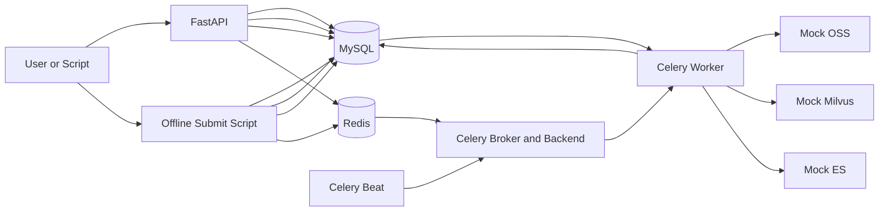
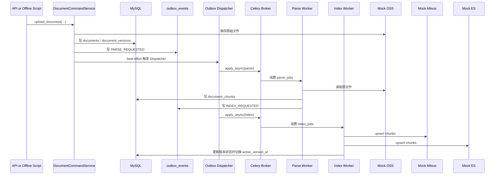
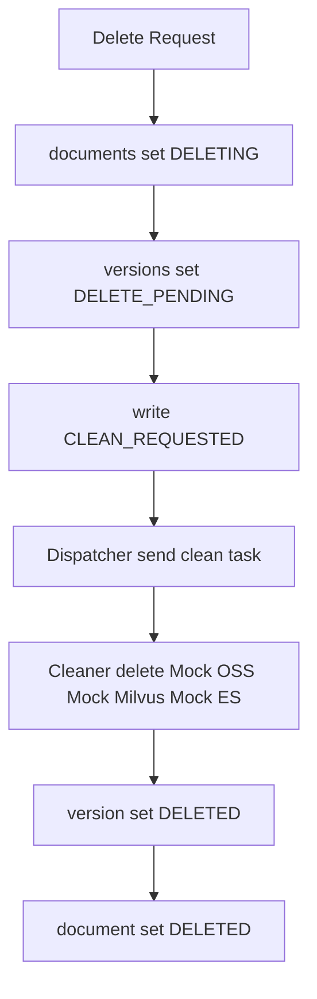
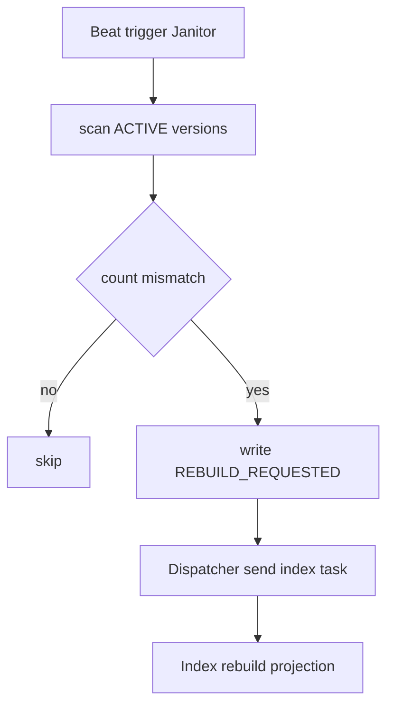

# Agentic RAG 最小可执行 Demo

## 1. 这是什么

这是一个“缩减版但保留关键生产组件”的 Agentic RAG 数据库管理 demo。

目标不是把所有企业级能力一次性写满，而是：

1. 保留真正生产里会存在的关键块：`MySQL`、`Redis`、`Celery`、`Outbox`、`Parser`、`Indexer`、`Cleaner`、`Janitor`。
2. 用最少的表和最少的代码，把“上传 -> 解析 -> 索引 -> 激活 -> 删除 -> 修复”这条链路跑通。
3. 运行方式尽量接近生产，不把异步消息解耦偷懒改成进程内同步调用。

这个 demo 对应的设计来源是下面 3 份文档：

1. [架构设计规划.md](../架构设计规划.md)
2. [架构设计规划（缩减版）.md](../架构设计规划（缩减版）.md)
3. [技术拆解.md](../技术拆解.md)

如果你想知道“为什么要这样设计”，先读缩减版规划；如果你想知道“每个模块的边界和细节为什么这样切”，再读技术拆解。

## 2. 这个 demo 保留了哪些生产级元素

虽然叫“最小可执行 demo”，但下面这些关键块都在：

1. `MySQL`
说明：
   用来保存 `documents`、`document_versions`、`document_chunks`、`outbox_events`，仍然是唯一真理源。

2. `Redis`
说明：
   既承担 Celery broker/backend，也承担轻量级分布式锁。

3. `Celery Worker`
说明：
   真正执行 `parse/index/clean/janitor/dispatch` 任务，不把任务内联到 FastAPI 进程里。

4. `Celery Beat`
说明：
   负责周期调度 Outbox 派发、Janitor 扫描、历史 Outbox 清理。

5. `Outbox`
说明：
   API 和 Worker 都先写 MySQL 和 `outbox_events`，再由 Dispatcher 调 Celery，避免事务内直接发消息。

6. `Mock OSS / Mock Milvus / Mock ES`
说明：
   不依赖真实对象存储、向量库和检索库，但接口边界保留，便于后续替换。

7. `模块级抽象基类`
说明：
   每个模块在自己的文件里维护抽象基类，例如 `ports/storage.py`、`ports/vector_store.py`，不引入一个过度统一的全局 `base`。

## 3. 与完整规划的关系

这个 demo 不是完整版的代码实现，而是缩减版规划的代码落地。

相对于 [架构设计规划.md](../架构设计规划.md)，它主动做了这些缩减：

1. 只保留 4 张核心表，没有上 `knowledge_bases`。
2. 没有独立 `pipeline_tasks` 任务审计表。
3. 没有独立 `projection_sync_status` 表，而是把投影状态折叠进 `document_versions`。
4. Janitor 只做基础 count 对账，不做更复杂的维护任务编排。

相对于 [架构设计规划（缩减版）.md](../架构设计规划（缩减版）.md)，它尽量保持实现一致，但这里也做了少量工程化补充，例如：

1. FastAPI 服务入口
2. 离线提交脚本
3. HTTP 客户端测试脚本
4. 文件型 mock 存储的原子写入

## 4. 目录结构

```text
最小可执行demo/
├── api.py
├── beat_main.py
├── bootstrap.py
├── celery_app.py
├── client_demo.py
├── config.py
├── db.py
├── demo_flow.py
├── embedding.py
├── enums.py
├── errors.py
├── init_db.py
├── locks.py
├── models.py
├── offline_submit_demo.py
├── repositories.py
├── schemas.py
├── search_store.py
├── services.py
├── storage.py
├── task_queue.py
├── tasks.py
├── vector_store.py
├── worker_main.py
└── .runtime/
```

各文件职责：

1. `config.py`
说明：
   所有运行配置、MySQL/Redis 连接串、调度参数都在这里。

2. `db.py`
说明：
   创建异步引擎、Session Factory、建表、销毁引擎。

3. `models.py`
说明：
   4 张核心表的 ORM 定义。

4. `repositories.py`
说明：
   最少 Repository 封装，保持查询逻辑集中。

5. `services.py`
说明：
   业务主编排层，包含上传、解析、索引、清理、Janitor、Outbox Dispatcher。

6. `tasks.py`
说明：
   Celery 任务入口，负责真正把服务层逻辑挂到 Worker 上。

7. `api.py`
说明：
   FastAPI 管理入口，适合 HTTP 测试和演示。

8. `offline_submit_demo.py`
说明：
   不依赖 FastAPI，直接写 MySQL + Outbox，再等待 Worker 异步处理，适合“先起 worker，再 `uv run xxx.py`”的离线测试方式。

9. `client_demo.py`
说明：
   对 FastAPI 发请求并轮询结果，固定 HTTP 链路。

10. `demo_flow.py`
说明：
    单进程本地自测脚本，只是辅助工具，不是主推荐运行方式。

## 5. 核心表设计

### 5.1 `documents`

作用：

1. 表示一个逻辑文档身份。
2. 保存当前对外生效的 `active_version_id`。

关键字段：

1. `external_doc_key`
2. `lifecycle_status`
3. `active_version_id`
4. `latest_version_no`
5. `row_version`

### 5.2 `document_versions`

作用：

1. 表示某个逻辑文档的不可变版本。
2. 是 Parser / Index / Cleaner 的主处理对象。

关键字段：

1. `file_hash`
2. `file_size`
3. `mime_type`
4. `parse_status`
5. `index_status`
6. `milvus_status`
7. `es_status`
8. `visibility_status`
9. `parser_config_hash`
10. `retry_count`
11. `last_error_message`

### 5.3 `document_chunks`

作用：

1. 保存 MySQL 内的切片事实数据。
2. 未来 Milvus / ES 都可以从它重建。

关键字段：

1. `chunk_uid`
2. `chunk_no`
3. `chunk_hash`
4. `content`
5. `metadata_json`

### 5.4 `outbox_events`

作用：

1. 保存待发布或待重试的任务事件。
2. 把“业务数据提交”和“异步任务派发”解耦。

关键字段：

1. `event_type`
2. `queue_name`
3. `task_name`
4. `dedupe_key`
5. `publish_status`
6. `available_at`
7. `next_retry_at`
8. `published_at`

## 6. 架构图

### 6.1 总体架构



### 6.2 上传到激活的数据流



### 6.3 删除链路



### 6.4 Janitor 修复链路



## 7. 组件职责

### 7.1 FastAPI

保留的职责：

1. 接收上传请求
2. 接收删除请求
3. 提供文档状态查询
4. 提供管理员入口，例如手动触发 Janitor

不承担的职责：

1. 直接执行 Parser / Index / Cleaner
2. 把任务逻辑内联到 HTTP 请求线程

### 7.2 Outbox Dispatcher

作用：

1. 读取 `outbox_events`
2. 调 Celery `apply_async`
3. 成功后标记 `SENT`
4. 失败后标记 `FAILED` 并设置 `next_retry_at`

这里当前的取舍是：

1. 为了避免“先标记 `SENT` 再发消息导致进程崩溃丢任务”，代码改成了“先派发，再标记 `SENT`”。
2. 这意味着如果任务已派发成功、但回写 `SENT` 时数据库失败，会出现重复派发窗口。
3. 对这个 demo 来说，这个取舍优先选择“可能重复，不允许丢失”，因为 Parser / Index / Cleaner 都按幂等思路写了。

### 7.3 Parser Worker

作用：

1. 从 Mock OSS 读取原始文件
2. 根据 `mime_type` 做最基础的文本解析
3. 按固定规则切片
4. 覆盖写入 `document_chunks`
5. 写 `INDEX_REQUESTED`

### 7.4 Index Worker

作用：

1. 读取 MySQL chunks
2. 调用 EmbeddingProvider
3. 双写 Mock Milvus / Mock ES
4. 成功后切换 `active_version_id`
5. 若有旧活动版本，则投递 `CLEAN_REQUESTED`

### 7.5 Cleaner Worker

作用：

1. 删除旧版本投影
2. 删除原始文件
3. 回写文档和版本最终状态

### 7.6 Janitor Worker

作用：

1. 扫描 `ACTIVE` 版本
2. 对比 MySQL chunks 数量与 Mock Milvus / Mock ES 数量
3. 发现缺失时写 `REBUILD_REQUESTED`

## 8. 运行方式

### 8.1 初始化数据库

```bash
uv run python src/learning_common_lib/案例/实现AgenticRAG数据库管理/最小可执行demo/init_db.py
```

### 8.2 标准生产风格启动

先启动 Worker：

```bash
cd src/learning_common_lib/案例/实现AgenticRAG数据库管理/最小可执行demo
uv run celery -A celery_app:celery_app worker -l info -P prefork -c 2 -Q parse_jobs,index_jobs,clean_jobs,repair_jobs,housekeeping_jobs
```

再启动 Beat：

```bash
cd src/learning_common_lib/案例/实现AgenticRAG数据库管理/最小可执行demo
uv run celery -A celery_app:celery_app beat -l info
```

最后如果要测 HTTP，再启动 API：

```bash
uv run python src/learning_common_lib/案例/实现AgenticRAG数据库管理/最小可执行demo/api.py
```

### 8.3 脚本式启动

如果不想写 Celery CLI，也可以：

```bash
uv run python src/learning_common_lib/案例/实现AgenticRAG数据库管理/最小可执行demo/worker_main.py
uv run python src/learning_common_lib/案例/实现AgenticRAG数据库管理/最小可执行demo/beat_main.py
```

### 8.4 离线测试

先起 Worker，再直接执行：

```bash
uv run python src/learning_common_lib/案例/实现AgenticRAG数据库管理/最小可执行demo/offline_submit_demo.py
```

这个脚本会：

1. 直接写 MySQL 和 Outbox
2. 等待 Worker 异步完成上传链路
3. 再提交删除
4. 再等待 Worker 异步完成清理

### 8.5 HTTP 测试

先起 Worker 和 API，再执行：

```bash
uv run python src/learning_common_lib/案例/实现AgenticRAG数据库管理/最小可执行demo/client_demo.py
```

这个脚本会：

1. 等待 `/health` 就绪
2. 上传文件
3. 轮询 `/documents/{id}`
4. 手动调用 `/admin/janitor/run`
5. 删除文档
6. 再轮询直到 `DELETED`

### 8.6 单进程自测

```bash
uv run python src/learning_common_lib/案例/实现AgenticRAG数据库管理/最小可执行demo/demo_flow.py
```

这个模式只建议开发调试时使用，不建议当成主路径。

## 9. 状态流转说明

### 9.1 上传后

版本初始状态：

1. `parse_status=PENDING`
2. `index_status=PENDING`
3. `milvus_status=PENDING`
4. `es_status=PENDING`
5. `visibility_status=STAGED`

### 9.2 解析成功后

版本状态变为：

1. `parse_status=SUCCESS`
2. `index_status=PENDING`
3. `chunk_count` 更新为实际切片数

### 9.3 索引成功后

版本状态变为：

1. `index_status=SUCCESS`
2. `milvus_status=SUCCESS`
3. `es_status=SUCCESS`
4. `visibility_status=ACTIVE`
5. `documents.active_version_id` 切换到当前版本

### 9.4 删除后

版本状态变为：

1. `visibility_status=DELETE_PENDING`
2. Cleaner 执行后：
   `milvus_status=DELETED`
   `es_status=DELETED`
   `visibility_status=DELETED`

文档状态最终变为：

1. `lifecycle_status=DELETED`

## 10. 隐性风险与当前取舍

这部分是我重新审查代码后，认为应该明确告诉你的点。

### 10.1 已经修掉的风险

1. 修掉了 Outbox “先 `SENT` 后派发”导致的丢任务窗口。
2. 修掉了 `FAILED` 事件忽略 `next_retry_at` 的重试风暴风险。
3. 修掉了数据库引擎每次请求/任务都创建和销毁的性能暗疾。
4. 修掉了上传去重路径里“事务内删文件”的小阻塞。
5. 修掉了 Janitor 在数据库事务里做文件系统 count 的锁持有问题。
6. 修掉了文件型 Mock 直接覆盖写入带来的半截 JSON 风险，改成了原子替换写。

### 10.2 仍然存在但可接受的取舍

1. `Outbox` 在“任务已发出但回写 `SENT` 失败”时，存在重复派发窗口。
说明：
   这里选择的是“宁可重复，也不丢任务”。

2. `api.py` 上传接口会一次性把整个文件读入内存。
说明：
   这对 demo 可以接受，但不适合大文件生产上传。

3. 文件型 Mock 的 `count_by_version` / `delete_by_version` 是扫描目录实现。
说明：
   对 demo 足够，但不是高并发实现。

4. Parser 目前只做最基础的文本解码，没有真正的 PDF/Word 解析树。
说明：
   这里保留 `mime_type` 只是为了把解析选择点留出来。

### 10.3 阻塞点评估

1. 文件写入和文件读取已经通过 `asyncio.to_thread(...)` 下放到线程，不会直接卡死事件循环。
2. API 到 Celery 的 `apply_async(...)` 也走了 `to_thread(...)`，避免把同步网络调用堵在 FastAPI 事件循环上。
3. Redis 锁在异步路径中也走了 `to_thread(...)`。
4. 真正还会阻塞的是解析本身和向量构造本身，但它们发生在 Celery worker 进程里，而不是 FastAPI 进程里，这就是保留 Worker 的意义。

## 11. 为什么不把所有逻辑继续“做大”

因为这个目录的目标不是完整版系统，而是“保留真实生产组件的最小可运行实现”。

如果你需要：

1. 多知识库
2. 更细粒度投影状态表
3. 更复杂任务审计
4. 更完整的 Janitor 运维矩阵
5. 更细的锁与补偿策略

请回到：

1. [架构设计规划.md](../架构设计规划.md)
2. [架构设计规划（缩减版）.md](../架构设计规划（缩减版）.md)
3. [技术拆解.md](../技术拆解.md)

## 12. 建议阅读顺序

如果你第一次接触这个 demo，建议按这个顺序看：

1. [架构设计规划（缩减版）.md](../架构设计规划（缩减版）.md)
2. 当前 `README.md`
3. `models.py`
4. `services.py`
5. `tasks.py`
6. `api.py`
7. `offline_submit_demo.py`
8. [技术拆解.md](../技术拆解.md)

这样最容易先建立“系统是怎么流动的”，再去看代码细节。
