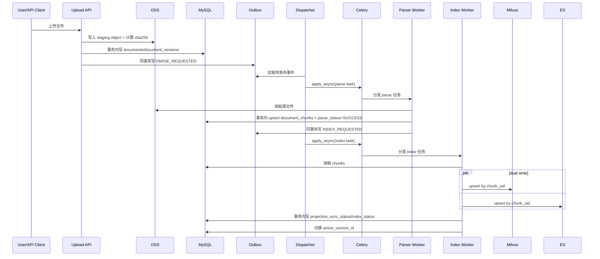
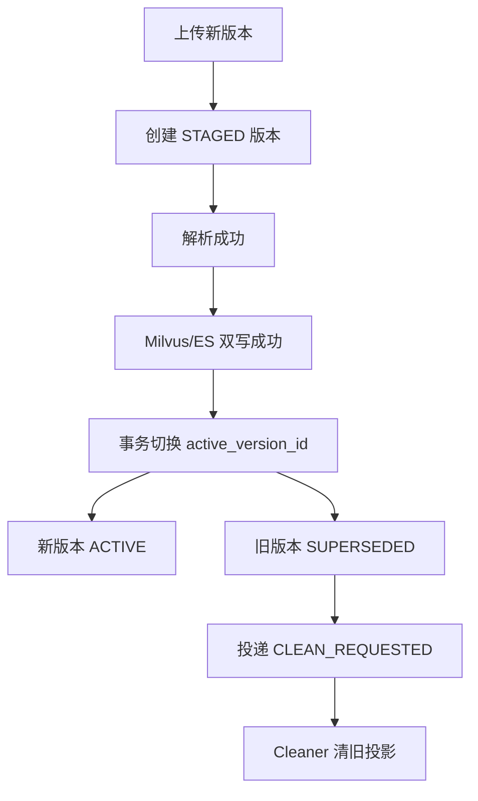
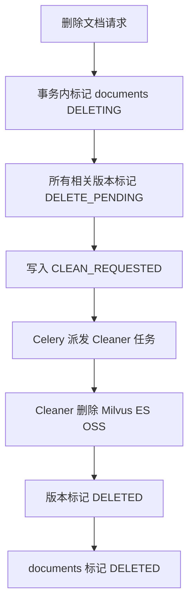
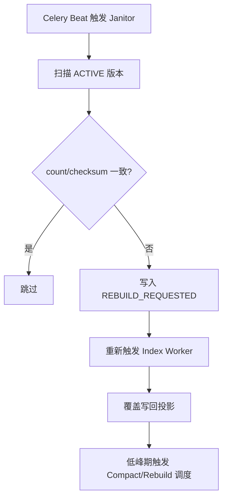
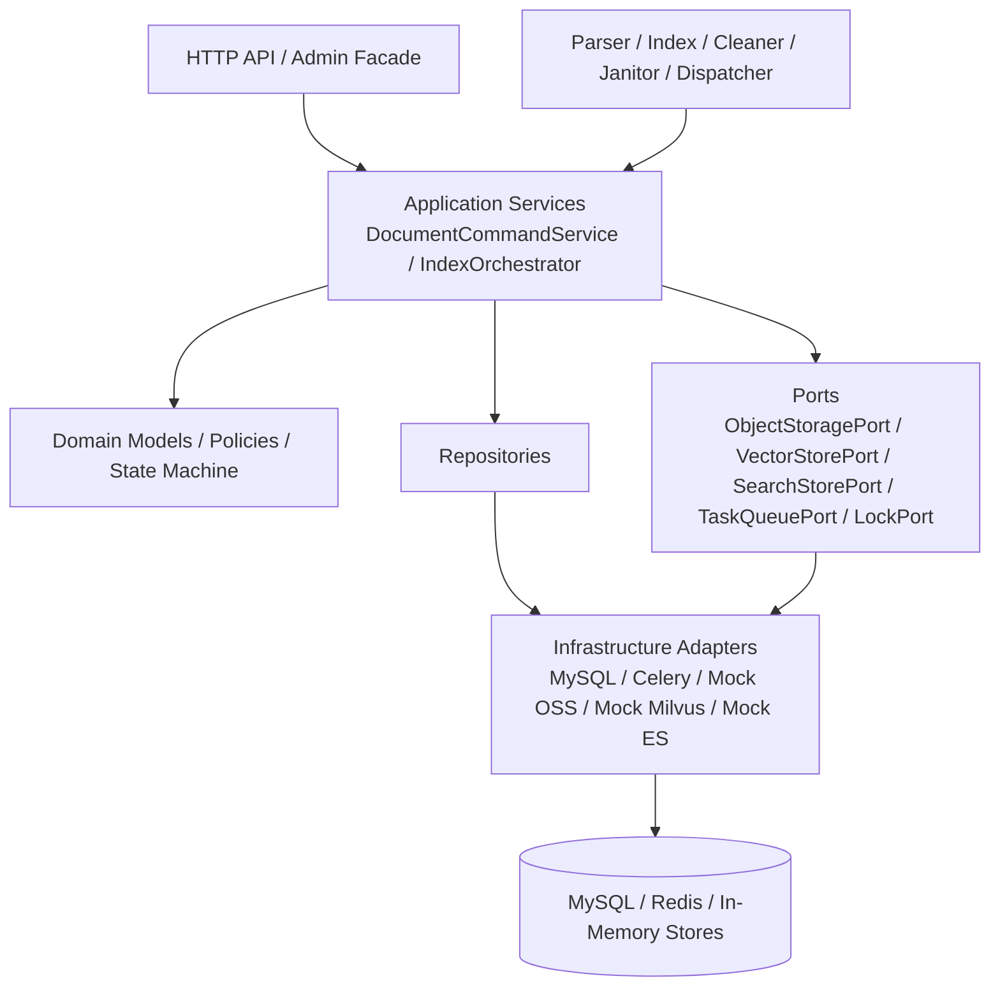

# Agentic RAG 数据库管理架构设计规划

## 1. 文档目的

本规划用于指导 `src/learning_common_lib/案例/实现AgenticRAG数据库管理` 目录下后续代码实现，目标不是一次性写满所有功能，而是先确定一套可落地、可扩展、可补偿、可演进的企业级骨架。

配套细化说明见：

1. [技术拆解：Chunk UID 与投影幂等](./技术拆解.md#chunk-identity)
2. [技术拆解：上传更新与影子切换](./技术拆解.md#upload-switch)
3. [技术拆解：Outbox 与 Celery](./技术拆解.md#outbox-queue)
4. [技术拆解：索引双写与激活切换](./技术拆解.md#index-commit)
5. [技术拆解：删除与清理](./技术拆解.md#delete-cleanup)
6. [技术拆解：Janitor 对账与索引维护](./技术拆解.md#janitor)
7. [技术拆解：锁策略与模块落地](./技术拆解.md#lock-strategy)
8. [技术拆解：Dispatcher 触发与在途版本策略](./技术拆解.md#dispatcher-trigger)
9. [技术拆解：Mock 并发安全与熔断降级](./技术拆解.md#mock-resilience)

本次规划优先解决以下问题：

1. MySQL、Milvus、ES、OSS 之间如何做一致性设计。
2. 文档上传、更新、删除时如何避免幽灵数据和新旧版本冲突。
3. 在 OSS/Milvus/ES 尚未启动的前提下，如何先用模拟模块把数据流和接口边界搭起来。
4. 在小规模 k8s 场景下，如何设计锁与并发控制。
5. 如何把当前仓库已有的 SQLAlchemy、Redis/Celery、统一异常处理经验复用进来。

## 2. 总体结论

推荐采用以下总体方案：

1. **MySQL 作为唯一真理源**。所有业务状态、版本状态、任务状态、补偿事件全部落 MySQL。
2. **Milvus 和 ES 视为投影层**。它们可以短暂落后，但最终必须从 MySQL 重建出来。
3. **文档采用“逻辑文档 + 不可变版本”模型**，不要直接在同一份文档记录上做原地覆盖。
4. **消息分发采用事务型 Outbox 思路**，避免“数据库事务成功但 Celery 任务没发出去”的双写不一致。
5. **核心状态流转靠 MySQL 事务 + 行锁/乐观锁保障**，而不是依赖 Redis 锁保证最终一致性。
6. **Redis 锁只负责跨 Pod 协调**，例如防止同一版本被多个 Worker 并发处理，或保障 Janitor 单实例执行。
7. **Parser / Index / Cleaner / Janitor 都要幂等**，任何阶段都要允许重复消费和重试。
8. **先用 Port + Adapter 架构抽象 OSS/Milvus/ES**，当前阶段提供内存模拟实现，未来替换真实服务时不改业务编排层。
9. **采用面向对象式热插拔接口**。每个模块在自己的子目录内维护对应抽象基类，例如存储模块、向量模块、仓储模块、服务模块分别定义自己的 `base.py` 或抽象接口文件，业务编排层只依赖这些模块级抽象协议。
10. **首版异步基座固定为 Celery + Redis Broker**。周期任务由 Celery Beat 调度，按队列拆 Worker Lane。
11. **Outbox 仍然保留**。即使改用 Celery，也不能在数据库事务里直接发任务，仍需先落 `outbox_events` 再由 Dispatcher 调用 Celery。
12. **Chunk 主键必须稳定可重建**。跨 MySQL、Milvus、ES 一律使用稳定 `chunk_uid`，禁止依赖数据库自增主键做投影主键。
13. **历史版本默认仅在 MySQL 中保留审计记录**。旧版本在激活切换后异步清理投影层，避免在线检索混入旧内容。
14. **Janitor 不只做对账**。还要负责索引维护任务的调度入口，例如低峰期触发 Compact / Rebuild。

## 3. 为什么不建议直接沿用“单表 documents + 先删后插”作为最终设计

参考文档中“更新时删除旧文档、插入新文档”的方向是对的，但如果只保留一张 `documents` 表，会遇到几个问题：

1. 版本历史不可审计，后续排查问题困难。
2. 文档更新时，很难清晰表达“新版本解析成功但索引未切换完成”的中间态。
3. 如果未来要支持灰度切换、回滚、对账、人工重建，单表模型会越来越脆弱。
4. 如果后续接入真正的查询服务，缺少版本实体会让“当前生效版本”与“历史归档版本”边界模糊。

因此本规划建议从一开始就把“逻辑文档”和“文档版本”拆开。

## 4. 推荐的领域模型

### 4.1 实体拆分

建议拆成以下几类核心实体：

1. **知识库** `knowledge_bases`
2. **逻辑文档** `documents`
3. **文档版本** `document_versions`
4. **文档切片** `document_chunks`
5. **投影同步状态** `projection_sync_status`
6. **事务型事件箱** `outbox_events`
7. **可选的任务执行记录** `pipeline_tasks`

### 4.2 设计原则

1. `documents` 表示一个业务上的“文档身份”，例如“员工手册”。
2. `document_versions` 表示该文档的某一个不可变版本，例如 V1、V2。
3. `document_chunks` 永远归属于某个具体版本，而不是逻辑文档。
4. Milvus / ES 中写入的数据也应该带上 `version_id`、`document_id`、`kb_id` 等元数据。
5. 查询层如果未来需要避免旧版本污染，应以 `active_version_id` 为准。

## 5. 表设计建议

以下是推荐的最小生产级表集合。当前仓库尚未引入 Alembic，示例阶段可以先用 SQLAlchemy 模型与 `create_all`，但模型设计要兼容未来迁移工具。

### 5.1 `knowledge_bases`

用途：知识库元数据。

关键字段建议：

- `id` bigint pk
- `kb_code` varchar(64) unique
- `name` varchar(128)
- `description` varchar(512)
- `status` enum(`ACTIVE`, `DISABLED`)
- `settings_json` json
- `row_version` bigint
- `created_at`
- `updated_at`

### 5.2 `documents`

用途：逻辑文档实体，不直接承载具体版本内容。

关键字段建议：

- `id` bigint pk
- `kb_id` bigint not null
- `external_doc_key` varchar(128) not null
- `title` varchar(256)
- `source_type` enum(`UPLOAD`, `API`, `URL`)
- `lifecycle_status` enum(`ACTIVE`, `DELETING`, `DELETED`)
- `active_version_id` bigint null
- `latest_version_no` int not null default 0
- `row_version` bigint not null default 0
- `created_at`
- `updated_at`
- `deleted_at` null

唯一约束建议：

- `unique(kb_id, external_doc_key)`

说明：

1. `external_doc_key` 用于表达业务唯一键，例如文件路径、业务方给的文档编码。
2. `active_version_id` 指向当前对外生效的版本。
3. `row_version` 用于乐观锁更新。

### 5.3 `document_versions`

用途：文档的不可变版本，是解析、索引、清理的主执行对象。

关键字段建议：

- `id` bigint pk
- `document_id` bigint not null
- `version_no` int not null
- `file_hash` char(64) not null
- `file_name` varchar(256)
- `file_size` bigint
- `mime_type` varchar(128)
- `storage_key` varchar(512) not null
- `parse_status` enum(`PENDING`, `RUNNING`, `SUCCESS`, `FAILED`)
- `index_status` enum(`PENDING`, `RUNNING`, `SUCCESS`, `FAILED`)
- `visibility_status` enum(`STAGED`, `ACTIVE`, `SUPERSEDED`, `DELETE_PENDING`, `DELETED`)
- `chunk_count` int not null default 0
- `parser_version` varchar(64)
- `parser_config_hash` char(64) not null
- `embedding_model` varchar(128)
- `retry_count` int not null default 0
- `row_version` bigint not null default 0
- `last_error_code` varchar(64) null
- `last_error_message` varchar(1024) null
- `created_at`
- `updated_at`

唯一约束建议：

- `unique(document_id, version_no)`
- `index(document_id, file_hash)`
- `index(parse_status, index_status, visibility_status)`

说明：

1. 上传新版本时新增一条 `document_versions`，不直接覆盖旧版本。
2. `visibility_status` 用于区分是否已对查询生效。
3. `parse_status` 和 `index_status` 分开存，便于表达中间状态与补偿。
4. `parser_config_hash` 记录切片规则、分词器、重叠长度等解析配置摘要，用于识别“配置变化导致的整版本重建”。
5. `row_version` 用于 Parser / Indexer / Cleaner 在并发更新版本状态时做乐观锁控制。

### 5.4 `document_chunks`

用途：MySQL 中保存解析后的结构化切片，是下游索引的事实来源。

关键字段建议：

- `id` bigint pk
- `version_id` bigint not null
- `chunk_uid` varchar(96) not null
- `chunk_no` int not null
- `chunk_hash` char(64) not null
- `content` mediumtext not null
- `token_count` int
- `char_count` int
- `metadata_json` json
- `created_at`
- `updated_at`

唯一约束建议：

- `unique(version_id, chunk_no)`
- `unique(chunk_uid)`
- `index(version_id)`

说明：

1. 切片内容建议保存在 MySQL，后续 Milvus / ES 可完全重建。
2. `chunk_hash` 可用于判断切片是否变化、做增量优化或审计。
3. `chunk_uid` 必须是稳定可重建的标识，例如 `chunk:{version_id}:{chunk_no}` 或等价的确定性键。
4. Milvus / ES 一律以 `chunk_uid` 为投影主键，不能直接依赖自增 `id`，否则重跑解析时容易出现旧投影残留。

### 5.5 `projection_sync_status`

用途：记录每个版本在每个投影库中的同步结果，不把 Milvus 与 ES 的结果混成一个字段。

关键字段建议：

- `id` bigint pk
- `version_id` bigint not null
- `sink_type` enum(`MILVUS`, `ES`)
- `sync_status` enum(`PENDING`, `RUNNING`, `SUCCESS`, `FAILED`, `DELETE_PENDING`, `DELETED`)
- `item_count` int not null default 0
- `checksum` char(64) null
- `last_synced_at` datetime null
- `retry_count` int not null default 0
- `row_version` bigint not null default 0
- `last_error_message` varchar(1024) null
- `created_at`
- `updated_at`

唯一约束建议：

- `unique(version_id, sink_type)`

说明：

1. 这是“投影层状态表”，用于细粒度对账与补偿。
2. 只有当 `MILVUS` 和 `ES` 都达到 `SUCCESS`，该版本才可切换为 `ACTIVE`。
3. `row_version` 用于多 Worker 并发补偿或 Janitor 修复时避免覆盖更新。

### 5.6 `outbox_events`

用途：解决 MySQL 事务提交后消息未发出的经典双写问题。

关键字段建议：

- `id` bigint pk
- `aggregate_type` enum(`DOCUMENT`, `DOCUMENT_VERSION`)
- `aggregate_id` bigint not null
- `event_type` enum(`PARSE_REQUESTED`, `INDEX_REQUESTED`, `CLEAN_REQUESTED`, `REBUILD_REQUESTED`, `MAINTENANCE_REQUESTED`)
- `dedupe_key` varchar(128) not null
- `queue_name` varchar(64) not null
- `task_name` varchar(128) not null
- `payload_json` json not null
- `publish_status` enum(`PENDING`, `SENT`, `FAILED`)
- `available_at` datetime not null
- `next_retry_at` datetime null
- `published_at` datetime null
- `created_at`
- `updated_at`

唯一约束建议：

- `unique(dedupe_key)`
- `index(publish_status, available_at)`

说明：

1. API 或 Worker 在事务内只负责写 MySQL 和 `outbox_events`。
2. 由单独 Dispatcher 把 `PENDING` 事件转换成 Celery `apply_async(...)` 调用；测试场景通过 `TaskQueuePort` 的内存实现模拟即可。
3. 这样可以避免“数据库更新成功，但任务没有入队”的一致性问题。
4. `publish_status=SENT` 的历史记录应由低频 housekeeping 任务定期清理或归档，避免 `outbox_events` 无限增长。

### 5.7 `pipeline_tasks`（可选，但推荐）

用途：记录任务执行历史、重试次数、死信状态，方便排障。

关键字段建议：

- `id` bigint pk
- `task_type` enum(`PARSE`, `INDEX`, `CLEAN`, `REPAIR`, `MAINTENANCE`)
- `target_version_id` bigint null
- `target_document_id` bigint null
- `dedupe_key` varchar(128) not null
- `queue_name` varchar(64) null
- `celery_task_id` varchar(64) null
- `status` enum(`PENDING`, `RUNNING`, `SUCCESS`, `FAILED`, `DEAD`)
- `attempt_count` int not null default 0
- `max_attempts` int not null default 8
- `next_retry_at` datetime null
- `last_error_message` varchar(1024) null
- `worker_id` varchar(128) null
- `started_at` datetime null
- `finished_at` datetime null
- `created_at`
- `updated_at`

唯一约束建议：

- `unique(dedupe_key)`

### 5.8 `file_hash` 与对象存储策略

这一块必须在规划阶段直接定死，否则实现时会出现“秒传”“去重”“清理归属”互相打架的问题。

首版建议规则：

1. `file_hash` 使用文件原始字节流的 `sha256`。
2. `file_hash` 的首要用途是判断**同一逻辑文档**是否发生内容变化，而不是把它当作 `documents` 的业务主键。
3. 同一个 `document_id` 如果上传了相同 `file_hash`，直接判定为幂等更新，返回当前活动版本，不再重复解析和索引。
4. 不同 `document_id` 即使 `file_hash` 相同，首版也**允许共存**，但不做跨文档版本复用，避免对象存储归属和删除引用计数复杂化。
5. OSS `storage_key` 首版按 `version_id` 维度命名，保证对象所有权清晰；不要首版就做按 `file_hash` 共享对象。
6. 如果未来要支持真正的跨文档秒传，再新增 `stored_objects` / `blob_objects` 表维护 `ref_count`，不要在首版隐式复用对象。

## 6. 状态机设计

### 6.1 文档级状态

`documents.lifecycle_status`

1. `ACTIVE`：文档可用
2. `DELETING`：用户发起删除，正在清理投影与文件
3. `DELETED`：逻辑删除完成

### 6.2 版本级状态

`document_versions` 建议拆成三组状态，而不是塞进一个字段：

1. 解析状态 `parse_status`
   - `PENDING`
   - `RUNNING`
   - `SUCCESS`
   - `FAILED`
2. 索引状态 `index_status`
   - `PENDING`
   - `RUNNING`
   - `SUCCESS`
   - `FAILED`
3. 可见性状态 `visibility_status`
   - `STAGED`
   - `ACTIVE`
   - `SUPERSEDED`
   - `DELETE_PENDING`
   - `DELETED`

### 6.3 推荐状态流转

上传新文档：

1. 创建 `documents`
2. 创建 `document_versions(parse=PENDING, index=PENDING, visibility=STAGED)`
3. Outbox 写入 `PARSE_REQUESTED`
4. Parser 成功后 `parse=SUCCESS`
5. Outbox 写入 `INDEX_REQUESTED`
6. Indexer 双写 Milvus / ES 成功后
7. 将该版本切换为 `ACTIVE`
8. 更新 `documents.active_version_id`

更新已有文档：

1. 先锁住 `documents` 行，检查该文档是否存在未完成的 `STAGED/RUNNING` 版本
2. 首版默认**不允许同一文档多个在途版本并行**
3. 如果已有在途版本，默认返回 `409 VERSION_IN_PROGRESS`，由客户端重试；后续如需“最新上传覆盖旧上传”，再单独补显式取消策略
4. 没有在途版本时，新建版本 `version_no + 1`
5. 新版本先走解析、索引
6. 新版本投影成功后，事务中切换 `documents.active_version_id`
7. 旧版本改为 `SUPERSEDED`
8. Outbox 写入旧版本 `CLEAN_REQUESTED`，异步清理旧版本投影
9. 旧版本 MySQL 记录默认保留，仅作为审计与排障依据，不再参与在线检索

删除文档：

1. `documents.lifecycle_status = DELETING`
2. 当前 `active_version_id` 或所有未清理版本打上 `DELETE_PENDING`
3. Outbox 写入 `CLEAN_REQUESTED`
4. Cleaner 清理 OSS / Milvus / ES
5. 清理成功后版本标记 `DELETED`
6. 文档标记 `DELETED`

## 7. 端到端数据流

### 7.1 上传新文档

建议流程：

1. API 接收文件流，边上传到 OSS staging key，边计算 `file_hash`
2. OSS staging 上传成功后，在事务中完成：
   - 查找/创建 `documents`
   - 做去重判断
   - 创建 `document_versions`
   - 写入 `outbox_events(PARSE_REQUESTED)`
3. 如果数据库事务失败，立即对 staging object 做 best-effort 回收
4. 事务提交后由业务层 best-effort 触发一次 Dispatcher
5. Celery Beat 每 5 秒兜底扫描一次 Outbox
6. Dispatcher 读取 Outbox 并投递解析任务
7. Parser 拉取文件、解析、切片，在一个事务中：
   - 覆盖写入该 `version_id` 的切片
   - 更新 `parse_status=SUCCESS`
   - 初始化或更新 `projection_sync_status`
   - 写入 `outbox_events(INDEX_REQUESTED)`
8. Indexer 读取切片，并发写 Milvus / ES
9. 两边都成功后，在事务中：
   - 更新两个 `projection_sync_status=SUCCESS`
   - 更新 `index_status=SUCCESS`
   - 切换 `documents.active_version_id`
   - 当前版本 `visibility=ACTIVE`
   - 旧版本（如有）改为 `SUPERSEDED`
   - 写入旧版本清理事件

补充约束：

1. `Parser` 生成切片时必须写入稳定 `chunk_uid`。
2. `Indexer` 只允许对 `parse_status=SUCCESS` 且 `index_status in (PENDING, FAILED)` 的版本执行。
3. 首版以 Celery 为统一异步任务载体；Dispatcher 的职责是从 Outbox 调用 Celery，而不是直接在事务里发任务。
4. `queue_name` 应在 Outbox 阶段就确定，例如 `parse_jobs`、`index_jobs`、`clean_jobs`、`repair_jobs`、`maintenance_jobs`。
5. 同一 `document_id` 在任意时刻只允许一个未完成的新版本处于在途状态。

### 7.2 更新文档

推荐采用“新版本影子构建，成功后切换”的方式，而不是“先删旧版本再写新版本”。

理由：

1. 不会产生检索空窗期。
2. 出错时仍保留旧版本可回退。
3. 更适合企业场景的问题排查与人工干预。
4. 能把“新版本是否已经对外生效”与“旧版本是否已经清干净”拆成两个独立步骤，降低并发切换风险。

### 7.3 删除文档

删除只做逻辑删除，不做同步强删。

建议流程：

1. 事务内先标记数据库状态
2. 通过 Outbox 投递清理任务
3. Cleaner 异步删除投影与对象存储
4. 清理成功后再更新数据库状态

### 7.4 对账修复

Janitor 定时执行：

1. 扫描 `index_status=SUCCESS` 且 `visibility=ACTIVE` 的版本
2. 比较：
   - MySQL `document_chunks.count`
   - Milvus `doc_id/version_id` 下向量数
   - ES `doc_id/version_id` 下索引数
3. 若发现数量不一致、校验和不一致、数据缺失：
   - 写入 `REBUILD_REQUESTED`
   - 重新触发 Indexer
4. 如果底层向量库长期频繁删改，Janitor 还要在低峰期调度 Compact / Rebuild Index 维护任务

## 8. 一致性设计

### 8.1 一致性的真正核心

核心不是“强行让 MySQL + Redis + Milvus + ES 在一个分布式事务里同时提交”，而是：

1. **MySQL 里状态转换必须正确**
2. **下游投影失败后必须可重试**
3. **所有任务必须幂等**
4. **所有外部系统都必须可从 MySQL 重建**

### 8.2 为什么要引入 Outbox

如果 API 事务里先写 MySQL，再直接发 Celery 任务，会存在以下问题：

1. MySQL 已提交，Celery 任务发送失败
2. Celery 任务已发出，但事务回滚

这两种情况都会造成数据流断裂。

因此更稳妥的方式是：

1. API/Worker 在同一个 MySQL 事务里只写业务数据和 `outbox_events`
2. Dispatcher 从 `outbox_events` 读待发送事件，再调用 Celery
3. 发成功后把 `publish_status` 改成 `SENT`

这样可以保证“要做的事情”至少在 MySQL 里有记录，不会凭空丢失。

### 8.3 为什么要把 Milvus 和 ES 的同步状态拆开

如果只维护一个 `index_status`，当 Milvus 成功、ES 失败时，系统不知道已经完成了哪一半。

因此建议：

1. 版本表保存总体索引状态
2. `projection_sync_status` 表保存每个投影库的明细状态

这样 Janitor 才能做细粒度修复。

### 8.4 幂等策略

必须保证以下幂等性：

1. 同一个版本重复解析，不会生成重复切片
2. 同一个版本重复写 Milvus / ES，不会出现重复数据
3. 同一个版本重复清理，不会抛出不可恢复错误
4. 同一个事件重复消费，只会推进一次有效状态机

具体建议：

1. `document_chunks` 以 `unique(version_id, chunk_no)` 约束去重
2. Milvus / ES 以稳定 `chunk_uid` 作为投影主键
3. 每个任务使用 `dedupe_key`
4. 状态流转使用“期望旧状态 -> 新状态”的更新条件

### 8.5 `file_hash` 规则

必须明确以下规则：

1. `file_hash` 只负责内容变更识别，不直接决定逻辑文档身份。
2. “秒传”只在同一逻辑文档内做幂等短路；不同文档之间不直接复用版本记录。
3. 首版不做跨文档对象存储复用，避免 Cleaner 删除时误伤其他文档引用。

### 8.6 `chunk_uid` 规则

必须明确以下规则：

1. `chunk_uid` 由确定性规则生成，例如 `chunk:{version_id}:{chunk_no}`。
2. Parser 重跑同一版本时，生成的 `chunk_uid` 必须完全一致。
3. Indexer 重建索引时，对 Milvus / ES 执行的是基于 `chunk_uid` 的 upsert，而不是 delete-all 后盲写。
4. Cleaner 删除旧版本投影时，优先按 `version_id` 或其下的 `chunk_uid` 集合清理。

### 8.7 `parser_config_hash` 规则

必须明确以下规则：

1. `parser_config_hash` 由切片大小、重叠长度、分词器版本、清洗规则、解析器版本等配置计算得到。
2. 同一版本重复解析时，如果发现当前解析配置与库中 `parser_config_hash` 不一致，不能直接做逐条 upsert。
3. 遇到配置变化时，应走“整版本重建”路径：重新生成 chunks、覆盖投影，必要时先清理旧投影再写入。
4. 如果系统希望保留旧解析策略结果，更稳妥的做法是创建新版本而不是原地重跑旧版本。

### 8.8 首版异步任务选型

首版建议直接固定为 `Celery + Redis Broker`：

1. 当前运行环境已经明确提供 Redis，Celery 可以直接复用。
2. Celery 自带任务重试、倒计时重试、队列路由、Worker Pool、Beat 定时调度，治理能力比直接操作 Redis Stream 更完整。
3. 当前仓库已经有可参考的 Celery 示例，团队理解和后续复用成本更低。
4. 代码层仍通过 `TaskQueuePort` 抽象，业务层不直接依赖 Celery API。

### 8.9 Dispatcher 触发策略

建议采用双保险模式：

1. 业务事务提交成功后，立即 best-effort 调用一次 Dispatcher，降低正常链路延迟。
2. Celery Beat 每 5 秒兜底扫描 `publish_status=PENDING` 且 `available_at <= now()` 的 Outbox 事件，防止瞬时异常导致事件滞留。
3. 立即触发失败不影响主事务结果，最终一致性仍由兜底扫描保障。
4. 另设一个低频 Beat 任务，例如每天 1 次，清理 `publish_status=SENT and published_at < now() - 7d` 的历史 Outbox 记录。

### 8.10 Celery 任务治理建议

建议至少固定以下策略：

1. 队列命名统一为 `parse_jobs`、`index_jobs`、`clean_jobs`、`repair_jobs`、`maintenance_jobs`。
2. 默认 Worker Pool 使用 `prefork`，因为 Parser、Cleaner、部分 SDK 调用和文档处理更接近同步阻塞模型。
3. 如果后续 Embedding 或外部调用明确是原生异步 IO，再为特定任务单独增加 aio lane，不影响主链路。
4. Janitor、Maintenance 等周期任务交给 Celery Beat 调度，不要自己再实现一套定时轮询器。
5. 对可重试异常配置统一重试策略，例如指数退避、最大重试次数和失败告警。
6. 默认重试基线可先采用“最大 5 次 + 指数退避 `60s, 120s, 240s, 480s, 960s`”，达到上限后落终态 `FAILED`，由人工或 Janitor 再决定是否重投。

### 8.11 熔断与降级建议

首版建议至少提供轻量级熔断能力：

1. 对 Embedding、Milvus、ES 分别维护连续失败计数。
2. 连续失败达到阈值后，短时间打开熔断，暂停继续消费对应高风险任务。
3. 熔断打开期间，任务不直接丢弃，而是使用 Celery `countdown` 延后重试。
4. 熔断恢复后优先处理积压任务，并记录恢复日志与告警。

## 9. 锁与并发控制设计

### 9.1 推荐结论

对于本项目的小规模 k8s 扩展场景，建议采用：

1. **MySQL 行锁/乐观锁负责核心一致性**
2. **Redis 分布式锁负责跨 Worker 抢占协调**

不要把 Redis 锁当成最终一致性的根基。

### 9.2 MySQL 负责什么

适合 MySQL 事务和锁解决的场景：

1. 同一文档是否可以创建新版本
2. 同一版本是否允许从 `PENDING` 进入 `RUNNING`
3. 切换 `active_version_id` 时的原子更新
4. 删除时文档与版本状态的原子变更

实现建议：

1. 更新关键状态时使用 `SELECT ... FOR UPDATE`
2. 或使用 `where id=? and row_version=?` 的乐观锁方式
3. 状态更新成功后 `row_version = row_version + 1`

### 9.3 Redis 负责什么

适合 Redis 锁解决的场景：

1. 防止两个 Pod 同时解析同一个 `version_id`
2. 防止两个 Pod 同时执行同一个 `INDEX` 任务
3. 防止多个 Janitor 实例同时全库扫描
4. 防止 Cleaner 重复处理同一个清理批次

锁 Key 建议：

1. `rag:parse:version:{version_id}`
2. `rag:index:version:{version_id}`
3. `rag:clean:version:{version_id}`
4. `rag:janitor:leader`

锁策略建议：

1. 使用短 TTL，例如 30s 到 300s
2. Worker 长任务需要心跳续租
3. 释放锁前校验 owner token

### 9.4 是否要用 Redlock

当前环境是单机 Docker Redis，未来目标是小规模 k8s。

本规划建议：

1. **核心数据状态不依赖 Redlock**
2. 对于调度协调，单 Redis `SET NX EX` 已足够
3. 如果后续 Redis 拓扑复杂，再评估是否升级锁实现

原因：

1. 业务状态已经以 MySQL 为真理源
2. Redis 锁只是减少重复执行，不是唯一正确性来源
3. 过早引入复杂分布式锁会增加理解和维护成本

## 10. 模块分层建议

建议采用偏 Hexagonal 的分层方式，让模拟实现与真实实现可替换。对于案例项目，目录应适度扁平化，避免为了理论完整度而出现过深层级。

参考详解见 [技术拆解：模块边界与代码目录](./技术拆解.md#module-layout)。

推荐边界：

1. `interface` 层只负责入参校验、响应封装、调用应用服务。
2. `application` 层负责编排事务、调用仓储、写 Outbox、触发状态流转。
3. `domain` 层承载状态机规则、幂等判断、版本切换策略。
4. `ports` 层只声明外部能力协议，不出现具体 Redis / Milvus / ES SDK 细节。
5. 每个模块在各自子目录中维护自己的抽象基类，不额外抽一个全局 `base` 层统一管理；目录层级控制在“可快速导航”的范围内。
6. `infrastructure` 层实现 MySQL、Celery、Mock Store、未来真实适配器。
7. `workers` 只是任务入口，不直接堆业务逻辑，真正逻辑落在应用服务中。

## 11. 当前仓库中的可复用经验

### 11.1 MySQL 层

可参考：

- `src/learning_common_lib/mysql_lession/examples/10_fastapi_integration`

建议复用点：

1. SQLAlchemy 2.x 异步引擎与 `async_sessionmaker`
2. Repository 模式
3. 生命周期中创建 Session Factory

### 11.2 异常体系

可参考：

- `src/learning_common_lib/python基础/exception教程/templates`

建议复用点：

1. 统一错误码
2. 统一异常基类
3. 对外响应和对内日志字段分离
4. Worker 层也沿用统一异常封装，避免散乱 `try/except`

### 11.3 异步任务与部署形态

可参考：

- `src/learning_common_lib/redis_lession/celery教程与Redlock/examples/04_async_worker_tasks`

建议复用点：

1. 按任务类型拆 Worker Lane
2. 同步任务、异步任务分离
3. 不把所有任务塞进一个 Worker 池
4. 首版直接采用 Celery，并优先参考 `prefork` 基线与按队列拆 Lane 的部署方式

## 12. 模拟实现设计

由于 OSS / Milvus / ES 当前不可用，建议先定义接口，再用内存版适配器模拟。异步任务层首版以 Celery 为准，同时保留内存版 `TaskQueuePort` 方便本地测试。

### 12.1 `ObjectStoragePort`

接口建议：

1. `put(storage_key, content)`
2. `get(storage_key)`
3. `delete(storage_key)`
4. `exists(storage_key)`

模拟实现：

- `dict[str, bytes]`
- 仅适用于单进程单测或 Celery eager / solo 场景；不适合 prefork 多进程集成测试

### 12.2 `VectorStorePort`

接口建议：

1. `upsert_chunks(version_id, records)`
2. `delete_by_version(version_id)`
3. `count_by_version(version_id)`
4. `query_by_version(version_id)`

模拟实现：

- `dict[str, VectorRecord]`，以 `chunk_uid` 为 key
- 如需提高 `count_by_version` 性能，可额外维护 `dict[int, set[str]]` 作为二级索引
- 如果需要多进程集成测试，建议改用 SQLite/File-backed mock，而不是普通进程内 dict

### 12.3 `SearchStorePort`

接口建议：

1. `upsert_chunks(version_id, docs)`
2. `delete_by_version(version_id)`
3. `count_by_version(version_id)`
4. `query_by_version(version_id)`

模拟实现：

- `dict[str, SearchRecord]`，以 `chunk_uid` 为 key
- 如需提高 `count_by_version` 性能，可额外维护 `dict[int, set[str]]` 作为二级索引
- 如果需要多进程集成测试，建议改用 SQLite/File-backed mock，而不是普通进程内 dict

### 12.4 `EmbeddingProvider`

接口建议：

1. `embed(texts: list[str]) -> list[list[float]]`

模拟实现：

1. 使用确定性伪向量
2. 相同文本生成相同向量
3. 便于测试幂等和重建逻辑

### 12.5 `TaskQueuePort`

接口建议：

1. `dispatch(task_name, payload, queue_name, countdown=None)`
2. `dispatch_batch(events)`
3. `schedule_periodic(task_name, schedule_name, payload)`
4. `revoke(task_id)`

建议实现：

1. `CeleryTaskQueueAdapter`：封装 `apply_async`、路由、重试参数和 Beat 注册。
2. `InMemoryTaskQueueAdapter`：用于测试，不依赖真实 Worker。
3. 对 Celery prefork 集成测试，优先使用 `task_always_eager=True`、`solo` pool 或持久化 mock，而不是依赖普通内存 dict 共享状态

## 13. Worker 设计建议

### 13.1 Parser Worker

职责：

1. 获取文件
2. 解析内容
3. 切片
4. 事务写入 MySQL
5. 投递索引事件

注意点：

1. Parser 不直接改 `active_version_id`
2. Parser 必须可重复执行
3. 再次执行时应覆盖同一版本切片，而不是追加
4. Parser 生成的 `chunk_uid` 必须稳定，确保重跑时投影层是 upsert 语义
5. 建议绑定到 `parse_jobs` 队列，默认使用 Celery `prefork` worker
6. 如果 `parser_config_hash` 变化，应拒绝原地增量重跑，改走整版本重建

### 13.2 Index Worker

职责：

1. 读取版本切片
2. 生成向量
3. 双写 Milvus / ES
4. 更新投影状态
5. 切换当前生效版本

注意点：

1. 不能只要 Milvus 成功就标记整体成功
2. 任一投影失败时，整体状态保持未完成
3. 必须记录明细失败原因
4. 对外部存储的写入主键统一使用 `chunk_uid`
5. 只有激活切换事务提交成功后，旧版本才允许进入清理队列
6. 建议绑定到 `index_jobs` 队列；如果后续 Embedding 明确是异步 IO，可单独拆 aio lane
7. 对 Embedding / Milvus / ES 连续失败应接入轻量级熔断，避免无效重试打爆下游

### 13.3 Cleaner Worker

职责：

1. 删除旧版本投影
2. 删除对象存储原文件
3. 更新版本和文档状态

注意点：

1. 清理是幂等操作
2. 删除不到数据不应该视为致命失败
3. 首版默认只清理旧版本投影和原始对象，不物理删除 MySQL 历史版本记录
4. 建议绑定到 `clean_jobs` 队列

### 13.4 Janitor Worker

职责：

1. 周期性对账
2. 修复缺失索引
3. 清理幽灵数据

注意点：

1. Janitor 需要单实例领导者锁
2. 对账不要一次全表扫到底，可以分页或按时间窗口扫描
3. 除了 count/checksum 对账，还要预留向量索引 Compact / Rebuild 调度入口
4. 建议由 Celery Beat 周期触发，实际执行放到 `repair_jobs` 或 `maintenance_jobs` 队列

## 14. API 设计建议

当前阶段建议先提供管理类 API，不急着做查询问答 API。

建议的最小接口：

1. `POST /knowledge-bases`
2. `POST /knowledge-bases/{kb_id}/documents/upload`
3. `POST /documents/{document_id}/versions`
4. `DELETE /documents/{document_id}`
5. `GET /documents/{document_id}`
6. `GET /documents/{document_id}/versions`
7. `POST /versions/{version_id}/rebuild`
8. `GET /versions/{version_id}/sync-status`

## 15. 实施顺序建议

建议分四个阶段推进。

### 阶段 1：基础骨架

1. 建立目录结构
2. 建立配置、枚举、异常、数据库连接
3. 建立 SQLAlchemy 模型
4. 建立 Mock OSS / Milvus / ES
5. 确定 Dispatcher 立即触发 + Beat 兜底机制

交付标准：

1. 模型可初始化
2. Mock 适配器可独立测试

### 阶段 2：核心写路径

1. 完成上传 API
2. 完成 Parser Service / Worker
3. 完成 Index Service / Worker
4. 完成 Outbox Dispatcher + Celery Task Adapter

交付标准：

1. 上传后可跑完整解析与索引链路
2. MySQL 状态流转正确
3. Mock Milvus / ES 中能看到投影结果

### 阶段 3：更新、删除、补偿

1. 完成版本切换
2. 完成旧版本清理
3. 完成删除流程
4. 完成 Janitor 对账修复

交付标准：

1. 文档更新不会产生新旧混检
2. 删除后不会残留幽灵数据
3. 故障后可通过 Janitor 修复

### 阶段 4：工程化加固

1. 增加测试覆盖
2. 增加日志、链路 ID、指标
3. 增加故障注入测试
4. 预留真实 OSS / Milvus / ES 适配器替换点

交付标准：

1. 关键链路有单测与集成测试
2. 幂等、重试、补偿场景可复现

## 16. 我建议在实现阶段优先坚持的几个取舍

1. **优先把状态机和幂等做对**，不要先追求“看起来很完整”的功能面。
2. **优先做 Outbox**，否则后面补一致性会越来越难。
3. **优先做版本模型**，不要一开始偷懒把更新直接覆盖成单记录。
4. **锁策略以简单可解释为主**，小规模 k8s 不要过度设计。
5. **先把模块级抽象接口和 Celery 路由做稳**，后续热插拔和异步治理都会轻松很多。
6. **先把模拟适配器跑顺**，再替换真实 OSS / Milvus / ES。

## 17. 首版默认业务决策

为避免后续代码实现时再反复返工，首版建议直接采用以下默认决策：

1. 历史版本默认只在 MySQL 中保留审计与排障记录，不在 Milvus / ES 中长期保留在线投影。
2. 知识库内允许“同内容不同逻辑文档”共存，但首版不做跨文档秒传和对象复用。
3. 首版只实现管理链路和索引链路，不实现问答查询 API；查询侧后续统一基于 `active_version_id` 过滤。
4. 首版异步任务固定采用 Celery + Redis Broker，周期任务使用 Celery Beat。

## 18. 本次规划的最终落地建议

如果直接进入代码实现，我建议下一步按下面顺序做：

1. 先落目录骨架与 ORM 模型
2. 再落模块级抽象接口 + Outbox + Celery 适配器
3. 再落上传、解析、索引主链路
4. 最后补删除、Janitor、修复链路

这条路径能最大化降低返工，并且最早验证“数据一致性设计”是否真的可运行。
