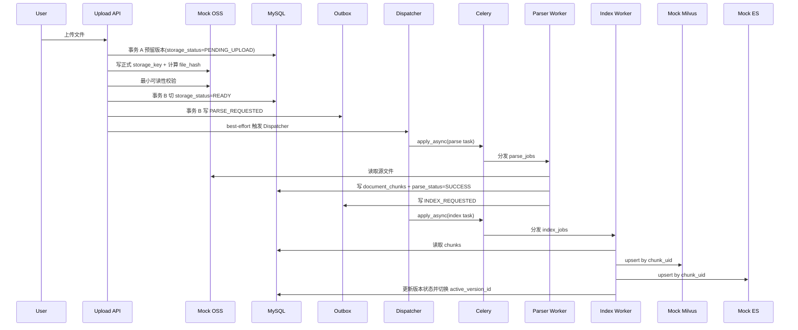
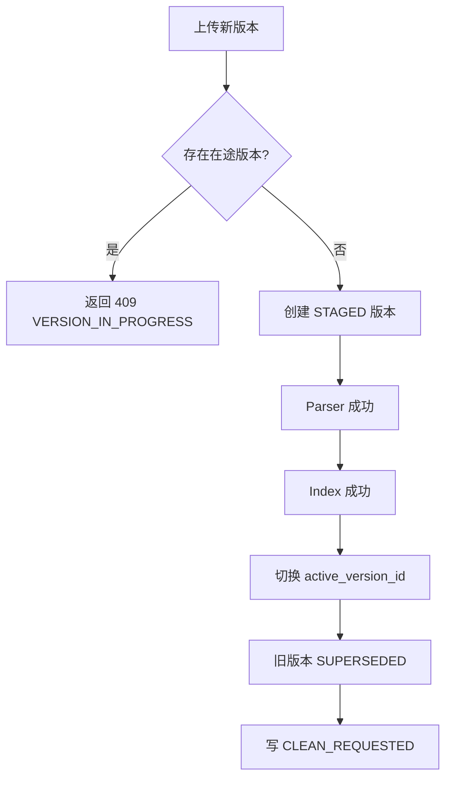
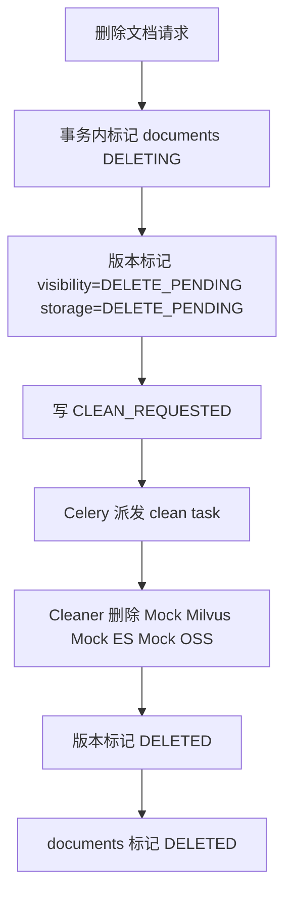
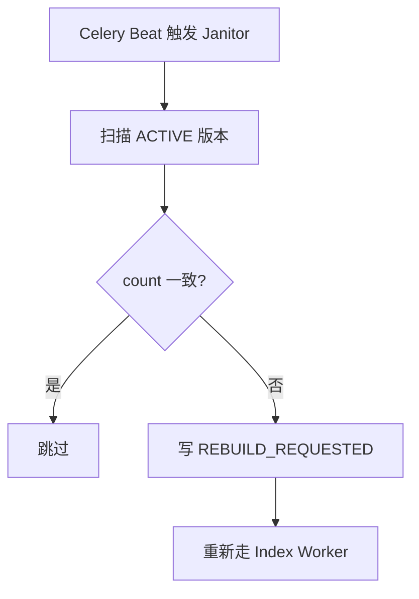

# Agentic RAG 数据库管理架构设计规划（缩减版）

## 0. 环境
1. Python 3.11，由 uv run 管理运行
2. MySQL 8.0+, 账号：`root`，密码：`123456`
3. redis stack 7.0+, 账号: `default`，密码：`123456`
4. Milvus ES 向量化等均使用模拟数据

## 1. 文档定位

本文件是面向“尽快跑通全链路”的缩减版规划。

它不是对 [架构设计规划](./架构设计规划.md) 的摘要版，也不是把原文简单删短，而是重新定义一套**首版最小可运行方案**：

1. 功能上缩减，优先打通上传 -> 解析 -> 索引 -> 激活 -> 删除 -> 修复这条链路。
2. 模块上不缺块，仍然保留 MySQL、Redis、Celery、Outbox、Mock OSS、Mock Milvus、Mock ES、Janitor、Cleaner 等模块。
3. 表设计、服务数量、状态字段做适度折叠，避免首版骨架过重。

如果后续需要升级为完整版，请参考：

1. [完整版规划](./架构设计规划.md)
2. [技术拆解](./技术拆解.md)
3. [技术拆解：Chunk UID 与投影幂等](./技术拆解.md#chunk-identity)
4. [技术拆解：Dispatcher 触发机制](./技术拆解.md#dispatcher-trigger)
5. [技术拆解：索引双写与补偿](./技术拆解.md#index-commit)
6. [技术拆解：Janitor 对账与索引维护](./技术拆解.md#janitor)

## 2. 缩减目标

缩减版只追求下面这件事：

1. 用户上传文件后，能写入 MySQL 元数据。
2. Outbox 产生事件并被 Dispatcher 转成 Celery 任务。
3. Parser 读取文件、切片、写入 `document_chunks`。
4. Index Worker 把 chunks 写入 Mock Milvus / Mock ES。
5. 成功后切换活动版本，保证查询侧只看新版本。
6. 删除文档时能异步清理投影与源文件。
7. Janitor 能做最基础的 count 对账，并在发现缺失时触发重建。
8. 至少提供一组最小管理/调试接口，能查看状态、触发重建、查看 Outbox 滞留。

缩减版不追求的内容：

1. 多知识库管理 UI / API
2. 复杂任务审计表
3. 独立的投影明细状态表
4. 复杂死信中心
5. 向量索引维护调度矩阵
6. 细粒度批次级补偿和人工运维控制台

## 3. 保留模块与缩减原则

首版仍然保留这些模块，但功能做缩减：

1. `MySQL`
说明：仍是唯一真理源，但只保留首版必须的 4 张表。

2. `Redis`
说明：仍然保留，首版主要承担 Celery broker / backend 与轻量级锁。

3. `Celery`
说明：仍然保留，继续作为异步任务总线，不退回同步串行调用。

4. `Outbox`
说明：仍然保留，避免事务里直接发 Celery 任务。

5. `Mock OSS / Mock Milvus / Mock ES`
说明：仍然保留，但首版优先考虑可跨进程测试的 mock 形式，不强依赖普通进程内 dict。

6. `Parser / Index / Cleaner / Janitor`
说明：4 类 Worker 都保留，但职责各自收窄。

7. `模块级抽象基类`
说明：仍然保留“热插拔接口”的做法，但每个模块只维护自己的基类，不抽全局 `base` 总父类。

## 4. 首版主动删减项

这部分是缩减版和完整版的关键差异，不要忽略。

### 4.1 删掉 `knowledge_bases` 表

首版不建 `knowledge_bases` 表。

替代方案：

1. 代码层固定 `DEFAULT_KB_CODE = "default"`。
2. 上传、更新、删除全部默认落到这个单一知识库。
3. 如果后续确实需要多知识库，再回到 [完整版规划](./架构设计规划.md) 中的多知识库模型。

### 4.2 删掉 `pipeline_tasks` 表

首版不建 `pipeline_tasks` 表。

替代方案：

1. 任务执行记录先靠 `outbox_events` 承接。
2. 运行日志中必须带 `dedupe_key`、`event_type`、`version_id`、`celery_task_id`。
3. 如果后续排障压力上来，再升级为独立任务执行表。

### 4.3 把 `projection_sync_status` 折叠回 `document_versions`

首版不建独立的 `projection_sync_status` 表。

替代方案：

1. 在 `document_versions` 上直接增加 `milvus_status` 和 `es_status`。
2. 对于中小规模、单文档级修复，这已经足够。
3. 如果后续需要更细粒度的补偿和审计，再升级回完整版中的独立投影状态表。

### 4.4 Janitor 先只做最基础修复

首版的 Janitor 只负责：

1. 扫描 `ACTIVE` 版本
2. 对比 MySQL chunk 数与 Mock Milvus / Mock ES count
3. 数量不一致时投递 `REBUILD_REQUESTED`

首版暂不做：

1. checksum 对账
2. Compact / Rebuild Index 运维任务编排
3. 热点分层扫描策略

如需这些增强能力，参考 [技术拆解：Janitor 对账与索引维护](./技术拆解.md#janitor)。

## 5. 缩减后的最小数据模型

缩减版建议只保留 4 张表。

### 5.1 `documents`

用途：逻辑文档实体。

关键字段建议：

- `id` bigint pk
- `external_doc_key` varchar(128) not null
- `title` varchar(256)
- `lifecycle_status` enum(`ACTIVE`, `DELETING`, `DELETED`)
- `active_version_id` bigint null
- `latest_version_no` int not null default 0
- `row_version` bigint not null default 0
- `created_at`
- `updated_at`
- `deleted_at` null

唯一约束建议：

- `unique(external_doc_key)`

说明：

1. 首版默认只有一个知识库，不再加 `kb_id` 外键。
2. 如果后续需要多知识库，可以补 `kb_code` 或回到完整版的 `knowledge_bases` 方案。

### 5.2 `document_versions`

用途：文档不可变版本，也是 Parser / Index / Cleaner 的执行主对象。

关键字段建议：

- `id` bigint pk
- `document_id` bigint not null
- `version_no` int not null
- `file_hash` char(64) not null
- `file_name` varchar(256)
- `file_size` bigint
- `mime_type` varchar(128)
- `storage_key` varchar(512) not null
- `storage_status` enum(`PENDING_UPLOAD`, `READY`, `DELETE_PENDING`, `DELETED`, `FAILED`)
- `parse_status` enum(`PENDING`, `RUNNING`, `SUCCESS`, `FAILED`)
- `index_status` enum(`PENDING`, `RUNNING`, `SUCCESS`, `FAILED`)
- `milvus_status` enum(`PENDING`, `SUCCESS`, `FAILED`, `DELETED`)
- `es_status` enum(`PENDING`, `SUCCESS`, `FAILED`, `DELETED`)
- `visibility_status` enum(`STAGED`, `ACTIVE`, `SUPERSEDED`, `DELETE_PENDING`, `DELETED`)
- `chunk_count` int not null default 0
- `parser_version` varchar(64)
- `parser_config_hash` char(64) not null
- `embedding_model` varchar(128)
- `last_error_message` varchar(1024) null
- `retry_count` int not null default 0
- `row_version` bigint not null default 0
- `created_at`
- `updated_at`

唯一约束建议：

- `unique(document_id, version_no)`
- `index(document_id, file_hash)`
- `index(parse_status, index_status, visibility_status, storage_status)`

说明：

1. `milvus_status` 和 `es_status` 折叠了完整版中的 `projection_sync_status` 表。
2. `parser_config_hash` 必须保留，避免切片配置变化时出现静默错误覆盖。
3. 同一 `document_id` 首版只允许一个未完成的新版本处于在途状态。
4. `file_size` 和 `mime_type` 成本很低，但对上传校验、解析策略选择和基础审计非常实用，不建议在缩减版里删除。
5. `storage_status` 用于约束对象是否已经可读、是否进入删除流程，以及避免 Cleaner/Parser 对错误状态对象误操作。
6. 对于 demo 落地，建议显式保留 `PENDING_UPLOAD -> READY` 过渡状态：先预留版本号和正式 `storage_key`，再写对象、校验对象，最后投递 `PARSE_REQUESTED`。
7. `storage_key` 首版直接按 `document_id/version_no` 维度命名，不做按 `file_hash` 共享对象。

### 5.3 `document_chunks`

用途：MySQL 中的切片事实表。

关键字段建议：

- `id` bigint pk
- `version_id` bigint not null
- `chunk_uid` varchar(96) not null
- `chunk_no` int not null
- `chunk_hash` char(64) not null
- `content` mediumtext not null
- `metadata_json` json
- `created_at`
- `updated_at`

唯一约束建议：

- `unique(version_id, chunk_no)`
- `unique(chunk_uid)`
- `index(version_id)`

说明：

1. `chunk_uid` 继续沿用完整版方案，不能退回数据库自增主键。
2. 详见 [技术拆解：Chunk UID 与投影幂等](./技术拆解.md#chunk-identity)。

### 5.4 `outbox_events`

用途：事务内落待发布事件，再由 Dispatcher 调用 Celery。

关键字段建议：

- `id` bigint pk
- `aggregate_type` enum(`DOCUMENT`, `DOCUMENT_VERSION`)
- `aggregate_id` bigint not null
- `event_type` enum(`PARSE_REQUESTED`, `INDEX_REQUESTED`, `CLEAN_REQUESTED`, `REBUILD_REQUESTED`)
- `queue_name` varchar(64) not null
- `task_name` varchar(128) not null
- `dedupe_key` varchar(128) not null
- `payload_json` json not null
- `publish_status` enum(`PENDING`, `SENT`, `FAILED`)
- `available_at` datetime not null
- `next_retry_at` datetime null
- `published_at` datetime null
- `created_at`
- `updated_at`

唯一约束建议：

- `unique(dedupe_key)`
- `index(publish_status, available_at)`

说明：

1. 首版所有任务流转都依赖这张表。
2. 不再额外建 `pipeline_tasks`，日志和 `outbox_events` 共同承担任务追踪。
3. `publish_status=SENT` 的历史记录不能无限保留；建议由 Celery Beat 每日清理 `published_at < now() - 7d` 的记录。

## 6. 缩减后的模块职责

缩减版模块仍然齐全，但职责尽量收敛。

### 6.1 `DocumentCommandService`

只负责：

1. 上传文件
2. 创建新文档或新版本
3. 删除文档
4. 事务提交后 best-effort 触发 Dispatcher

首版不负责：

1. 多知识库路由
2. 批量导入
3. 灰度切换策略

首版约束：

1. 更稳妥的 demo 落地是分成两个事务：事务 A 预留版本记录并写 `storage_status=PENDING_UPLOAD`，事务外写正式对象并做最小可读性校验，事务 B 再切到 `READY` 并写 `PARSE_REQUESTED`。
2. 如果数据库事务失败，要对已上传对象做 best-effort 删除，避免遗留无主对象。
3. 同一逻辑文档上传与当前活动版本相同 `file_hash` 时，直接短路返回当前活动版本，不重复解析与索引。

### 6.2 `OutboxDispatcherService`

只负责：

1. 扫描 `publish_status=PENDING`
2. 调用 Celery `apply_async(...)`
3. 标记 `outbox_events.publish_status=SENT`

首版触发机制：

1. 业务事务提交后立即 best-effort 触发一次
2. `Celery Beat` 每 5 秒兜底扫描一次

详见 [技术拆解：Dispatcher 触发机制](./技术拆解.md#dispatcher-trigger)。

补充规则：

1. `Celery Beat` 还应提供一个低频 housekeeping 任务，例如每天 1 次，用于清理历史 `SENT` 状态的 outbox 记录。
2. 清理条件建议为 `publish_status=SENT and published_at < now() - 7d`。
3. 这不是主链路阻塞项，但必须在首版文档里明确，避免 `outbox_events` 无限制增长。

### 6.3 `ParsePipelineService`

只负责：

1. 读取 Mock OSS 文件
2. 解析文本
3. 按固定配置切片
4. 事务写入 `document_chunks`
5. 更新 `parse_status`
6. 写 `INDEX_REQUESTED`

首版约束：

1. `parser_config_hash` 不允许缺失
2. 配置变化时走整版本重建，不做静默增量 upsert
3. 默认最大重试 5 次，指数退避基线 `60s, 120s, 240s, 480s, 960s`
4. 达到重试上限后，版本标记 `parse_status=FAILED`，等待人工重试或 Janitor 后续介入

### 6.4 `IndexPipelineService`

只负责：

1. 读取 `document_chunks`
2. 调用 EmbeddingProvider
3. 双写 Mock Milvus / Mock ES
4. 更新 `milvus_status` / `es_status`
5. 更新 `index_status`
6. 切换 `documents.active_version_id`
7. 为旧版本写 `CLEAN_REQUESTED`

首版不拆出独立 `VersionActivationService`。

默认重试基线：

1. 最大重试 5 次
2. 指数退避基线 `60s, 120s, 240s, 480s, 960s`
3. 达到上限后标记 `index_status=FAILED`
4. `milvus_status` 或 `es_status` 保留最后失败结果，供 Janitor 再决定是否重建

### 6.5 `CleanupService`

只负责：

1. 删除旧版本投影
2. 删除文档源文件
3. 回写版本/文档状态

首版不做：

1. 历史版本归档策略
2. 多存储后端清理编排

缩减版默认策略：

1. 当前 `ACTIVE` 版本源文件默认保留，保证 Janitor 重建和排障仍有原始输入。
2. `SUPERSEDED` 旧版本在 Cleaner 成功后删除其源文件。
3. 删除整个逻辑文档时，清理该文档下所有版本对象。

### 6.6 `JanitorService`

只负责：

1. 扫描 `ACTIVE` 版本
2. 对比 chunk count
3. 投递 `REBUILD_REQUESTED`

首版不做：

1. checksum 对账
2. 索引维护调度
3. 复杂失败窗口扫描

## 7. 缩减版数据流

### 7.1 上传 -> 解析 -> 索引 -> 激活



补充规则：

1. `PARSE_REQUESTED` 只能在对象上传成功且 `storage_status=READY` 后写入。
2. 如果事务 A 已提交但对象写入或校验失败，版本应落为 `storage_status=FAILED`，不能继续保持“假装在途”。
3. 如果 MySQL 事务失败，`DocumentCommandService` 要 best-effort 删除刚写入的对象，避免无主文件。
4. 在线查询接口读取内容时，必须以 `documents.active_version_id` 为准；管理/调试接口可以按 `version_id` 直读单版本状态。

### 7.2 更新文档



### 7.3 删除文档



### 7.4 Janitor 修复



## 8. 缩减版保留的关键规则

这些规则不能因为做“缩减版”就被删掉。

### 8.1 Outbox 不能省

即使首版功能缩减，`Outbox + Celery` 这条线也不能删。

原因：

1. 一旦在数据库事务里直接发 Celery 任务，就重新回到了经典双写不一致问题。
2. 这块是架构正确性的底线，不属于“可随便缩减”的部分。

### 8.2 `chunk_uid` 不能退化

缩减版仍然必须坚持：

1. `chunk_uid` 稳定生成
2. Mock Milvus / Mock ES 以 `chunk_uid` 为主键
3. 重建索引时按 `chunk_uid` 覆盖

### 8.3 单文档只允许一个在途版本

首版不支持多个 `STAGED` 版本并行。

原因：

1. 这样最容易保证状态机简单
2. 这样最容易跑通全链路
3. 这样最不容易引入“后来上传把前面上传冲掉”的边界 bug

详见 [技术拆解：单文档在途版本策略](./技术拆解.md#inflight-version)。

### 8.4 `parser_config_hash` 不能省

这不是高级功能，而是为了防止错误重建。

如果切片配置变了却还按旧 `chunk_uid` 逻辑硬 upsert，后面排障会非常痛苦。详见 [技术拆解：parser_config_hash 与整版本重建](./技术拆解.md#parser-config-rebuild)。

### 8.5 Mock 必须考虑 Celery 进程模型

首版如果要真正跑通 API + Celery Worker 两个进程，普通内存 dict 不够稳。

建议直接采用下面三选一：

1. `Celery eager` 模式跑单进程链路
2. `solo` 模式做单进程验证
3. SQLite / file-backed mock 适配器做多进程联调

详见 [技术拆解：Mock 并发安全与测试模式](./技术拆解.md#mock-test-mode)。

### 8.6 Outbox 历史记录不能无限增长

缩减版虽然功能收窄，但 `outbox_events` 仍然会持续增长。

首版建议直接固定：

1. `publish_status=SENT` 且 `published_at < now() - 7d` 的记录，由 Celery Beat 每日清理。
2. `PENDING/FAILED` 记录不允许被清理任务误删。
3. 如果后续需要长期审计，再把清理策略升级成“归档后删除”。

### 8.7 `file_hash` 与对象就绪规则

缩减版不引入复杂对象归档表，但这几条规则仍然必须写死：

1. `file_hash` 只用于同一逻辑文档内的内容变更识别，不决定逻辑文档身份。
2. `storage_key` 按版本维度命名，不做跨文档对象共享，也不做按 hash 共享对象。
3. demo 更推荐显式经过 `PENDING_UPLOAD -> READY`：先预留正式 `storage_key`，再写对象，最后再写 `PARSE_REQUESTED`。
4. 如果上传成功但事务失败，必须对对象做 best-effort 回收，避免产生“OSS 里有文件、MySQL 里无版本”的孤儿对象。
5. 如果对象写入或校验失败，版本应进入 `storage_status=FAILED`，便于运维接口可见。
6. Cleaner 删除对象时只能按版本归属处理，不能按 `file_hash` 猜测复用关系。

### 8.8 查询与激活契约

即使缩减版暂不实现完整问答 API，也必须把读路径边界写清楚：

1. 在线查询接口一律以 `documents.active_version_id` 作为当前生效版本依据。
2. 管理/调试接口可以按 `version_id` 查看状态，但不能因此绕过 `ACTIVE` 过滤参与在线检索。
3. `SUPERSEDED`、`DELETE_PENDING`、`DELETED` 版本即使投影尚未完全清干净，也不允许参与在线检索。
4. 只有当 `milvus_status=SUCCESS` 且 `es_status=SUCCESS` 时，Indexer 才能切换 `active_version_id`。
5. Janitor 触发 `REBUILD_REQUESTED` 只负责重建目标版本投影，不负责隐式切换活动版本。

### 8.9 上传与资源保护基线

企业级 demo 不要求做满配安全体系，但至少要把最小保护边界定死：

1. 首版默认只支持 `text/plain`、`text/markdown`、`application/pdf` 三类 MIME；不支持类型返回 `415 UNSUPPORTED_MEDIA_TYPE`。
2. 单文件大小建议固定上限，例如 `20MB`；超限返回 `413 FILE_TOO_LARGE`。
3. Parse / Index 默认最大重试 5 次，达到上限后落 `FAILED`，不能无限重试。
4. Embedding、Mock Milvus、Mock ES 出现连续失败时，只允许走指数退避和 `countdown` 延后重试，不允许紧密死循环重打下游。

### 8.10 可观测性与人工干预最小要求

缩减版可以没有完整运维控制台，但不能没有最小排障抓手：

1. 结构化日志至少带 `trace_id`、`document_id`、`version_id`、`dedupe_key`、`event_type`、`celery_task_id`。
2. 至少暴露 4 类指标或等价统计：`outbox_pending_count`、`parse_failed_count`、`index_failed_count`、`rebuild_requested_count`。
3. 至少提供“查看版本状态”“手动触发版本重建”“查看 Outbox 滞留”三种人工干预入口。
4. 这些能力可以先通过简单管理 API 或 CLI 提供，不要求首版就做前端控制台。

## 9. 缩减版接口与抽象

模块不删，但每个模块只保留最少接口。

### 9.1 `ObjectStoragePort`

首版只保留：

1. `put`
2. `get`
3. `delete`

### 9.2 `VectorStorePort`

首版只保留：

1. `upsert_chunks`
2. `delete_by_version`
3. `count_by_version`

### 9.3 `SearchStorePort`

首版只保留：

1. `upsert_chunks`
2. `delete_by_version`
3. `count_by_version`

### 9.4 `TaskQueuePort`

首版只保留：

1. `dispatch`
2. `dispatch_batch`

周期任务注册先交给 Celery 配置，不急着抽成更复杂的调度接口。

### 9.5 `DistributedLockPort`

首版只保留：

1. `try_lock`
2. `release`

首版建议只先用于：

1. `rag:parse:version:{version_id}`
2. `rag:index:version:{version_id}`
3. `rag:janitor:leader`

### 9.6 最小管理与运维接口

为了让 demo 具备可排障性，建议至少补下面这些接口：

1. `GET /documents/{document_id}`：查看文档状态、`active_version_id`、最新版本号。
2. `GET /versions/{version_id}`：查看 `parse/index/milvus/es/storage/visibility` 状态与最后错误。
3. `POST /versions/{version_id}/rebuild`：手动触发版本重建。
4. `GET /ops/outbox/pending`：查看滞留的 `PENDING/FAILED` Outbox 事件。
5. `POST /ops/outbox/dispatch`：手动触发一次 Dispatcher 兜底扫描。
6. `GET /admin/stats` 或等价接口：返回最小统计值，如 `outbox_pending_count`、`parse_failed_count`、`index_failed_count`、`active_version_count`。

## 10. 缩减版目录建议

为了案例项目易导航，目录建议控制在扁平结构：

```text
src/learning_common_lib/案例/实现AgenticRAG数据库管理/
├── api/
├── services/
├── ports/
├── repositories/
├── infrastructure/
├── workers/
```

说明：

1. 模块还在，但目录更扁平。
2. 每个模块继续维护自己的基类，不抽全局 `base` 层。
3. 如果后续模块膨胀，再回到 [技术拆解](./技术拆解.md#module-layout) 中更完整的目录分层。

## 11. 缩减版实施顺序

### 阶段 1：最小骨架

只做：

1. 4 张表
2. Celery app
3. Redis broker
4. Outbox Dispatcher
5. Mock OSS / Mock Milvus / Mock ES
6. 模块级基类与最小 Port

交付标准：

1. 能建表
2. 能发 Celery 任务
3. Mock 模块能独立通过最基本测试

### 阶段 2：主链路跑通

只做：

1. 上传 API
2. Parse Worker
3. Index Worker
4. 活动版本切换

交付标准：

1. 上传后能自动完成 parse/index
2. `documents.active_version_id` 正确切换
3. Mock Milvus / Mock ES 中能查到新版本 chunks

### 阶段 3：删除与修复

只做：

1. 删除 API
2. Cleaner Worker
3. Janitor Worker
4. `REBUILD_REQUESTED`
5. 最小管理/运维接口
6. 结构化日志与基础指标

交付标准：

1. 删除后投影能清理
2. Janitor 能发现 count 不一致并触发重建
3. 能通过接口查看失败版本、重建版本、查看 Outbox 滞留
4. 日志和指标足以定位主链路失败点

### 阶段 4：再向完整版靠拢

等主链路稳定后，再考虑补：

1. `knowledge_bases`
2. `pipeline_tasks`
3. `projection_sync_status`
4. checksum 对账
5. 更复杂的维护任务

## 12. 企业级 Demo 最小验收场景

如果希望这份缩减版不仅是“跑通样例”，而是“企业级 demo”，建议至少验证下面这些场景：

1. `Happy Path`：上传一个新文件后，能自动完成 `PARSE_REQUESTED -> INDEX_REQUESTED -> ACTIVE` 的全链路切换。
2. 幂等上传：同一逻辑文档重复上传相同 `file_hash`，系统直接返回当前活动版本，不新增版本、不重复解析。
3. 在途版本保护：同一文档第一版仍在 `STAGED/RUNNING` 时再次上传，返回 `409 VERSION_IN_PROGRESS`。
4. 解析失败重试：人为制造一次 Parser 异常，验证 Celery 指数退避生效，达到上限后落 `parse_status=FAILED`。
5. 单侧投影失败修复：让 Mock Milvus 或 Mock ES 其中一侧失败，验证版本不会激活，Janitor 后续能触发 `REBUILD_REQUESTED`。
6. 删除与清理：删除文档后，版本进入 `DELETE_PENDING/DELETED`，Mock Milvus、Mock ES、Mock OSS 中不再残留该文档数据。
7. 重复消费幂等：同一个 `PARSE_REQUESTED` 或 `INDEX_REQUESTED` 被重复投递时，不会产生重复 chunks、重复投影或脏激活。
8. 上传防护：上传不支持的 MIME 类型或超出大小上限的文件时，系统按约定返回 `415/413`，且不写入版本记录。

## 13. 什么时候需要升级回完整版

出现下面任一情况时，就不建议继续停留在缩减版：

1. 需要多知识库
2. 需要保留详细任务历史
3. 需要更细粒度的投影补偿审计
4. 需要复杂批量导入 / 批量重建
5. 需要更强的 Janitor 运维能力

届时建议直接回到 [架构设计规划](./架构设计规划.md) 与 [技术拆解](./技术拆解.md) 的完整版方案，而不是在缩减版上继续堆补丁。
