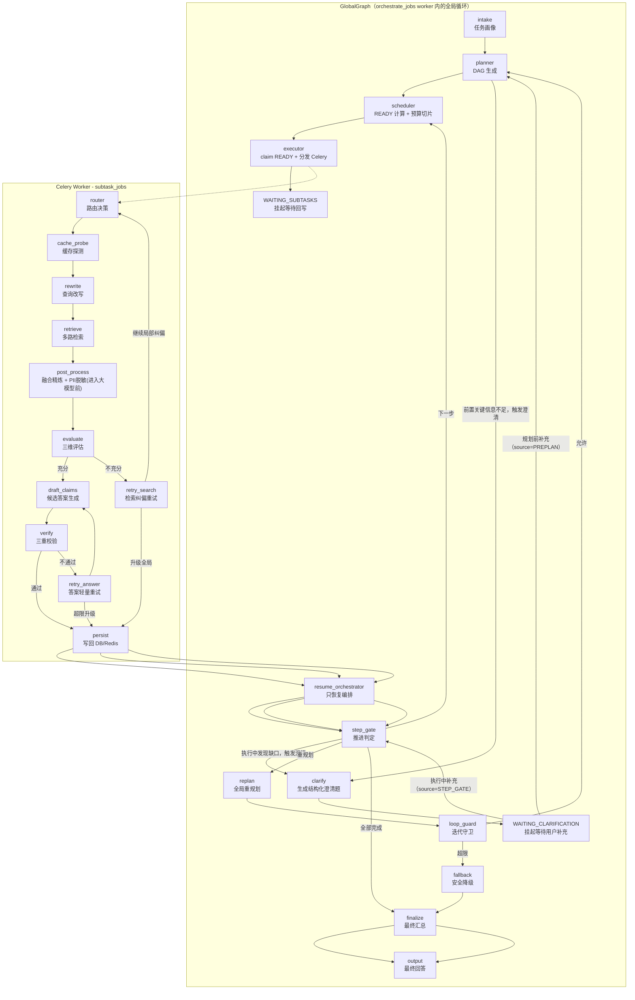
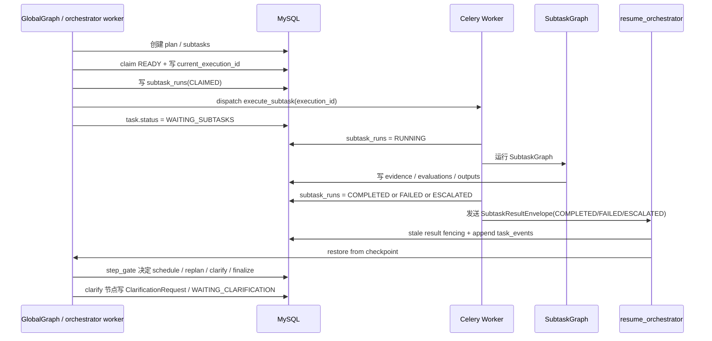
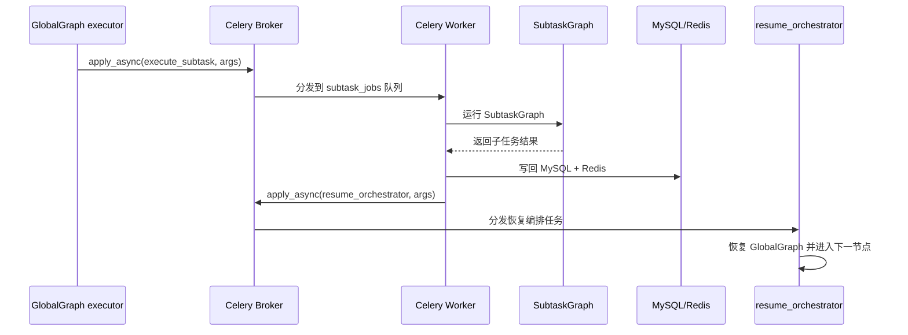
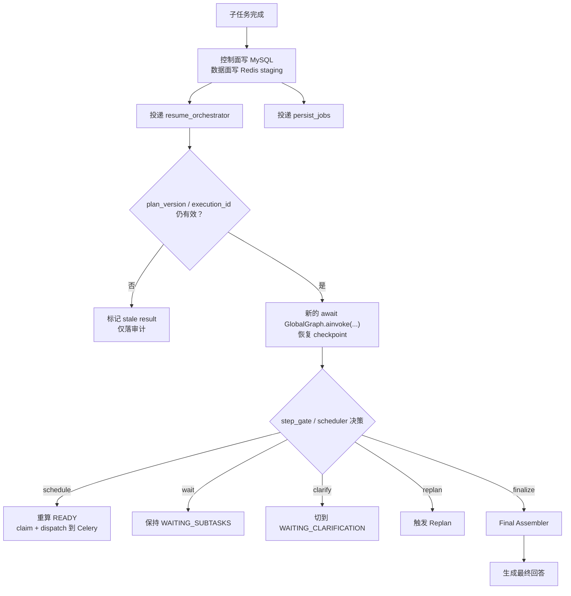
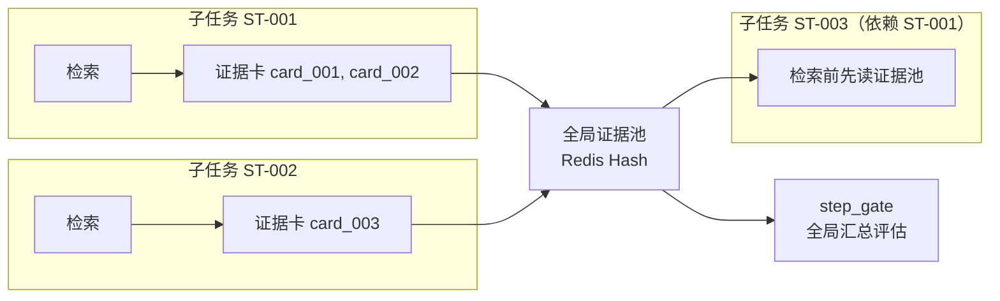
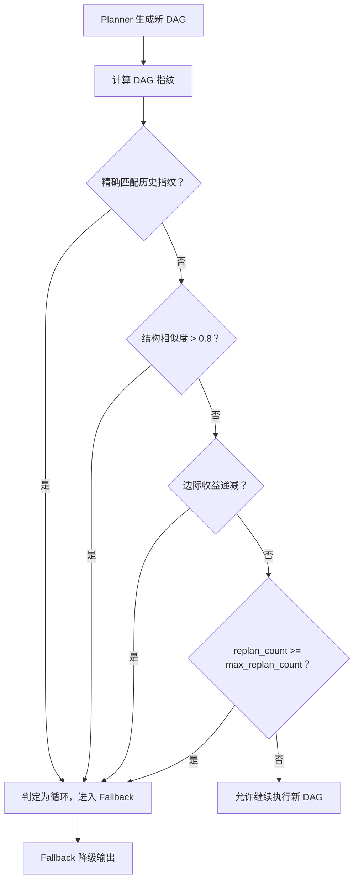

# Agentic RAG 用户深度检索技术拆解
本文件用于补充说明 [架构设计规划](./架构设计规划.md) 中最容易在实现阶段出现歧义的模块。规划文档负责给出整体决策和边界，这份技术拆解负责把关键模块展开到"可以直接开始写代码"的粒度。

## 1. 文档定位

建议把两份文档配合阅读：

1. [架构设计规划](./架构设计规划.md)：看整体原则、表设计、状态机、记忆系统、实施顺序。
2. 本文：看关键模块的落地规则、编排引擎选型、状态传递机制、并发适配和流程图。

本文不重复展开所有表字段和状态机定义，而是只解释那些"实现时最容易踩坑"的地方。

> 本文保留多数细化流程、表格和示例，但统一修正为 MySQL-first、恢复编排驱动、租户隔离闭合的实现口径。

本文覆盖的技术点：

1. [LangGraph DAG 编排](#langgraph-dag)：为什么用 LangGraph、两图架构、State Schema、条件边、并行执行、Checkpointing、与 Celery 分工。
2. [任务状态传递与 Redis 存储](#state-redis)：Key 命名规范、全局任务状态、DAG 入度表、子任务工作记忆、证据池、预算追踪、事件流、Scheduler 就绪发现。
3. [Celery 高并发适配](#celery-concurrency)：定位、首版够用的理由、真实瓶颈、缓解措施、演进路径。
4. [全局循环与子任务循环的交互边界](#loop-boundary)：职责划分、升级协议、证据共享、Replan 取消策略。
5. [证据冲突仲裁](#conflict-arbitration)：检测时机、仲裁策略、不可调和冲突处理。
6. [Replan 循环检测与收敛保证](#replan-convergence)：DAG 指纹、相似度检测、收敛策略、最终兜底。

<a id="langgraph-dag"></a>
## 2. LangGraph DAG 编排

### 2.1 为什么用 LangGraph 而不是手写 DAG 调度器

手写调度器的坑：

1. 状态持久化要自己实现——进程崩溃后 DAG 执行到哪一步、每个节点的中间结果全部丢失。
2. 并行控制要自己实现——`asyncio.gather` 只解决并发执行，不解决"并行分发后汇聚到同一个状态"。
3. 条件路由要自己实现——`if/else` 散落在各处，新增分支时容易遗漏边界。
4. Checkpoint 和恢复要自己实现——从第 N 步恢复执行需要手动序列化/反序列化全部上下文。
5. 调试和可视化要自己实现——出了问题只能翻日志，无法直观看到执行路径。

LangGraph 原生提供：

1. `StateGraph` + `TypedDict` 状态：声明式定义节点和边，状态自动在节点间传递。
2. 条件边（`add_conditional_edges`）：根据状态字段动态选择下一个节点。
3. `Send()` 并行分发：一个节点可以向多个目标并行发送不同的状态切片，天然支持 DAG 并行。
4. `Checkpointer`：内置 Redis/SQLite 持久化能力，配合业务真理源可在崩溃后从最近 checkpoint 恢复。
5. 可视化：`graph.get_graph().draw_mermaid()` 直接生成流程图。

### 2.2 两图架构设计

整体采用 GlobalGraph + SubtaskGraph 两层嵌套：

1. **GlobalGraph**（全局循环）：负责 Intake → Planner → Clarify → Scheduler → Executor → StepGate → Replan / Finalize 的主流程。Clarify 是唯一允许直接进入 `WAITING_CLARIFICATION` 的节点。
2. **SubtaskGraph**（子任务闭环）：负责 Router → Cache → Rewrite → Retrieval → Eval → Verify / Escalate 的局部循环。子图只能上报 `needs_user_input` 升级信号，不能直接发问用户。
3. **嵌套方式**：GlobalGraph 的 `executor` 节点负责 claim READY、登记 `execution_id` 并分发 Celery；Celery Worker 内部完整运行 `SubtaskGraph`，子图执行完毕后把结果写回 MySQL/Redis，再恢复 GlobalGraph。
4. **实现约束**：首版不依赖 `Send()` 的“自动汇聚到下一个节点”语义来承载异步 Celery 结果；真正的恢复入口只有 `resume_orchestrator`。Clarify 的次数、范围和默认项应用一律在 GlobalGraph 中完成。



> **关键边界**：
>
> 1. `GlobalGraph` 在分发一批子任务后进入 `WAITING_SUBTASKS`，不在图内阻塞等待 Celery `.get()` 或 `asyncio.to_thread(...get)`。
> 2. `resume_orchestrator` 只做结果验收、恢复和幂等防重，不独立计算 READY。
> 3. `SubtaskGraph` 在单个 `subtask_jobs` Worker 内完整执行，首版不在主路径上继续拆出 `llm_jobs/retrieval_jobs/compute_jobs` 二级 Celery。
> 4. 子任务只能通过 `EscalationReport(reason=needs_user_input, suggested_global_action=clarify)` 请求全局 Clarify；真正生成题目、写入 `WAITING_CLARIFICATION` 和应用默认项的只有 `clarify` 节点。
> 5. `clarification_source=PREPLAN` 时，澄清回复回到 `planner`；`clarification_source=STEP_GATE` 时，澄清回复回到 `step_gate`，不强制重新规划。
> 6. `post_process` 在写证据卡和共享证据池之前必须完成 PII 检测与脱敏；未脱敏的原始敏感片段不能直接跨子任务共享。

详细时序如下：



### 2.3 GlobalGraph State Schema

GlobalGraph 的状态用一个 `TypedDict` 定义，所有节点共享同一份状态，LangGraph 自动在节点间传递和持久化。

```python
from __future__ import annotations
from typing import TypedDict, Literal

class GlobalState(TypedDict, total=False):
    # ── 任务标识 ──
    task_id: int                          # search_tasks.id
    request_id: str                       # 全链路追踪 ID
    session_id: str
    tenant_id: str
    user_id: str

    # ── 任务画像 ──
    original_query: str
    resolved_query: str                   # 指代消解后
    task_profile: dict                    # intent/complexity/risk/sla
    error: str | None                     # 最近一次节点级错误码（轻量）

    # ── 控制平面 ──
    budget: dict                          # max_llm_tokens / max_retrieval_calls / max_latency_ms
    policy: dict                          # threshold_profile / stop_rules
    global_iteration: int                 # 当前全局循环轮次（仅运行计数）
    replan_count: int                     # 已执行的全局重规划次数
    max_replan_count: int                 # 全局重规划上限，默认 2
    clarification_count: int              # 已触发 Clarify 次数（全任务累计）
    max_clarification_count: int          # Clarify 上限，默认 2
    preplan_clarification_used: int       # 规划前 Clarify 已使用次数，首版上限 1
    postexec_clarification_used: int      # 执行后 Clarify 已使用次数，首版上限 1

    # ── DAG 规划 ──
    active_plan_version: int
    dag_ref: dict                         # 当前活动 DAG 的轻量引用（plan_version / fingerprint）
    dag_fingerprint: str                  # DAG 指纹哈希
    historical_fingerprints: list[str]    # 历史版本指纹，用于循环检测
    replan_reason: str                    # 最近一次重规划原因

    # ── 恢复与等待 ──
    waiting_reason: Literal["SUBTASKS", "CLARIFICATION", "NONE"]
    pending_resume_execution_id: str | None
    latest_result_ref: dict | None        # 最近一次回写结果的轻量引用
    clarification_ref: dict | None        # 当前澄清请求引用（含 question_type/source/defaults）
    conflict_summary_ref: dict | None     # 冲突摘要引用，供 step_gate/finalize 读取
    final_input_ref: dict | None          # Final Assembler 输入引用

    # ── 流程控制 ──
    next_action: Literal["schedule", "replan", "clarify", "finalize", "fallback", "output"]
```

字段设计原则：

1. 控制平面字段（`budget`、`policy`）在 `intake` 节点初始化，后续节点只读不写。
2. Graph State 只保留控制字段和外部工件引用，不保存完整 `evidence_pool`、`raw_results`、`subtask_results` 等大对象。
3. `historical_fingerprints` 用于 Replan 循环检测，每次 `planner` 生成新 DAG 时追加。
4. `next_action` 是 `step_gate` 节点的输出，决定条件边的走向。
5. `global_iteration` 只用于观察和日志，不作为首版硬性停机阈值；真正的硬约束是 `max_replan_count` 和 DAG 循环检测。

### 2.4 GlobalGraph 条件边定义

GlobalGraph 有两个关键条件边：

条件边一：`step_gate` 的五路分支

```python
def step_gate_router(state: GlobalState) -> str:
    """step_gate 节点的输出决定下一步走向"""
    action = state["next_action"]
    if action == "schedule":
        return "scheduler"      # 还有就绪子任务，继续调度
    if action == "replan":
        return "replan"         # 需要全局重规划
    if action == "clarify":
        return "clarify"        # 等待用户补充
    if action == "finalize":
        return "finalize"       # 进入 Final Assembler
    if action == "output":
        return "output"         # 全部完成，生成最终回答
    return "fallback"           # 异常兜底

graph.add_conditional_edges("step_gate", step_gate_router, {
    "scheduler": "scheduler",
    "replan": "replan",
    "clarify": "clarify",
    "finalize": "finalize",
    "output": "output",
    "fallback": "fallback",
})
```

条件边二：`loop_guard` 的两路分支

```python
def loop_guard_router(state: GlobalState) -> str:
    """检查全局重规划是否超限"""
    if state["replan_count"] >= state["max_replan_count"]:
        return "fallback"
    # 检查 DAG 指纹是否重复（循环检测）
    if state["dag_fingerprint"] in state.get("historical_fingerprints", [])[:-1]:
        return "fallback"
    return "planner"

graph.add_conditional_edges("loop_guard", loop_guard_router, {
    "planner": "planner",
    "fallback": "fallback",
})
```

### 2.5 SubtaskGraph State Schema

```python
class SubtaskState(TypedDict, total=False):
    # ── 子任务标识 ──
    tenant_id: str
    task_id: int
    subtask_code: str
    plan_version: int
    execution_id: str
    attempt_no: int

    # ── 输入 ──
    description: str                      # 子任务描述
    task_type: Literal["RETRIEVAL", "REASONING", "REFLECTION"]
    route_hints: list[str]                # Planner 建议的检索路由
    required_inputs_ref: dict | None
    global_evidence_ref: dict | None
    error: str | None                     # 最近一次节点级错误码（轻量）

    # ── 控制 ──
    iteration: int                        # 当前局部循环轮次
    max_iterations: int                   # 局部纠偏上限，默认 2
    timeout_ms: int
    budget_slice: dict                    # 分配给本子任务的预算切片

    # ── 缓存 ──
    cache_hit: bool
    cached_evidence_ref: dict | None      # 缓存命中的证据引用
    cache_fresh: bool                     # 缓存是否仍在有效期

    # ── 改写与检索 ──
    rewritten_queries: dict[str, str]     # route_type → rewritten_query
    retrieval_result_ref: dict | None     # 多路检索结果引用

    # ── 证据评估 ──
    evidence_ref: dict | None             # 脱敏并压缩后的证据引用
    eval_ref: dict | None                 # 评估结果引用
    eval_verdict: Literal["SUFFICIENT", "INSUFFICIENT"]
    gap_type: str                         # coverage_gap / conflict_gap / confidence_gap / user_input_gap
    gap_detail: str

    # ── 输出校验 ──
    output_ref: dict | None
    verify_result_ref: dict | None
    verify_passed: bool
    escalation_ref: dict | None

    # ── 流程控制 ──
    next_action: Literal["verify", "retry", "escalate", "done"]
```

> **状态约束**：
> 1. `SubtaskState` 只保存子图控制信息和数据库引用，证据卡全文、原始检索结果、完整 claims 列表全部放在 MySQL/Redis，不直接塞进 Checkpointer。
> 2. `evidence_ref` 默认只指向已完成 PII 脱敏的证据卡集合；原始敏感片段只允许停留在当前子任务的短生命周期 staging 中。

建议同时固定以下公共契约，避免 Application / Worker / Repository 各自猜字段：

```python
class PlanNodeSpec(TypedDict):
    subtask_code: str
    task_type: Literal["RETRIEVAL", "REASONING", "REFLECTION"]
    description: str
    depends_on: list[str]
    route_hints: list[str]
    required_inputs: list[str]
    expected_output_schema: dict
    acceptance_criteria: dict
    failure_policy: dict
    budget_slice: dict


class EscalationReport(TypedDict, total=False):
    subtask_code: str
    reason: str
    best_score: float
    score_gain_from_previous: float
    gap_type: str
    gap_detail: str
    evidence_refs: list[str]
    suggested_global_action: str
    missing_slots: list[str]
    candidate_options: list[dict]


class FinalAnswerInput(TypedDict):
    completed_subtask_outputs: list[dict]
    global_evidence_refs: list[str]
    arbitration_refs: list[str]
    uncovered_rips: list[str]
    degraded_reason: str | None
```

### 2.6 SubtaskGraph 条件边定义

SubtaskGraph 有四个关键条件边：

条件边一：`evaluate` 的阈值判定

```python
def evaluate_router(state: SubtaskState) -> str:
    verdict = state["eval_verdict"]
    if verdict == "SUFFICIENT":
        return "verify"
    return "retry"
```

条件边二：`verify` 的三路分支

```python
def verify_router(state: SubtaskState) -> str:
    if state["verify_passed"]:
        return "done"
    result = load_verify_result(state["verify_result_ref"])
    if not result.get("factual_consistent"):
        return "retry_answer"       # 事实不一致 → 轻量重生成
    if result.get("has_sensitive"):
        return "retry_answer"       # 敏感信息 → 脱敏后重生成
    if not result.get("citation_aligned"):
        return "retry_answer"       # 引用不对齐 → 重新标注
    return "retry_answer"           # 兜底
```

条件边三：`local_guard` 检索纠偏守卫

```python
def local_guard_router(state: SubtaskState) -> str:
    if state.get("gap_type") == "user_input_gap":
        return "escalate"
    if state["iteration"] >= state["max_iterations"]:
        return "escalate"
    return "router"
```

条件边四：`verify_retry_guard` 输出层轻量重试守卫

```python
def verify_retry_guard_router(state: SubtaskState) -> str:
    if state["iteration"] >= state["max_iterations"]:
        return "escalate"
    return "draft_claims"
```

> **实现约束**：
>
> 1. `retry` 节点内部负责缺口诊断与动作映射；当判断为 `user_input_gap` 时，只能写 `EscalationReport(reason=needs_user_input, suggested_global_action=clarify)`，再经 `local_guard` 升级到全局，不能在子图内直接生成用户追问。
> 2. `verify_router` 触发的 `retry_answer` 属于输出层轻量重试，默认经 `verify_retry_guard` 回到 `draft_claims` / `verify` 支路，不重新走 `router -> retrieval`。

### 2.7 READY 批次分发：图内计算，图外异步执行

首版并行的正确边界是：

1. `scheduler` 节点在图内计算 READY 集合、预算切片和批次宽度。
2. `executor` 节点在 MySQL 事务内 claim READY 子任务，生成 `execution_id`，写入 `subtask_runs`。
3. 子任务真正的并发执行发生在 Celery `subtask_jobs` Worker 中。
4. LangGraph 不等待 Worker 完成，而是把全局任务状态切到 `WAITING_SUBTASKS`，由 `resume_orchestrator` 恢复。

```python
def scheduler_node(state: GlobalState) -> GlobalState:
    ready_codes = compute_ready_codes_from_mysql_or_redis(
        task_id=state["task_id"],
        plan_version=state["active_plan_version"],
    )
    batch = ready_codes[:MAX_CONCURRENT]
    return {
        **state,
        "latest_result_ref": None,
        "next_action": "schedule" if batch else "finalize",
    }


def executor_node(state: GlobalState) -> GlobalState:
    claimed = []
    for subtask in load_ready_batch(...):
        execution_id = new_execution_id(...)
        budget_slice = reserve_budget_slice(...)
        if claim_ready_subtask(..., execution_id=execution_id, budget_slice=budget_slice):
            create_subtask_run(..., execution_id=execution_id)
            dispatch_subtask.delay(..., execution_id=execution_id, budget_slice=budget_slice)
            claimed.append(execution_id)

    if claimed:
        mark_task_waiting_subtasks(...)
    return state
```

> **为什么不再强调 `Send()` 自动汇聚**：`Send()` 非常适合纯 LangGraph 内部的同步并发，但当前主路径是“LangGraph 计算 READY → Celery 异步执行 → `resume_orchestrator` 恢复”。如果继续把 `Send()` 的自动汇聚语义写成主路径，会让实现者误以为 GlobalGraph 会在图内等待 Celery 分支自然回流，这是错误的。

### 2.7.1 `networkx` 只做计划图编译器，不做运行时真理源

在 `planner` 内部使用 `networkx` 构建动态 DAG 是合理的，尤其适合处理：

1. cycle detection（`is_directed_acyclic_graph`）
2. 拓扑分层（`topological_generations`）
3. 祖先/后继分析
4. DAG 指纹生成与 replan diff

推荐边界：

1. `planner` 内部短生命周期构建 `nx.DiGraph`
2. 产出 JSON-safe 的 `dag_spec` / `topo_layers` / `dag_fingerprint`
3. 后续 `scheduler` / `step_gate` 只消费序列化后的计划定义与控制面状态

明确禁止：

1. 不要把 `nx.DiGraph`、自定义节点对象或 Python callable 直接放进 LangGraph State / Checkpointer
2. 不要把 `networkx` 图对象当作运行时真理源；真实状态仍以 MySQL 控制面（`task_plans` / `subtasks` / `subtask_runs` / `task_events`）为准
3. 不要把 `topo_layers` 当成唯一调度依据；它只是 planner 提供的并行参考层，真正 READY 仍需结合运行时状态再次判定

工程原因：

- `networkx` 很适合做“计划图编译器”
- 但 claim、execution_id fencing、retry、stale result、budget gate 都是运行时控制问题，不是图算法问题
- 一旦把图对象本体塞进 state/checkpoint，序列化、恢复和版本兼容风险都会迅速上升

因此，推荐模式是：

```text
planner 输入 → networkx 临时构图 → 校验/分层/指纹 → 输出 dag_spec(JSON-safe)
```

而不是：

```text
planner 输出 nx.DiGraph → runtime 直接拿 graph 对象推进执行
```

### 2.8 Checkpointing：崩溃恢复与状态持久化

LangGraph 内置 Checkpointer 机制，每个节点执行完毕后自动保存状态快照。

首版推荐用 Redis 做 Checkpointer：

```python
from langgraph.checkpoint.redis import RedisSaver

checkpointer = RedisSaver(redis_url="redis://:123456@localhost:6379/0")
global_graph = global_graph_builder.compile(checkpointer=checkpointer)
```

Checkpointer 的关键行为：

1. 每个节点执行完毕后，自动将当前 State 序列化并写入 Redis。
2. 进程崩溃后/async 编排服务在需要恢复时，用 `await graph.ainvoke(None, config={"configurable": {"thread_id": thread_id}})` 从最近 checkpoint 恢复。
3. Redis Key 格式由 LangGraph 内部管理，无需手动维护。
4. MySQL 继续承担业务真理源与恢复判定，Checkpoint 只负责 LangGraph 运行时状态，不替代业务持久化。
5. 如果外层只有同步封装层，封装层可以用 `asyncio.run(...)` 或同步 `invoke(...)` 包装，但这不是首选主路径。

恢复流程：

1. API 重试入口或 `resume_orchestrator` 收到恢复信号后，用原始 `thread_id` 发起一次新的 `await graph.ainvoke(...)`。
2. LangGraph 自动检测到已有 checkpoint，从最近完成的节点继续执行。
3. 已完成的节点不会重复执行，只有未完成的节点会重新运行。

`thread_id` 规范：

1. `GlobalGraph`：`tenant:{tenant_id}:task:{task_id}`
2. `SubtaskGraph`：`tenant:{tenant_id}:task:{task_id}:plan:{plan_version}:subtask:{subtask_code}:exec:{execution_id}`

### 2.8.1 GlobalGraph 的“挂起 / 唤醒”到底发生了什么

这里的“挂起”是业务状态机语义，不是保留一个 Python 线程或协程在图里等待子任务结果。还需要强调一点：`GlobalGraph` 主体运行在 `orchestrate_jobs` worker（或等价的编排 worker）中，而不是 FastAPI 请求协程里。

执行路径必须理解为“退出当前图调用，再由外部事件重新进入”：

1. FastAPI/API 层只负责创建任务、返回 `request_id`、暴露 SSE 与 Clarify 提交接口，不负责长时间持有 GlobalGraph。
2. `scheduler` 计算 READY 批次，`executor` claim 子任务并 dispatch Celery。
3. `executor` 在 MySQL 中写入 `WAITING_SUBTASKS`，同时把最小控制状态交给 Checkpointer。
4. 当前这次 `await global_graph.ainvoke(...)` 调用到此结束；事件循环释放这个协程，不再持有等待中的 Future。
5. 子任务在 Celery Worker 内独立执行，Graph 不轮询、不 `.get()`、不保留等待线程。
6. Worker 完成后写回控制面结果，并投递轻量 `resume_orchestrator(SubtaskResultEnvelope)`。
7. `resume_orchestrator` 触发一次新的 `await global_graph.ainvoke(None, config={"configurable": {"thread_id": thread_id}})` 或 `await global_graph.ainvoke()  command`，LangGraph 从最近 checkpoint 继续执行 `step_gate` / `scheduler`。

因此，`WAITING_SUBTASKS` 的本质是：

1. 任务外部可见状态处于等待中。
2. 编排 worker 内当前这次图调用已经结束，不再占住等待线程。
3. 恢复靠新的事件驱动调用，而不是旧协程被“唤醒回来继续等”。
4. 当前主线不是“FastAPI 挂着等待整个 Deep Search 完成”，也不是“单个 worker 在一个事件循环里把所有 SubtaskGraph 当 asyncio 协程跑完”。

### 2.8.2 `to_thread(...)` 的正确边界

问题不在 `to_thread` 这个工具本身，而在是否把“等待外部异步任务结果”重新塞回 `GlobalGraph`。

明确禁止：

1. `await asyncio.to_thread(async_result.get, timeout=...)`
2. 在 Graph 节点内轮询 `ready()` / `successful()`
3. 用 `to_thread(...get)` 把 Celery 结果等待重新拉回图内
4. 依赖 Celery callback 直接串行推进下游 DAG

明确允许：

1. async producer 侧用 `await asyncio.to_thread(task.delay, ...)` 或 `await asyncio.to_thread(task.apply_async, ...)` 发布 Celery 任务
2. 这类调用只是短时桥接 Celery 同步客户端 API，不等待子任务完成
3. 真正的恢复入口仍然是后续的 `resume_orchestrator -> await global_graph.ainvoke(...)`

### 2.8.3 `interrupt()` / `Command(resume=...)` 的适用边界与陷阱

LangGraph 当前推荐的等待/恢复语法是：

```python
from langgraph.types import interrupt, Command

payload = interrupt({"kind": "clarify", ...})
...
await graph.ainvoke(Command(resume=payload), config=config)
```

这套机制适合：

1. Clarify / 审批 / 人机协作等待点
2. 纯等待节点（wait node）中接收外部恢复载荷

但它**不适合**直接放在带副作用的派发节点里。

原因：

- `interrupt()` 底层会中断当前执行并保存 checkpoint
- 恢复时，发生中断的那个节点会重新执行
- 如果该节点在 `interrupt()` 之前已经做了副作用（例如发 Celery / TaskIQ 任务），恢复时会再次派发一次

错误模式：

```python
def dispatch_and_wait(state):
    dispatch_to_worker(...)   # 副作用
    result = interrupt(...)   # 恢复时该节点会重跑，导致重复派发
```

正确模式：

```python
dispatch_node -> wait_node
```

其中：

1. `dispatch_node` 只负责副作用，执行完立即 return
2. `wait_node` 第一行直接 `interrupt(...)`
3. 恢复时只重跑 `wait_node`，不会重复派发外部任务

放到当前架构里的结论：

1. 当前主线的 `WAITING_SUBTASKS` 仍以 `resume_orchestrator` 恢复编排为主，不要求在 `executor` 节点内部使用 `interrupt()`
2. 如果未来为了让代码更像协程而引入 `interrupt()/Command(resume=...)`，必须把“派发外部任务”和“等待外部结果”拆成两个节点
3. `Command(resume=...)` 传入的结果包也不能直接信任，仍必须先过 `tenant_id + task_id + plan_version + subtask_code + execution_id` 的控制面验收与 fencing

因此，在当前生产架构里：

- Clarify 场景天然适合 `interrupt()`
- 外部 worker 结果恢复场景，`interrupt()` 只能作为“纯等待节点”的语法糖
- 不允许在 dispatch / claim / 写外部 side effect 的节点里直接 `interrupt()`

### 2.8.4 为什么当前主线不采用“单 worker + `Send()` 跑完整个 Deep Search”

一种看似更简单的方案是：

```text
FastAPI → Task Queue → 单个 worker
                    └── GlobalGraph
                        └── Send() fan-out
                            ├── SubtaskGraph-1（协程）
                            ├── SubtaskGraph-2（协程）
                            └── SubtaskGraph-3（协程）
```

这种方案在教学/原型阶段是成立的，优点也很明确：

1. 架构极简，没有跨进程协调
2. 没有 `resume_orchestrator`、外部恢复、Done stream 等额外机制
3. 日志集中、调试直接
4. 如果所有子任务都是短时 async I/O，延迟也会较低

但它不是当前生产主线，原因如下：

1. 单 worker 进程崩溃时，整个任务更容易整体丢失或回滚到较粗粒度恢复点
2. 一旦子任务包含 CPU 密集步骤或长时间阻塞 I/O，会拖慢同一事件循环中的其他分支
3. 无法把不同子任务横向扩展到多台机器或不同资源池
4. 30-60 秒级任务会长期占用同一个 worker 生命周期，不利于隔离、限流和故障恢复
5. 很难把 `subtask_runs`、`execution_id` fencing、数据面异步刷库和外部回放事件做成清晰的控制面契约

因此，当前主线明确采用：

```text
FastAPI/API
  -> 创建任务 / 查询状态 / SSE / Clarify 提交

orchestrate_jobs worker
  -> 分段执行 GlobalGraph
  -> 计算 READY / dispatch / 进入 WAITING_SUBTASKS

subtask_jobs worker
  -> 独立执行单个 SubtaskGraph
  -> 写回控制面与数据面

resume_orchestrator
  -> 触发下一次 GlobalGraph 恢复
```

这个取舍意味着：

1. 我们接受“跨进程协调更复杂”
2. 换取“故障隔离更强、扩展更自然、控制面更清晰”
3. `Send()` 仍然保留在纯 LangGraph 同步并行或 planner-side DAG 展示场景中，但不作为当前异步 Celery 主路径的承载方式

### 2.9 LangGraph 与 Celery 的分工边界

两者的定位完全不同，不要混淆：

1. **LangGraph 管控制流**：节点定义、条件路由、状态恢复、重规划、最终汇总。当前主线运行在 `orchestrate_jobs` worker（或等价的编排 worker）中，而不是 FastAPI 请求协程里；本身不持有大对象执行态。
2. **Celery 管执行闭环**：单个子任务内部的改写、检索、PII 脱敏、证据压缩、评估、校验在同一 Worker 内完成，避免 Celery 套 Celery。

交互方式：

1. `executor` 节点为 READY 子任务生成 `execution_id`，条件更新 MySQL 状态为 `RUNNING`，再 dispatch Celery task。
2. Celery Worker 内部完整运行 `SubtaskGraph`，完成后把结果写回 MySQL/Redis，并返回标准结果包。
3. Worker 完成后投递轻量 `resume_orchestrator(...)`，恢复 `GlobalGraph` 继续推进。

补充说明：

- 纯 LangGraph 单 worker + `Send()` 并行 fan-out 是可行的简化模式，适合教学、原型验证和短任务场景。
- 但当前生产主线不采用这种模式；我们明确选择“编排 worker 分段执行 GlobalGraph + 执行 worker 独立跑 SubtaskGraph + `resume_orchestrator` 恢复推进”。

建议统一结果契约：

```python
class SubtaskResultEnvelope(TypedDict):
    tenant_id: str
    task_id: int
    plan_version: int
    subtask_code: str
    execution_id: str
    attempt_no: int
    status: Literal["COMPLETED", "FAILED", "ESCALATED"]
    error_code: str | None
    produced_evidence_refs: list[str]
    output_ref: dict | None
    escalation_ref: dict | None
    budget_delta: dict | None
```



为什么不让 Celery 直接管编排：

1. Celery 的 `chain/chord/group` 只能表达静态 DAG，不支持运行时条件路由。
2. Celery 没有内置的状态持久化和 checkpoint 恢复。
3. 用 Celery 做编排会导致"编排逻辑散落在各个 task 的回调里"，难以维护。

为什么不让 LangGraph 直接做 IO 密集操作：

1. LangGraph 运行在主进程中，阻塞式 IO 会拖慢整个编排循环。
2. Celery Worker 可以按任务类型选择不同的 pool（prefork/gevent/aio），LangGraph 做不到。
3. Celery 自带重试、限流、路由、监控，这些能力不需要在 LangGraph 层重复实现。

### 2.10 节点错误处理与超时

当前所有节点代码都是 happy path，但生产环境中 LLM 超时、检索不可用是常态。本节定义节点级错误处理模板和超时机制。

> **版本锁定**：首版锁定 `langgraph>=0.2,<0.3`，避免跨大版本 API 不兼容。在 `requirements.txt` 或 `pyproject.toml` 中明确约束。

#### 2.10.1 节点级 try/except 模板

所有 LangGraph 节点统一使用以下错误处理模板。异常后写入 State 的 `error` 字段，由条件边路由到 fallback：

```python
import asyncio
import logging
from typing import Any

logger = logging.getLogger(__name__)

async def safe_node(state: dict, *, node_name: str, handler, timeout_s: float = 30) -> dict:
    """节点级统一错误处理包装器"""
    try:
        result = await asyncio.wait_for(handler(state), timeout=timeout_s)
        return result
    except asyncio.TimeoutError:
        logger.error(f"[{node_name}] timeout after {timeout_s}s",
                     extra={"task_id": state.get("task_id")})
        return {**state, "error": f"{node_name}_timeout", "next_action": "fallback"}
    except Exception as e:
        logger.exception(f"[{node_name}] unhandled error",
                         extra={"task_id": state.get("task_id")})
        return {**state, "error": f"{node_name}_error: {type(e).__name__}", "next_action": "fallback"}

# 使用示例：
async def planner_node(state: GlobalState) -> GlobalState:
    async def _do_plan(s):
        # 实际规划逻辑
        ...
        return updated_state
    return await safe_node(state, node_name="planner", handler=_do_plan, timeout_s=15)
```

#### 2.10.2 per-node 超时配置

不同节点的超时阈值差异很大，统一在配置中管理：

| 节点 | 默认超时 | 说明 |
|------|---------|------|
| `intake` | 5s | 任务画像提取，单次 LLM 调用 |
| `planner` | 15s | DAG 生成，可能涉及复杂推理 |
| `scheduler` | 3s | 纯计算，不应超时 |
| `executor` | 10s | 负责领取 READY 子任务、登记 `execution_id`、分发 Celery，不等待整个子图完成 |
| `step_gate` | 5s | 汇总判定 |
| `replan` | 15s | 重规划 |
| `evaluate` | 10s | 证据评估 |
| `verify` | 10s | 三重校验 |

对于 Celery 侧的重型任务，使用 `soft_time_limit` 触发 `SoftTimeLimitExceeded`，Worker 有机会做清理：

```python
import asyncio

@celery_app.task(bind=True, queue="subtask_jobs",
                 soft_time_limit=60, time_limit=75)
def execute_subtask(self, execution_id, **kwargs):
    try:
        return asyncio.run(run_subtask_graph_async(execution_id=execution_id, **kwargs))
    except SoftTimeLimitExceeded:
        logger.warning("Subtask soft timeout, returning failed envelope with partial evidence")
        return {"status": "FAILED", "error": "subtask_timeout", "partial": True}
```

#### 2.10.3 Worker 回写结果时 resume_orchestrator 的捕获

在修订后的链路里，`SubtaskGraph` 运行在 Celery Worker 内部；`GlobalGraph.executor` 不直接捕获子图异常。真正需要防守的是 `resume_orchestrator` 处理 Worker 结果时的 stale result、回写失败和恢复失败：

```python
import asyncio

async def resume_orchestrator_async(result: SubtaskResultEnvelope) -> None:
    tenant_id = result["tenant_id"]
    task_id = result["task_id"]
    plan_version = result["plan_version"]
    subtask_code = result["subtask_code"]
    execution_id = result["execution_id"]

    if not await persist_result_if_current(result):
        logger.info("stale result ignored",
                    extra={"tenant_id": tenant_id, "task_id": task_id,
                           "plan_version": plan_version, "subtask_code": subtask_code,
                           "execution_id": execution_id})
        return

    try:
        thread_id = f"tenant:{tenant_id}:task:{task_id}"
        await global_graph.ainvoke(None, config={"configurable": {"thread_id": thread_id}})
    except Exception:
        logger.exception("resume_orchestrator failed",
                         extra={"tenant_id": tenant_id, "task_id": task_id,
                                "plan_version": plan_version, "subtask_code": subtask_code,
                                "execution_id": execution_id})
        raise


@celery_app.task(queue="orchestrate_jobs")
def resume_orchestrator(result: SubtaskResultEnvelope):
    """Celery 薄适配层；核心恢复逻辑保持 async-first。"""
    return asyncio.run(resume_orchestrator_async(result))
```

> 如果 `orchestrate_jobs` 后续切到 aio worker，可直接把外层 task 改成 `async def`；核心恢复逻辑不需要改。

#### 2.10.4 Checkpointer 写入失败处理

Checkpointer 写入 Redis 失败不应阻塞主流程。LangGraph 默认行为是抛异常，需要在初始化时包装：

```python
class ResilientCheckpointer:
    """包装 RedisSaver，写入失败时降级为仅日志，不阻塞主流程"""
    def __init__(self, underlying: RedisSaver):
        self._underlying = underlying

    async def aput(self, config, checkpoint, metadata):
        try:
            return await self._underlying.aput(config, checkpoint, metadata)
        except Exception as e:
            logger.error(f"Checkpoint write failed, continuing without persistence: {e}")
            # 不抛异常，主流程继续执行
            # 代价：如果此时崩溃，会从上一个成功的 checkpoint 恢复，可能重复执行一个节点

    async def aget(self, config):
        # 读取失败则抛异常，因为无法恢复
        return await self._underlying.aget(config)
```

> **注意**：Checkpointer 写入失败意味着崩溃恢复能力暂时丧失。应配合告警（参见 `架构设计规划.md` Section 12.3），连续写入失败 > 3 次时触发告警。

<a id="state-redis"></a>
## 3. 任务状态传递与 Redis 存储

### 3.1 Redis Key 命名规范

所有 Key 统一前缀 `rag:search:{tenant_id}:`，按功能域分层：

| 功能域 | Key 模式 | 数据类型 | TTL |
|--------|----------|----------|-----|
| 全局任务状态 | `rag:search:{tenant_id}:task:{task_id}:state` | Hash | 任务完成后 24h |
| DAG 入度表 | `rag:search:{tenant_id}:task:{task_id}:plan:{ver}:indegree` | Hash | 计划切换后 1h |
| 子任务工作记忆 | `rag:search:{tenant_id}:subtask:{task_id}:{code}:memory` | Hash | 子任务完成后 2h |
| 全局证据池 | `rag:search:{tenant_id}:task:{task_id}:evidence` | Hash | 任务完成后 24h |
| 数据面 staging | `rag:search:{tenant_id}:run:{execution_id}:payload` | Hash | 刷库成功后删除 |
| 预算消耗 | `rag:search:{tenant_id}:task:{task_id}:budget` | Hash | 任务完成后 24h |
| LangGraph Checkpoint | `langgraph:checkpoint:{thread_id}:*` | String/Hash | 由 LangGraph 管理 |

命名规则：

1. 所有 Key 使用 `:` 分隔层级，不使用 `.` 或 `-`。
2. 变量部分用 `{}`  标注，实际值为数字或短字符串。
3. TTL 在任务进入终态后由清理逻辑统一设置，运行期间不设 TTL。

### 3.2 全局任务状态（Redis Hash）

Key：`rag:search:{tenant_id}:task:{task_id}:state`

| 字段 | 类型 | 说明 |
|------|------|------|
| `status` | string | PENDING/PLANNING/EXECUTING/WAITING_SUBTASKS/WAITING_CLARIFICATION/FINALIZING/COMPLETED/FAILED/DEGRADED |
| `active_plan_version` | int | 当前活动计划版本 |
| `global_iteration` | int | 全局循环轮次 |
| `replan_count` | int | 重规划次数 |
| `clarification_count` | int | 已触发 Clarify 次数 |
| `preplan_clarification_used` | int | 前置 Clarify 已使用次数 |
| `postexec_clarification_used` | int | 执行后 Clarify 已使用次数 |
| `total_subtasks` | int | 当前计划的子任务总数 |
| `completed_count` | int | 已完成子任务数 |
| `failed_count` | int | 已失败子任务数 |
| `waiting_deadline` | string | Clarify 截止时间或下一次恢复观察点 |
| `last_updated` | string | ISO 时间戳 |

读写时机：

1. `intake` 节点创建，写入初始状态。
2. `scheduler`、`step_gate`、`replan` 节点更新对应字段。
3. 控制面字段先在 MySQL 事务内提交，再删除 Redis 热缓存；前端轮询或 SSE 推送读取 Redis miss 时可回退 MySQL 重建。
4. MySQL 始终是真理源，Redis 只保留热缓存；任务进入终态后统一设置 TTL。
5. 对极热控制面 key，可选采用延迟双删（`写库 -> 删缓存 -> sleep -> 再删一次`）兜底并发读写 race condition；但首版不追求金融级强一致。

### 3.3 DAG 入度表（Redis Hash + Lua 脚本）

Key：`rag:search:{tenant_id}:task:{task_id}:plan:{ver}:indegree`

每个字段是 `subtask_code → 当前入度值`。

初始化：`planner` 节点生成 DAG 后，一次性写入所有子任务的入度。

原子递减 + 就绪判定 Lua 脚本：

```lua
-- KEYS[1] = indegree hash key
-- ARGV[1] = 刚完成的 subtask_code
-- ARGV[2..N] = 该子任务的所有下游 subtask_code
-- 返回：入度变为 0 的子任务列表

local ready = {}
for i = 2, #ARGV do
    local new_val = redis.call('HINCRBY', KEYS[1], ARGV[i], -1)
    if new_val == 0 then
        table.insert(ready, ARGV[i])
    end
end
return ready
```

为什么用 Lua 而不是多次 HINCRBY：

1. 多次 HINCRBY 之间如果有并发完成的子任务，可能导致同一个下游被重复判定为就绪。
2. Lua 脚本在 Redis 中原子执行，保证入度递减和就绪判定的一致性。

### 3.4 子任务工作记忆（Redis Hash）

Key：`rag:search:{tenant_id}:subtask:{task_id}:{code}:memory`

| 字段 | 类型 | 说明 |
|------|------|------|
| `iteration` | int | 当前局部循环轮次 |
| `rewritten_queries` | JSON string | 各路改写后的查询 |
| `eval_scores` | JSON string | 最近一轮评估分数 |
| `gap_type` | string | 最近一轮缺口类型 |
| `retry_history` | JSON string | 历次纠偏动作记录 |

Checkpoint 策略：

1. SubtaskGraph 的每个节点执行完毕后，LangGraph Checkpointer 自动保存。
2. 工作记忆 Hash 是额外的热缓存，用于 Scheduler 快速读取子任务进度，不替代 Checkpointer。
3. L2 的目标是“减少局部重跑成本”，允许 Redis 宕机时丢失。
4. 但一旦形成被验收的子任务结果、可跨子任务复用的证据卡、升级报告或关键纠偏结论，就必须晋升到 L3-Evidence / L4 / MySQL 审计表。
5. 子任务完成后设置 2h TTL，避免 Redis 内存无限增长。

### 3.5 全局证据池（Redis Hash）

Key：`rag:search:{tenant_id}:task:{task_id}:evidence`

每个字段是 `card_uid → JSON 序列化的证据卡`。

写入时机：

1. 子任务的 `post_process` 节点在完成 `Rerank -> PII 检测与脱敏 -> Compress` 后，先将“已脱敏证据卡摘要”写入 Redis 热池，并把完整 payload 写入 Redis staging。
2. Redis 热池用于跨子任务实时共享（后续子任务可以读取前序子任务的证据），因此默认只允许写入可共享的脱敏证据。
3. `redaction_status=BLOCKED` 的高敏证据不进入 Redis 热池，只保留受控引用或审计摘要。
4. MySQL 持久化改由 `persist_jobs` 异步批量刷入，用于审计、最终查询和补偿恢复。
5. 这是数据面而不是控制面；在当前深搜场景下，可以接受极少量 staging 丢失，并通过重检或补偿任务恢复。

读取时机：

1. `evaluate` 节点读取全局证据池，检测跨子任务冲突。
2. `output` 节点读取全部证据，生成最终回答。
3. `replan` 节点读取证据池，评估已有成果，决定重规划策略。

### 3.6 预算消耗追踪（Redis Hash + HINCRBY）

Key：`rag:search:{tenant_id}:task:{task_id}:budget`

| 字段 | 类型 | 说明 |
|------|------|------|
| `llm_tokens` | int | 已消耗 LLM token 数 |
| `retrieval_calls` | int | 已执行检索次数 |
| `elapsed_ms` | int | 已耗时（由各节点累加） |

更新方式：

1. 每次 LLM 调用或检索执行后，用 `HINCRBY` 原子递增对应字段。
2. 不需要加锁，`HINCRBY` 本身是原子操作。

超限检测：

1. 每个 LangGraph 节点执行前，先读取预算消耗，与 `budget` 上限比较。
2. 如果任一维度超限，直接将 `next_action` 设为 `fallback`。

### 3.7 状态变更事件流

首版确认方案：**Worker 回写控制面结果 + `resume_orchestrator` 恢复编排 + SSE 进度推送**。不引入 Redis Stream，也不让 Celery `on_success` 直接链式调度下游。

原因：

1. Redis Stream 需要额外的消费者组管理、ACK、死信和重平衡逻辑，首版复杂度过高。
2. 让 Celery `on_success` 直接推进下游，会和 LangGraph 编排形成双控制面。
3. 采用“Worker 回写控制面结果 → `resume_orchestrator` 恢复 GlobalGraph”后，编排权只保留在 LangGraph/MySQL 这一侧，恢复路径最清晰。
4. 进度推送统一基于 `task_events` 持久化 + SSE 回放，避免仅靠内存态消息导致断线丢进度。

具体实现：

```python
import asyncio

async def execute_subtask_async(
    tenant_id: str,
    task_id: int,
    subtask_code: str,
    plan_version: int,
    execution_id: str,
    attempt_no: int,
):
    """子任务执行核心，保持 async-first。"""
    result = await subtask_graph.ainvoke(build_subtask_state(...))
    payload_ref = await stage_data_plane_payload(
        tenant_id=tenant_id,
        execution_id=execution_id,
        result=result,
    )
    envelope = await save_control_plane_result(
        tenant_id=tenant_id,
        task_id=task_id,
        plan_version=plan_version,
        subtask_code=subtask_code,
        execution_id=execution_id,
        attempt_no=attempt_no,
        result=result,
        payload_ref=payload_ref,
    )
    event_type = "subtask_escalated" if envelope["status"] == "ESCALATED" else "subtask_completed"
    sse_type = "subtask.escalated" if envelope["status"] == "ESCALATED" else "subtask.completed"
    await append_task_event(task_id, event_type, envelope)
    await publish_sse_event(task_id, sse_type, envelope)
    persist_data_plane.apply_async(args=[payload_ref])
    resume_orchestrator.apply_async(args=[envelope])
    return envelope


@celery_app.task(bind=True, queue="subtask_jobs")
def execute_subtask(
    self,
    tenant_id: str,
    task_id: int,
    subtask_code: str,
    plan_version: int,
    execution_id: str,
    attempt_no: int,
):
    """Celery 薄适配层；如果 worker 仍是 prefork，则用 asyncio.run 进入 async 核心。"""
    return asyncio.run(
        execute_subtask_async(
            tenant_id=tenant_id,
            task_id=task_id,
            subtask_code=subtask_code,
            plan_version=plan_version,
            execution_id=execution_id,
            attempt_no=attempt_no,
        )
    )
```

`resume_orchestrator` 的职责只保留三件事：

1. 校验结果是否仍属于当前活动执行实例
2. 追加 `accepted` / `stale_ignored` 审计事件
3. 恢复 GlobalGraph

```python
import asyncio

async def resume_orchestrator_async(result: SubtaskResultEnvelope) -> None:
    """处理 Worker 结果并恢复 GlobalGraph"""
    if not is_current_execution(result):
        await append_task_event(result["task_id"], "subtask_stale_ignored", result)
        return

    await append_task_event(result["task_id"], "subtask_result_accepted", result)

    thread_id = f"tenant:{result['tenant_id']}:task:{result['task_id']}"
    await global_graph.ainvoke(None, config={"configurable": {"thread_id": thread_id}})


@celery_app.task(queue="orchestrate_jobs")
def resume_orchestrator(result: SubtaskResultEnvelope):
    return asyncio.run(resume_orchestrator_async(result))
```

> **约束**：`resume_orchestrator` 不直接做 READY 判定，也不直接 dispatch 下游子任务；这些动作统一在恢复后的 `scheduler` / `step_gate` 中执行。
>
> **Clarify 约束**：Clarify 只能由 GlobalGraph 的 `planner` 或 `step_gate` 触发。首版全任务最多 2 次，且固定为“前置 1 次 + 执行后 1 次”。题型默认 `SINGLE_SELECT`；仅 `source_preference`、`output_granularity`、`delivery_format` 三类允许 `MULTI_SELECT`，且 `max_selected <= 2`。超过 Clarify 配额时，必须直接走 `fallback` 或 `replan`，不能再追问。

恢复后的判定矩阵：

| 恢复后看到的状态 | 下一步 |
|------------------|--------|
| 有新 READY | 回到 `scheduler`，claim + dispatch 新批次 |
| 无新 READY，但仍有 `RUNNING` | 保持 `WAITING_SUBTASKS`，等待下一次 Worker 结果 |
| 无 `RUNNING`，但有阻塞节点 / 失败信号 / 死锁迹象 | 进入 `replan` 或死锁处理 |
| 全部子任务完成 | 进入 `FINALIZING` |

#### 3.7.1 SSE 进度推送实现约束

SSE 不是“附加优化”，而是首版主反馈通道。实现时必须满足：

1. `task_events.id` 作为 SSE `id`，服务端支持 `Last-Event-ID` 回放。
2. `POST /search` 成功后 1 秒内至少落一条 `task.accepted` 或 `task.planning` 事件。
3. 当 5 秒内没有业务事件时，由 API 层补发 `heartbeat`。
4. SSE 只消费结构化 `task_events`，不直接消费 Celery 内存回调，避免断线后丢进度。
5. `WAITING_CLARIFICATION` 时必须由 GlobalGraph 的 `clarify` 节点发送 `task.waiting_clarification` 事件，payload 至少包含 `question`、`question_type`、`options`、`clarification_source`、`expires_at`，以及 `default_option_id` 或 `default_selected_option_ids`。
6. `clarification_default_applied` 必须落 `task_events`，并建议同步推送 `task.clarification_default_applied`，保证默认恢复路径可审计、可回放。

### 3.8 Scheduler 就绪任务发现机制

完整流程（含 stale result fencing 和恢复后重新决策）：



### 3.9 LangGraph Checkpointer 与 Redis 的集成

LangGraph 的 `RedisSaver` 会在 Redis 中维护自己的 Key 空间，与业务 Key 互不干扰。

集成要点：

1. 首版 Checkpointer 与业务热数据暂时同用 Redis `db=0`，依赖 LangGraph 自有 keyspace 与业务 Key 前缀隔离，而不依赖 DB 编号隔离。
2. `GlobalGraph` 的 `thread_id` 使用 `tenant:{tenant_id}:task:{task_id}`，保证跨租户恢复时不会串数据。
3. `SubtaskGraph` 的 `thread_id` 使用 `tenant:{tenant_id}:task:{task_id}:plan:{plan_version}:subtask:{subtask_code}:exec:{execution_id}`，避免不同执行尝试复用旧 checkpoint。
4. 不要手动操作 Checkpointer 的 Key，所有读写通过 LangGraph API 完成。
5. 保留独立的 `redis_checkpoint_url` 配置项只是为了后续平滑拆分到独立 DB 或实例；首版默认与 `redis_url` 相同。

### 3.10 Redis 故障处理与运维

当前所有 Redis 操作假设 Redis 永远可用，但 Redis 宕机或网络抖动在生产中必然发生。本节定义故障处理、连接池配置、内存管理和持久化策略。

#### 3.10.1 Redis 操作统一 try/except

所有业务侧 Redis 操作必须包裹 try/except，失败时回退到 MySQL 查询，不阻塞主流程：

```python
import redis
import logging

logger = logging.getLogger(__name__)

def get_indegree_from_redis_or_mysql(tenant_id: str, task_id: int, plan_version: int) -> dict:
    """读取 DAG 入度表，Redis 不可用时回退 MySQL"""
    try:
        key = f"rag:search:{tenant_id}:task:{task_id}:plan:{plan_version}:indegree"
        data = redis_client.hgetall(key)
        if data:
            return {k.decode(): int(v) for k, v in data.items()}
    except redis.RedisError as e:
        logger.warning(f"Redis read failed, falling back to MySQL: {e}",
                       extra={"tenant_id": tenant_id, "task_id": task_id})

    # 回退：从 MySQL subtask_dependencies 表计算入度
    return compute_indegree_from_mysql(tenant_id, task_id, plan_version)


def safe_redis_write(func):
    """装饰器：Redis 写入失败时仅记录日志，不阻塞主流程"""
    def wrapper(*args, **kwargs):
        try:
            return func(*args, **kwargs)
        except redis.RedisError as e:
            logger.error(f"Redis write failed in {func.__name__}: {e}")
            return None
    return wrapper
```

> **原则**：Redis 读失败 → 回退 MySQL；Redis 写失败 → 仅日志告警（MySQL 作为真理源已持久化）。Lua 脚本执行失败时，回退为 MySQL 事务内计算入度并更新状态。

#### 3.10.1.a 控制面热缓存更新顺序

控制面缓存统一采用 cache-aside：

1. 先在 MySQL 事务内提交控制面变更
2. 提交成功后删除对应 Redis 热缓存 key
3. 后续读请求 miss 时，再从 MySQL 重建缓存

为什么不采用“先删缓存再写库”：

- 并发读可能在写库完成前读到旧值，再把旧值回填进缓存
- 对控制面 key，这种旧值回填比短暂缓存 miss 更危险

首版取舍：

- 默认使用“先写库，再删缓存”
- 对极热 key（如 `task:{task_id}:state`）可选增加一次延迟双删
- 当前业务允许极低概率的短暂脏缓存，不引入 binlog 驱动缓存失效

#### 3.10.2 连接池配置

生产环境必须使用连接池，避免频繁创建/销毁连接：

```python
import redis

# 业务 Redis（首版 db=0）
business_pool = redis.ConnectionPool(
    host="localhost",
    port=6379,
    db=0,
    password="<从环境变量读取>",
    max_connections=20,          # 中小企业首版足够
    socket_timeout=3,            # 单次操作超时 3s
    socket_connect_timeout=2,    # 连接建立超时 2s
    retry_on_timeout=True,       # 超时后自动重试一次
    health_check_interval=30,    # 每 30s 健康检查
    decode_responses=False,      # Lua 脚本需要 bytes
)
business_redis = redis.Redis(connection_pool=business_pool)

# Checkpointer Redis（db=0）—— 由 LangGraph RedisSaver 管理
# 当前依赖 langgraph:checkpoint:* keyspace 与业务前缀隔离；后续可平滑拆到独立 DB/实例
```

#### 3.10.3 Checkpoint Key TTL 策略

LangGraph Checkpointer 的 Key 由框架内部管理，默认不设 TTL，长期运行会导致 Redis 内存无限增长。

解决方案：任务进入终态后，由清理逻辑统一设置 TTL：

```python
async def cleanup_task_redis_keys(tenant_id: str, task_id: int, subtask_codes: list[str]):
    """任务完成后为所有相关 Redis Key 设置 TTL"""
    ttl_24h = 86400  # 24 小时

    pipe = business_redis.pipeline()
    # 业务 Key
    pipe.expire(f"rag:search:{tenant_id}:task:{task_id}:state", ttl_24h)
    pipe.expire(f"rag:search:{tenant_id}:task:{task_id}:evidence", ttl_24h)
    pipe.expire(f"rag:search:{tenant_id}:task:{task_id}:budget", ttl_24h)
    # 子任务工作记忆（较短 TTL）
    for code in subtask_codes:
        pipe.expire(f"rag:search:{tenant_id}:subtask:{task_id}:{code}:memory", 7200)  # 2h
    pipe.execute()

    # Checkpointer Key：通过 LangGraph API 删除已完成任务的 checkpoint
    # 或仅针对 langgraph:checkpoint:* keyspace 上用 SCAN + EXPIRE 批量设置 TTL
    # 首版建议用定时任务（Celery Beat）每小时扫描一次
```

#### 3.10.4 内存估算

| 数据类型 | 单任务 Key 数 | 单 Key 大小 | 100 并发估算 |
|---------|-------------|------------|-------------|
| 全局任务状态 | 1 | 1-2 KB | 100-200 KB |
| DAG 入度表 | 1 | 0.5-1 KB | 50-100 KB |
| 子任务工作记忆 | 3-8 个 | 5-50 KB/个 | 15-400 MB |
| 全局证据池 | 1 | 10-100 KB | 1-10 MB |
| 预算消耗 | 1 | 0.5 KB | 50 KB |
| Checkpoint | 5-15 个 | 5-50 KB/个 | 25-750 MB |

**总计**：100 并发任务约 50-500 MB（取决于证据卡数量和子任务复杂度）。建议 Redis 实例分配 1-2 GB 内存，设置 `maxmemory-policy allkeys-lru` 作为安全网。

#### 3.10.5 Redis 持久化建议

生产环境推荐 AOF 持久化，平衡性能与数据安全：

```
# redis.conf
appendonly yes
appendfsync everysec          # 每秒刷盘，最多丢失 1 秒数据
auto-aof-rewrite-percentage 100
auto-aof-rewrite-min-size 64mb
```

Redis 重启后的恢复策略：

1. AOF 恢复后，业务 Key 自动可用。
2. 但 Redis 中的热缓存可能不完整（TTL 过期或 AOF 截断），需要从 MySQL 重建：
   - 启动时扫描 `search_tasks` 表中 `status IN ('PLANNING', 'EXECUTING', 'WAITING_SUBTASKS', 'WAITING_CLARIFICATION', 'FINALIZING')` 的任务。
   - 从 MySQL 重建这些任务的入度表、证据池、预算消耗到 Redis。
   - 重建完成后恢复 Scheduler 调度。

> **注意**：Checkpointer 数据丢失意味着正在执行的任务无法从断点恢复，会从头重跑。这是可接受的（幂等性保证不会产生副作用），但应记录告警。

<a id="celery-concurrency"></a>
## 4. Celery 高并发适配

### 4.1 Celery 在本场景的定位

Celery 不是"消息队列"，而是"异步任务执行引擎"。消息队列是 Redis Broker，Celery 是建立在 Broker 之上的任务调度、执行、重试、监控框架。

在本架构中，Celery 只负责一件事：**执行 LangGraph 分发出来的重型 IO/CPU 任务**。编排逻辑由 LangGraph 管，Celery 不参与条件路由和状态传递。

### 4.2 首版为什么 Celery 够用

1. 目标并发度是中小企业级别（QPS 10-100），Celery + Redis Broker 在这个量级下完全没有压力。
2. 当前仓库已有完整的 Celery 模式示例（prefork/gevent/aio 三种 pool），落地路径最短。
3. Celery 的治理能力（重试、路由、Beat、Flower 监控）开箱即用，不需要额外开发。
4. 首版 Celery 的任务粒度是“一个完整子任务闭环”，单任务通常耗时 10-60 秒，prefork 模型对中小企业并发仍然足够。

### 4.3 Celery 的真实瓶颈在哪

不要过早优化，但要知道瓶颈在哪：

1. **prefork 进程开销**：每个 worker 进程约 50-100MB 内存。如果需要 20 个并发 worker，就是 1-2GB。对中小企业来说不是问题，但要注意 K8s Pod 的 memory limit。
2. **Redis Broker 单线程**：Redis 单实例 QPS 可达 10K+，但如果 Broker 和业务缓存共用同一个 Redis，高并发时可能互相影响。建议 Broker 和业务缓存使用不同的 Redis DB 或实例。
3. **任务序列化开销**：默认 JSON 序列化对大 payload（如完整证据列表）有性能损耗。首版可以接受，后续可切换 msgpack。
4. **长任务阻塞**：如果某个 LLM 调用耗时 60 秒，prefork worker 在此期间被占用。通过 `soft_time_limit` 和 `time_limit` 控制。

### 4.4 缓解措施

首版先收敛为 4 条队列，不把单个 `SubtaskGraph` 再拆成二级 Celery：

| 任务类型 | 队列 | 推荐 Pool | 原因 |
|----------|------|-----------|------|
| 子任务闭环执行 | `subtask_jobs` | prefork 或 aio pool | 单个 Worker 内跑完 Router → Retrieval → Eval → Verify |
| 恢复编排 | `orchestrate_jobs` | solo 或 prefork(1) | 轻量，只做恢复、重规划、最终汇总 |
| 数据面刷库 | `persist_jobs` | prefork | 批量刷 `evidence_cards` / `evidence_evaluations` / `subtask_outputs` |
| 对账 / 收割 / 清理 | `maintenance_jobs` | prefork | Beat 驱动，执行 reaper / reconcile / cleanup |

Worker Lane 部署建议：

```bash
# Lane 1: 子任务执行
celery -A app worker -Q subtask_jobs -P prefork -c 4

# Lane 2: 编排恢复
celery -A app worker -Q orchestrate_jobs -P solo -c 1

# Lane 3: 数据面刷库
celery -A app worker -Q persist_jobs -P prefork -c 2

# Lane 4: 维护任务
celery -A app worker -Q maintenance_jobs -P prefork -c 2
```

### 4.5 未来演进路径

1. 当 QPS > 500 或需要更细粒度的异步控制时，考虑 `taskiq`（原生 async）或 `arq`（轻量 async）。
2. 当 `subtask_jobs` 成为瓶颈后，再拆成 `llm_jobs`、`retrieval_jobs`、`compute_jobs` 三类 lane，而不是首版就引入嵌套 Celery。
3. LangGraph 自身支持 async node，后续可以让部分轻量 IO（如 Redis 读写）直接在 LangGraph 节点内 async 执行，减少 Celery 调度开销。
4. 如果 Redis Broker 成为瓶颈，可以切换到 RabbitMQ 或 Kafka，Celery 的 Broker 是可插拔的。
5. K8s 扩展时，按 Lane 独立部署 Deployment，通过 HPA 按队列积压量自动扩缩。

### 4.6 Celery Worker 监控与优雅关闭

#### 4.6.1 Flower 监控部署

Flower 是 Celery 官方的实时监控工具，首版直接部署：

```bash
# 启动 Flower（建议用 Docker 或 systemd 管理）
celery -A app flower --port=5555 --broker_api=redis://:${REDIS_PASSWORD}@localhost:6379/0

# 关键监控项：
# - Active/Reserved/Scheduled 任务数
# - Worker 在线状态与心跳
# - 队列积压深度
# - 任务成功率/失败率
```

> Worker 日志统一使用 structlog JSON 格式，便于 ELK/Loki 采集和结构化查询。

#### 4.6.2 Worker 优雅关闭

生产环境中 Worker 重启（部署、扩缩容）必须优雅关闭，避免任务丢失：

```yaml
# K8s Deployment 配置
spec:
  terminationGracePeriodSeconds: 120  # 给 Worker 足够时间完成当前任务
  containers:
    - name: celery-worker
      lifecycle:
        preStop:
          exec:
            command: ["celery", "-A", "app", "control", "shutdown"]
```

关闭流程：
1. K8s 发送 `SIGTERM` → Celery Worker 停止接收新任务（warm shutdown）。
2. Worker 等待当前正在执行的任务完成（最长等待 `terminationGracePeriodSeconds`）。
3. 超时后 K8s 发送 `SIGKILL` 强制终止。
4. 被强制终止的任务由 Celery 的 `acks_late=True` 机制自动重新投递。

#### 4.6.3 关键配置项清单

```python
# celery_config.py
celery_app.conf.update(
    # --- Broker ---
    broker_url="redis://:${REDIS_PASSWORD}@localhost:6379/2",
    broker_connection_retry_on_startup=True,

    # --- Result Backend ---
    result_backend="redis://:${REDIS_PASSWORD}@localhost:6379/3",
    result_expires=3600,              # 结果保留 1 小时

    # --- 任务行为 ---
    task_acks_late=True,              # 任务完成后才 ACK，保证 at-least-once
    task_reject_on_worker_lost=True,  # Worker 崩溃时任务重新入队
    task_serializer="json",
    result_serializer="json",
    accept_content=["json"],

    # --- 超时 ---
    task_soft_time_limit=60,          # 默认软超时 60s
    task_time_limit=75,               # 默认硬超时 75s

    # --- 队列路由 ---
    task_routes={
        "workers.execute_subtask": {"queue": "subtask_jobs"},
        "workers.resume_orchestrator": {"queue": "orchestrate_jobs"},
        "workers.persist_data_plane": {"queue": "persist_jobs"},
        "workers.reap_*": {"queue": "maintenance_jobs"},
    },

    # --- Worker ---
    worker_prefetch_multiplier=1,     # 每次只预取 1 个任务，避免任务堆积在单个 Worker
    worker_max_tasks_per_child=100,   # 每个子进程执行 100 个任务后重启，防内存泄漏
)
```

> **后续扩展说明**：如果未来把 `subtask_jobs` 再拆成 IO 密集型 lane，可以评估第三方库 `celery-aio-pool`（`pip install celery-aio-pool`）为 `llm_jobs`、`retrieval_jobs` 提供原生 asyncio 事件循环池。首版不把它纳入主链路要求，避免执行模型再分叉。

<a id="loop-boundary"></a>
## 5. 全局循环与子任务循环的交互边界

### 5.1 两层循环的职责划分

这是最容易写混的地方。必须先定死边界：

| 职责 | 全局循环（GlobalGraph） | 子任务循环（SubtaskGraph） |
|------|------------------------|--------------------------|
| 任务分解 | 负责 | 不参与 |
| DAG 调度 | 负责 | 不参与 |
| 检索路由 | 只给 route_hints | 最终决策 |
| 查询改写 | 不参与 | 负责 |
| 证据评估 | 只看全局汇总 | 负责单子任务评估 |
| 纠偏重试 | 不参与局部纠偏 | 负责 |
| 重规划 | 负责 | 只能请求升级 |
| 预算管控 | 全局预算分配 | 子任务预算切片内自治 |

核心原则：子任务循环在自己的预算切片内自治；只有命中预定义升级条件时，才把控制权交回全局循环。

角色-状态所有权矩阵：

| 角色 | 主要读取 | 主要写入 | 禁止写入 |
|------|----------|----------|----------|
| Planner Agent | `search_tasks`、`task_events`、会话摘要 | `task_plans`、`subtasks`、`subtask_dependencies` | `subtask_runs`、`subtask_outputs` |
| Orchestrator Agent | `search_tasks`、`subtasks`、`subtask_runs` | `search_tasks.status`、`current_execution_id`、`task_events` | 证据正文 |
| Retrieval Agent | `PlanNodeSpec`、L2/L3 证据引用 | 脱敏后的 `evidence_cards`、L2 工作记忆 | `active_plan_version` |
| Evidence Judge Agent | `evidence_cards`、`evidence_evaluations` | `evidence_evaluations`、`EscalationReport` | `subtasks.status` 的全局推进 |
| Verifier Agent | `subtask_outputs`、证据引用 | `subtask_outputs` | DAG 结构 |
| Final Assembler Agent | `subtask_outputs`、冲突仲裁结果 | `search_tasks.final_*` | 子任务运行态 |

> **工程要求**：任何角色都不得直接修改不归自己所有的状态域；需要跨角色传递信息时，一律通过显式契约或事件记录，而不是在共享 JSON 里“顺手塞字段”。
>
> **Clarify 工程约束**：`Clarification Agent` 只在 GlobalGraph 内运行。首版允许 `SINGLE_SELECT` 和受控 `MULTI_SELECT` 两种题型，请求体必须包含 `question`、`question_type`、`options[]`、`clarification_source` 和 `expires_at`。单选题写 `default_option_id`；多选题写 `default_selected_option_ids`、`min_selected`、`max_selected`，且 `max_selected <= 2`。不得返回自由文本追问。

### 5.2 子任务升级协议（Escalate 触发条件）

子任务在以下条件下必须停止局部纠偏，向全局循环发送升级报告：

1. **局部纠偏无增益**：连续两轮纠偏后，`eval_scores.total` 提升不超过 0.05。说明局部手段已经穷尽。
2. **跨子任务冲突**：本子任务的证据与全局证据池中其他子任务的证据存在不可调和的冲突（详见 Section 6）。
3. **预算切片耗尽**：本子任务分配的 token/检索次数已用完，但评估仍未达标。
4. **超时**：本子任务执行时间超过 `timeout_ms`。
5. **关键缺口必须依赖用户选择**：例如来源口径冲突、输出粒度或比较基线不明确，继续内部补检不会显著提升正确性时，升级为 `needs_user_input`。

升级报告内容：

```python
escalation_report = {
    "subtask_code": "ST-003",
    "reason": "needs_user_input",
    "best_score": 0.62,
    "score_gain_from_previous": 0.01,
    "gap_type": "user_input_gap",
    "gap_detail": "需要用户指定财务月报还是数仓结算口径作为优先来源",
    "evidence_refs": ["card_001", "card_003"],
    "suggested_global_action": "clarify",
    "missing_slots": ["source_preference"],
    "candidate_options": [
        {"option_id": "prefer_dw", "label": "优先数仓"},
        {"option_id": "prefer_finance_report", "label": "优先财务月报"}
    ]
}
```

### 5.3 全局证据池的跨子任务共享机制



共享规则：

1. 子任务完成 `post_process` 后，先把已脱敏证据卡摘要写入全局证据池（Redis Hash），完整 payload 写入 Redis staging，并由 `persist_jobs` 异步刷入 MySQL。
2. 后续子任务在 `router` 节点启动时，先读取全局证据池，检查是否有可复用的证据。
3. 如果前序子任务的证据已经覆盖了当前子任务的部分需求，可以跳过对应的检索路由。
4. `redaction_status=BLOCKED` 的证据不进入共享池，也不能被后续子任务直接消费。
5. `step_gate` 节点读取全局证据池做汇总评估，决定是否需要重规划。

### 5.4 Replan 时如何处理正在执行的子任务

这是最容易出 bug 的地方。Replan 意味着 DAG 要换版本，但可能还有子任务在跑。

首版推荐策略：**等待当前批次完成，不强制取消**。

原因：

1. 强制取消 Celery task 需要 `revoke(terminate=True)`，这会导致 worker 进程被杀，可能留下脏状态。
2. 正在执行的子任务可能已经产出了有价值的证据，强制取消会浪费这些成果。
3. 首版的全局重规划上限只有 2 次，等待当前批次完成的额外延迟可以接受。

具体流程：

1. `step_gate` 判定需要 Replan 后，将 `next_action` 设为 `replan`。
2. 通过 `subtask_runs` 当前活跃执行实例与 `task_events` 判断当前批次是否已收敛，不再引入额外的 Result Backend 等待链路。
3. 当前批次结果完成后，先按 `tenant_id + task_id + plan_version + execution_id` 做 stale result fencing：
   - 仍属于活动计划版本 → 正常写入全局证据池并参与后续决策
   - 已属于旧计划版本 → 只落库审计或进入候选证据区，不直接推进新 DAG
4. `replan` 节点基于当前活动计划可见的证据和失败信息，生成新版本 DAG。
5. 新 DAG 中可以复用已完成子任务的结果，只规划未覆盖的部分。

<a id="conflict-arbitration"></a>
## 6. 证据冲突仲裁

### 6.1 跨子任务冲突检测时机

冲突检测不是只在最后做一次，而是在三个时机触发：

1. **子任务 `evaluate` 节点**：检测本子任务内部的证据冲突（同一子任务的多路检索结果互相矛盾）。
2. **子任务 `post_process` 写入全局证据池时**：新证据与已有证据池做交叉比对。
3. **`step_gate` 全局汇总时**：对全部证据做最终冲突扫描。

检测方法：

1. 对同一实体的同一属性，如果两张证据卡的 `claim` 数值差异超过阈值，标记为冲突。
2. 对同一事件的因果关系，如果两张证据卡的 `claim_type=CAUSAL` 且结论相反，标记为冲突。
3. 冲突对写入 `evidence_cards.conflicts_with_json`，并汇总为 `conflict_summary_ref` 供 `step_gate` 和 `finalize` 读取。

#### 实体匹配算法

两张证据卡是否"讨论同一件事"的判定规则：

```python
def is_potential_conflict(card_a: dict, card_b: dict) -> bool:
    """判断两张证据卡是否可能冲突"""
    # 条件 1：实体交集非空（至少有一个共同实体）
    entities_a = set(card_a.get("entities", []))
    entities_b = set(card_b.get("entities", []))
    if not entities_a & entities_b:
        return False

    # 条件 2：claim_type 相同（同类断言才可能冲突）
    if card_a["claim_type"] != card_b["claim_type"]:
        return False

    return True
```

#### 数值冲突严重度分级

对 `claim_type=NUMERIC` 的证据卡，按数值偏差率分级：

| 偏差率 | 严重度 | 处理 |
|--------|--------|------|
| ≤ 10% | NONE | 视为正常误差，不标记冲突 |
| 10% ~ 30% | MEDIUM | 标记冲突，仲裁时降低落败方 confidence × 0.7 |
| > 30% | SEVERE | 标记严重冲突，仲裁时降低落败方 confidence × 0.3 |

偏差率计算：`abs(value_a - value_b) / max(abs(value_a), abs(value_b))`

#### 仲裁审计记录

仲裁过程必须结构化记录，便于事后审计和模型调优：

```python
arbitration_record = {
    "conflict_id": "CF-001",
    "card_a_uid": "EC-003",
    "card_b_uid": "EC-007",
    "conflict_type": "NUMERIC",           # NUMERIC / CAUSAL / DESCRIPTIVE
    "severity": "MEDIUM",                 # NONE / MEDIUM / SEVERE
    "deviation_rate": 0.18,               # 仅 NUMERIC 类型
    "arbitration_rule": "source_tier",    # 使用的仲裁规则
    "winner_uid": "EC-003",
    "winner_reason": "T1(数仓) > T2(内部文档)",
    "loser_confidence_before": 0.82,
    "loser_confidence_after": 0.574,      # 0.82 × 0.7
    "timestamp": "2026-03-16T10:30:00Z"
}
# 写入 evidence_evaluations.gap_detail（JSON 格式）
```

### 6.2 仲裁策略

当检测到冲突时，按以下优先级仲裁：

1. **source_tier 优先**：`T1`（权威系统/数仓）> `T2`（内部文档）> `T3`（外部网页）。如果冲突双方 tier 不同，优先采信高 tier。
2. **时效优先**：`data_freshness` 更新的证据优先。例如 2024Q4 的数据优先于 2024Q3 的数据。
3. **多数投票**：如果 tier 和时效都相同，看是否有第三方证据佐证其中一方。被更多证据佐证的一方胜出。
4. **置信度加权**：以上规则都无法判定时，取 `confidence` 更高的一方。

仲裁结果写入：

1. 胜出的证据卡 `confidence` 不变或微调上升。
2. 落败的证据卡 `confidence` 下调，但不删除，保留审计痕迹。
3. 仲裁过程记录到 `evidence_evaluations` 表的 `gap_detail` 字段。

### 6.3 不可调和冲突的处理

如果仲裁后仍然无法判定哪方正确（例如两个 T1 源给出矛盾数据），采用以下策略：

1. 不强行选择一方，而是在最终回答中明确披露冲突。
2. 最终回答格式示例："关于 Q4 华东区销售额，数仓记录为 2.3 亿，而财务月报记录为 2.1 亿，两个数据源存在差异，建议以数仓最终结算数据为准。"
3. `final_confidence` 因冲突存在而下调。
4. 如果不可调和冲突涉及核心结论，写入 `EscalationReport(reason=needs_user_input, suggested_global_action=clarify)`，由 `step_gate` 决定是否触发全局 Clarify。

<a id="replan-convergence"></a>
## 7. Replan 循环检测与收敛保证

### 7.1 DAG 指纹哈希算法

每次 Planner 生成新 DAG 后，计算一个指纹哈希用于循环检测。

计算规则：

1. 提取 DAG 中所有子任务的 `(subtask_code, task_type, route_hints, depends_on)` 四元组。
2. 按 `subtask_code` 字典序排序。
3. 将排序后的四元组列表序列化为 JSON 字符串。
4. 计算 SHA-256 哈希，取前 16 位作为指纹。

```python
import hashlib
import json

def compute_dag_fingerprint(dag_json: dict) -> str:
    tasks = dag_json["tasks"]
    tuples = sorted([
        (t["subtask_code"], t["task_type"],
         tuple(sorted(t.get("route_hints", []))),
         tuple(sorted(t.get("depends_on", []))))
        for t in tasks
    ])
    raw = json.dumps(tuples, sort_keys=True, ensure_ascii=False)
    return hashlib.sha256(raw.encode()).hexdigest()[:16]
```

### 7.2 相似度检测（与历史版本比较）

光靠精确匹配不够。Planner 可能生成"几乎一样但微调了一个子任务描述"的 DAG，指纹不同但本质上是循环。

检测方法：

1. 计算新 DAG 与每个历史版本 DAG 的结构相似度。
2. 相似度定义：`共同子任务数 / max(新DAG子任务数, 旧DAG子任务数)`。
3. 如果相似度 > 0.8 且新 DAG 没有引入新的检索路由，判定为"实质循环"。

> **阈值 0.8 的依据**：经验值，来源于 DAG 调度领域的常见实践。0.8 意味着 80% 的子任务结构相同，只有 20% 有变化——这种程度的微调通常不会带来实质性的新信息。阈值过低（如 0.6）会误判合理的 Replan；过高（如 0.95）会漏判"换汤不换药"的循环。建议上线后根据实际 Replan 日志调优。

> **"新检索路由"定义**：新 DAG 的 `route_hints` 集合与旧 DAG 的 `route_hints` 集合做差集，差集非空即为"引入了新的检索路由"。例如旧 DAG 只用了 `[QV, QK]`，新 DAG 增加了 `QS`，则差集 `{QS}` 非空，不判定为循环。

### 7.3 收敛策略（边际收益递减检测）

即使 DAG 不重复，也可能出现"每次 Replan 都有微小改进但永远达不到阈值"的情况。

检测方法：

1. 记录每次 Replan 后的全局证据覆盖率 `coverage_score`。
2. 如果连续两次 Replan 的 `coverage_score` 提升不超过 0.03，判定为"边际收益递减"。
3. 触发降级：用当前已有证据生成"尽力而为"的回答，并在回答中标注不确定性。

> **阈值 0.03 的依据**：0.03 对应约 3% 的覆盖率提升。在典型的 5-8 个 RIP（Required Information Points）场景下，0.03 的提升意味着连续两轮 Replan 都没有新覆盖任何一个完整的 RIP。此时继续迭代的边际成本（token 消耗、延迟）远大于收益。同样建议上线后根据日志中的 `coverage_score` 变化曲线调优。

### 7.4 最终兜底：max_replan + Fallback 降级

无论上述检测是否触发，都有硬性兜底：

1. `max_replan_count` 默认为 2，超过后强制进入 Fallback。
2. Fallback 输出必须包含：已收集的证据摘要、未覆盖的信息点、建议的下一步操作。
3. `search_tasks.status` 标记为 `DEGRADED`（而不是 `FAILED`），表示"有部分结果但不完整"。


