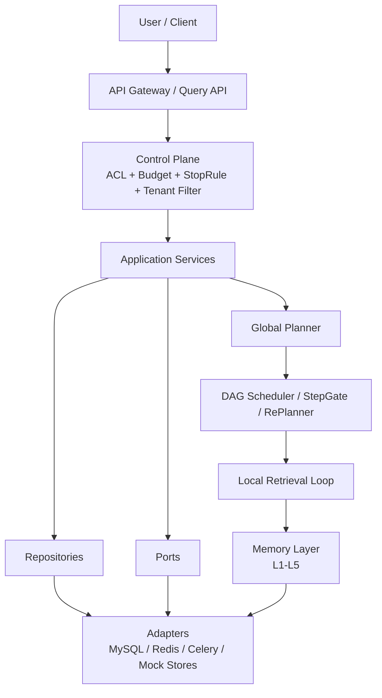
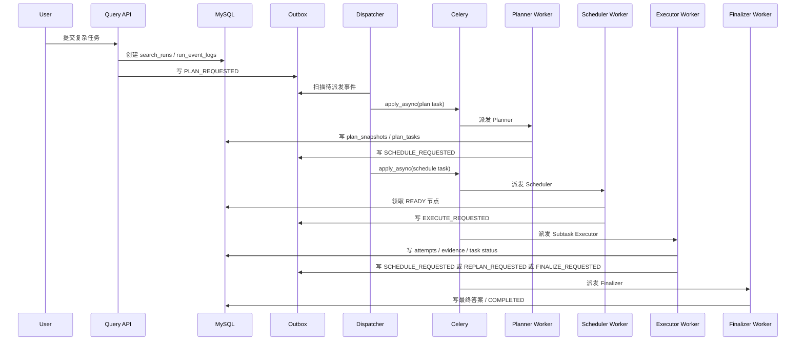
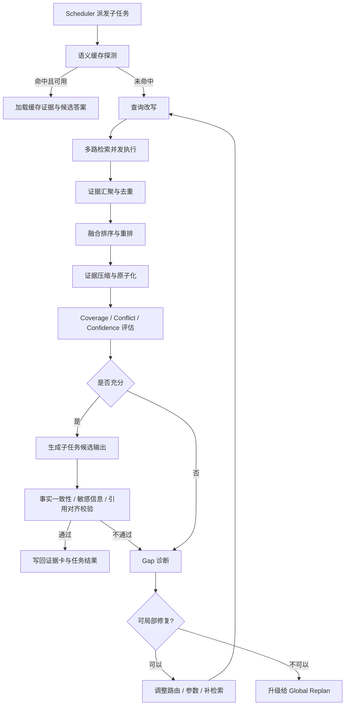
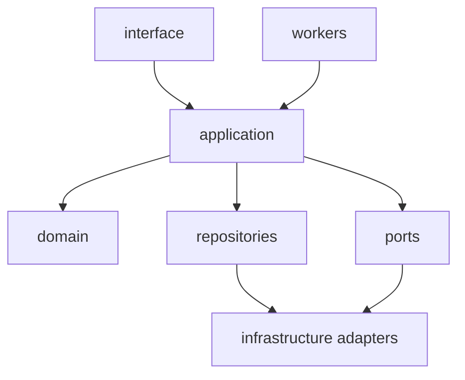

# Agentic RAG 用户检索架构设计规划

## 1. 文档目的

本规划用于指导 `src/learning_common_lib/案例/用户AgenticRAG检索` 目录下后续代码实现。目标不是先把所有算法细节一次写满，而是先固定一套适合中小型企业并发规模、便于在小规模 k8s 场景扩展、同时兼顾稳定性与可控性的 Agentic RAG 运行时骨架。

本次规划重点解决以下问题：

1. 复杂用户任务如何采用 `Plan -> Execute -> RePlan` 的多 Agent 架构运行，而不是退化成单次检索和单次生成。
2. 任务状态如何在 `API / Planner / Scheduler / Executor / Verifier / Final Synthesizer` 之间高性能、高稳定地传递，同时保证可追踪、可恢复。
3. 在 Milvus、ES、图数据库、Web Search 等外部服务尚未启动的前提下，如何先通过面向对象热插拔接口与 Mock 适配器把运行时数据流和边界搭起来。
4. 在企业级权限、预算、时延约束下，如何让局部纠偏与全局重规划共存，而不是每次失败都推倒重来。
5. 在小规模 k8s 部署场景下，如何把 MySQL 事务、乐观锁、Redis 分布式锁、Celery 队列配合起来，避免同一任务被多个 Pod 反复执行。

## 2. 总体结论

推荐采用以下总体方案：

1. **主循环采用 `Global Planner + DAG Scheduler + StepGate + Global Replanner`**。复杂任务先拆成 DAG 子任务，再按依赖调度，而不是让一个 Agent 在长上下文里反复自我对话。
2. **子循环采用 `Local Retrieval Loop`**。每个子任务内部负责查询改写、多路检索、证据评估、局部纠偏和输出校验，不把全局计划变更与局部补检索混在一起。
3. **MySQL 作为运行时真理源**。所有运行状态、计划快照、任务状态、证据引用、用户追问、结果摘要、事件日志最终都落 MySQL。
4. **Redis 作为热状态与协调层**。只负责缓存、短期工作记忆、队列 Broker、领导者锁、任务租约、低延迟事件分发，不承载最终业务真相。
5. **异步基座固定为 `Celery + Redis Broker`**。按角色拆分队列，使用 Worker Lane 承载 Planner、Scheduler、Subtask Executor、Verifier、Repair、Maintenance。
6. **状态传播采用 `MySQL 状态表 + 事件日志 + Outbox + Dispatcher` 组合**。事务中只做状态落库和事件登记，异步派发由 Dispatcher 统一完成，避免“状态已改但任务未发”的断裂。
7. **检索层必须解耦为 Ports + Adapters**。向量检索、全文检索、结构化查询、图查询、Web 检索、Embedding、Rerank、LLM、Memory Store 全部通过接口抽象。
8. **首版不追求真实检索精度，先追求运行时边界正确**。Milvus、ES、Graph、Web Search 首版用内存 Mock 或固定样本数据模拟，但调用方式必须与真实服务一致。
9. **检索结果不直接喂给生成器，必须先进入 `Evidence Card` 标准化层**。后续覆盖性、冲突性、置信度、引用对齐、敏感信息校验都围绕证据卡进行。
10. **上下文管理采用五层记忆体系**。单次 LLM 调用上下文、子任务工作记忆、任务状态记忆、会话情景记忆、跨会话长期记忆分别管理，避免上下文窗口被历史信息挤爆。
11. **核心一致性依赖 MySQL 事务和乐观锁，Redis 锁只做跨 Pod 抢占协调**。不要把 Redis 分布式锁当成最终一致性的根基。
12. **首版默认不使用 Redlock**。当前环境是单 Redis，小规模 k8s 下用 `SET NX EX` + owner token + 心跳续租即可满足协调需要。

## 3. 为什么不建议直接做“单 Agent 串行检索”

如果把复杂任务简化为“用户提问 -> 一次检索 -> 一次生成”，会有以下问题：

1. 无法明确区分“计划错误”和“检索错误”，失败后只能整体重试，成本高且不可控。
2. 无法支持多个子任务并行执行，复杂问题在企业场景下时延会明显拉长。
3. 无法沉淀任务状态，难以支持中途追问、补充信息、人工接管和断点恢复。
4. 无法对每个子任务的证据覆盖率、冲突率、引用正确性做独立评估，容易把局部信息缺口放大成最终幻觉。
5. 无法向前端稳定输出过程状态，用户只能等待一个最终结果，不利于产品交互和问题排查。

因此本规划建议从首版开始就明确区分：

1. **全局层**：负责任务分解、依赖调度、是否重规划、是否终止。
2. **局部层**：负责单个子任务内的检索、评估、纠偏、校验。
3. **控制层**：负责权限、预算、停止规则、并发限制、敏感信息和统一状态传播。

## 4. 推荐的系统分层

### 4.1 逻辑分层

建议拆成以下五层：

1. **入口与控制层**：API、ACL、Tenant Filter、Request Context、Budget Policy、Stop Rule。
2. **全局规划层**：Planner、DAG Builder、Scheduler、StepGate、Global Replanner。
3. **子任务执行层**：Router、Rewrite、Multi-Retriever、Fusion、Rerank、Compress、Evidence Eval、Verify。
4. **记忆与状态层**：Session Memory、Task State Memory、Semantic Cache、Scratchpad、Progress Event。
5. **基础设施层**：MySQL、Redis、Celery、Mock Vector Store、Mock Search Store、Mock Graph Store、Mock Web Retriever、LLM Adapter。

### 4.2 架构总览

### 4.3 首版建议固定的角色

建议至少定义以下对象角色：

1. `QueryCommandService`：复杂检索任务的主入口，负责创建运行记录、写入初始事件、决定是同步快速返回还是异步任务化。
2. `RunPlanningService`：调用 Planner，为用户问题生成可执行 DAG 和初始预算。
3. `DagSchedulerService`：负责就绪任务判定、依赖推进、并行度限制、失败升级与重规划触发。
4. `SubtaskExecutionService`：负责单个子任务内部的改写、检索、评估、纠偏。
5. `EvidenceOrchestratorService`：负责证据卡去重、融合、压缩、冲突标注、父块回填。
6. `VerificationService`：负责事实一致性、敏感信息、引用对齐校验。
7. `FinalAnswerService`：负责汇总已完成子任务结果，生成最终回答和引用。
8. `MemoryService`：负责五层记忆的写入、裁剪、摘要上提和过期回收。
9. `ProgressEventService`：负责把 MySQL 中的状态与事件转换为前端可消费的进度流。
10. `OutboxDispatcherService`：负责扫描待派发事件并调用 Celery `apply_async(...)`。
11. `LockManager`：统一封装 Redis 锁和租约续期。

## 5. 运行时领域模型

### 5.1 推荐实体

建议至少拆成以下核心实体：

1. **会话** `conversation_sessions`
2. **检索运行实例** `search_runs`
3. **规划快照** `plan_snapshots`
4. **计划任务节点** `plan_tasks`
5. **子任务执行尝试** `subtask_attempts`
6. **证据卡** `evidence_cards`
7. **运行事件日志** `run_event_logs`
8. **事务型派发事件** `runtime_outbox_events`
9. **语义缓存** `semantic_cache_entries`
10. **记忆快照** `memory_snapshots`（可选，但推荐）

### 5.2 设计原则

1. `conversation_sessions` 表示用户在一个会话中的交互上下文，不等于某一次复杂检索。
2. `search_runs` 表示某一次复杂检索执行，是 Planner、Scheduler、Executor 共同围绕的核心实体。
3. `plan_snapshots` 表示某次规划结果。全局重规划不是原地修改，而是生成新的计划快照。
4. `plan_tasks` 表示 DAG 中的执行节点，必须可独立追踪状态与结果。
5. `subtask_attempts` 表示同一任务节点在局部纠偏过程中的多次尝试，用于记录 gap 诊断与修复动作。
6. `evidence_cards` 是执行层和验证层的统一中间表示，不建议直接把原始检索文档片段跨模块传来传去。
7. `run_event_logs` 是审计、恢复、实时进度回放的基础，不能只依赖 Redis 临时消息。
8. `runtime_outbox_events` 只承担“下一步应该发生什么”的派发职责，不替代业务状态表。

## 6. 表设计建议

### 6.1 `conversation_sessions`

用途：承载会话级上下文和情景记忆入口。

关键字段建议：

- `id` bigint pk
- `session_code` varchar(64) unique
- `tenant_id` varchar(64) not null
- `user_id` varchar(64) not null
- `title` varchar(256)
- `session_status` enum(`ACTIVE`, `WAITING_USER`, `CLOSED`, `EXPIRED`)
- `latest_run_id` bigint null
- `summary_text` text null
- `summary_version` int not null default 0
- `created_at`
- `updated_at`

说明：

1. 一个会话下可以包含多次 `search_runs`。
2. 会话摘要不应无限增长，建议采用版本化压缩。

### 6.2 `search_runs`

用途：复杂检索任务的核心运行实体。

关键字段建议：

- `id` bigint pk
- `session_id` bigint not null
- `request_id` varchar(64) unique
- `tenant_id` varchar(64) not null
- `user_id` varchar(64) not null
- `query_text` text not null
- `normalized_query` text null
- `intent_type` varchar(64) null
- `complexity_level` enum(`SIMPLE`, `COMPLEX`)
- `risk_level` enum(`LOW`, `MEDIUM`, `HIGH`)
- `run_status` enum(`CREATED`, `PLANNING`, `EXECUTING`, `REPLANNING`, `WAITING_USER`, `SYNTHESIZING`, `COMPLETED`, `DEGRADED`, `FAILED`, `CANCELLED`, `EXPIRED`)
- `active_plan_id` bigint null
- `active_plan_version` int not null default 0
- `budget_json` json
- `stop_rule_json` json
- `result_summary_json` json null
- `final_answer_text` longtext null
- `waiting_reason` varchar(256) null
- `row_version` bigint not null default 0
- `created_at`
- `updated_at`

索引建议：

- `index(session_id, created_at)`
- `index(tenant_id, user_id, created_at)`
- `index(run_status, updated_at)`

说明：

1. `search_runs` 是恢复执行时的首要入口。
2. `row_version` 用于调度器和重规划器并发修改运行状态时做乐观锁控制。

### 6.3 `plan_snapshots`

用途：保存每次全局规划或重规划生成的 DAG 快照。

关键字段建议：

- `id` bigint pk
- `run_id` bigint not null
- `plan_version` int not null
- `planner_name` varchar(64) not null
- `planner_model` varchar(128) null
- `root_goal` varchar(512) not null
- `dag_json` json not null
- `estimated_total_ms` int null
- `max_parallel_width` int not null default 1
- `plan_status` enum(`ACTIVE`, `SUPERSEDED`, `COMPLETED`, `CANCELLED`)
- `created_at`
- `updated_at`

唯一约束建议：

- `unique(run_id, plan_version)`

说明：

1. 首版建议直接同时保存结构化行数据和 `dag_json` 快照，既方便调度，也利于审计和回放。
2. 重规划时不要覆写旧计划，而是新建 `plan_version + 1`。

### 6.4 `plan_tasks`

用途：保存 DAG 中每个子任务的独立状态。

关键字段建议：

- `id` bigint pk
- `run_id` bigint not null
- `plan_id` bigint not null
- `task_key` varchar(64) not null
- `task_title` varchar(256) not null
- `task_type` enum(`RETRIEVAL`, `REASONING`, `REFLECTION`, `SYNTHESIS`, `CLARIFICATION`)
- `route_hint_json` json null
- `depends_on_json` json not null
- `priority` int not null default 100
- `timeout_ms` int not null
- `retry_budget` int not null default 2
- `task_status` enum(`PENDING`, `READY`, `RUNNING`, `SUCCESS`, `FAILED`, `WAITING_USER`, `BLOCKED`, `SKIPPED`, `CANCELLED`)
- `result_summary_json` json null
- `last_error_code` varchar(64) null
- `last_error_message` varchar(1024) null
- `row_version` bigint not null default 0
- `started_at` datetime null
- `finished_at` datetime null
- `created_at`
- `updated_at`

唯一约束建议：

- `unique(plan_id, task_key)`
- `index(run_id, task_status, priority)`

说明：

1. 首版可直接用 `depends_on_json` 保存依赖关系，减少 join 复杂度。
2. 如果未来需要做更强的 DAG 分析，再拆 `plan_task_edges` 表。

### 6.5 `subtask_attempts`

用途：记录单个任务节点在局部纠偏闭环中的多次执行尝试。

关键字段建议：

- `id` bigint pk
- `run_id` bigint not null
- `plan_task_id` bigint not null
- `attempt_no` int not null
- `iteration_no` int not null
- `route_bundle_json` json null
- `query_bundle_json` json null
- `gap_type` varchar(64) null
- `gap_detail` varchar(512) null
- `eval_result_json` json null
- `verify_result_json` json null
- `status` enum(`CREATED`, `RETRIEVING`, `EVALUATING`, `VERIFYING`, `RETRYING`, `ESCALATED`, `SUCCESS`, `FAILED`)
- `latency_ms` int null
- `token_usage_json` json null
- `created_at`
- `updated_at`

唯一约束建议：

- `unique(plan_task_id, attempt_no)`

说明：

1. `attempt_no` 是局部重试的重要审计键。
2. `eval_result_json` 和 `verify_result_json` 是后续重规划的重要输入。

### 6.6 `evidence_cards`

用途：保存结构化证据卡，作为生成与验证的统一输入。

关键字段建议：

- `id` bigint pk
- `run_id` bigint not null
- `plan_task_id` bigint not null
- `attempt_id` bigint not null
- `card_code` varchar(64) not null
- `claim_text` text not null
- `claim_type` enum(`NUMERIC`, `CAUSAL`, `DESCRIPTIVE`, `TEMPORAL`, `PROCEDURAL`)
- `source_type` enum(`VECTOR`, `ES`, `SQL`, `GRAPH`, `WEB`, `CACHE`, `MANUAL`)
- `source_ref_json` json not null
- `reliability_tier` enum(`T1`, `T2`, `T3`)
- `retrieval_score` decimal(8,4) null
- `confidence_score` decimal(8,4) null
- `entities_json` json null
- `corroborated_by_json` json null
- `conflicts_with_json` json null
- `content_hash` char(64) not null
- `created_at`
- `updated_at`

唯一约束建议：

- `unique(card_code)`
- `index(plan_task_id, attempt_id)`

说明：

1. `card_code` 建议由 `run_id + plan_task_id + attempt_no + seq_no` 生成，保证唯一且可追踪。
2. `content_hash` 用于去重和缓存回写。

### 6.7 `run_event_logs`

用途：保存运行过程中的所有关键事件，支持回放、对账和前端进度展示。

关键字段建议：

- `id` bigint pk
- `run_id` bigint not null
- `plan_id` bigint null
- `plan_task_id` bigint null
- `event_type` varchar(64) not null
- `event_level` enum(`INFO`, `WARN`, `ERROR`)
- `event_payload_json` json not null
- `occurred_at` datetime not null
- `created_at`

索引建议：

- `index(run_id, id)`
- `index(plan_task_id, id)`

说明：

1. 该表是进度流的回放源。
2. Redis 中的事件消息可以丢，但这里不能丢。

### 6.8 `runtime_outbox_events`

用途：解决状态提交与异步派发之间的双写一致性问题。

关键字段建议：

- `id` bigint pk
- `aggregate_type` enum(`SEARCH_RUN`, `PLAN_TASK`, `SESSION`)
- `aggregate_id` bigint not null
- `event_type` enum(`PLAN_REQUESTED`, `SCHEDULE_REQUESTED`, `EXECUTE_REQUESTED`, `VERIFY_REQUESTED`, `REPLAN_REQUESTED`, `FINALIZE_REQUESTED`, `PROGRESS_PUBLISH_REQUESTED`, `MEMORY_COMPACT_REQUESTED`)
- `dedupe_key` varchar(128) not null
- `queue_name` varchar(64) not null
- `task_name` varchar(128) not null
- `payload_json` json not null
- `publish_status` enum(`PENDING`, `SENT`, `FAILED`)
- `available_at` datetime not null
- `next_retry_at` datetime null
- `published_at` datetime null
- `created_at`
- `updated_at`

唯一约束建议：

- `unique(dedupe_key)`
- `index(publish_status, available_at)`

说明：

1. 事务内只写 `runtime_outbox_events`，不直接发 Celery。
2. 同一事件是否重复发送，由 `dedupe_key` 兜底控制。

### 6.9 `semantic_cache_entries`

用途：承载“改写前语义探测”和“验证后结果回写”的长期缓存。

关键字段建议：

- `id` bigint pk
- `tenant_id` varchar(64) not null
- `scope_type` enum(`USER`, `ROLE`, `TENANT`, `GLOBAL`)
- `query_hash` char(64) not null
- `query_text` text not null
- `query_embedding_key` varchar(128) not null
- `answer_snapshot_json` json not null
- `evidence_checksum` char(64) not null
- `acl_fingerprint` char(64) not null
- `hit_count` int not null default 0
- `last_hit_at` datetime null
- `expires_at` datetime null
- `created_at`
- `updated_at`

唯一约束建议：

- `unique(tenant_id, scope_type, query_hash, acl_fingerprint)`

说明：

1. 语义缓存必须带权限指纹，避免跨用户错用证据。
2. 只有通过验证的结果才允许写回缓存。

### 6.10 `memory_snapshots`（可选，但推荐）

用途：保存任务级和会话级的压缩记忆。

关键字段建议：

- `id` bigint pk
- `owner_type` enum(`SESSION`, `RUN`, `TASK`)
- `owner_id` bigint not null
- `memory_level` enum(`L2`, `L3`, `L4`, `L5`)
- `snapshot_version` int not null
- `summary_json` json not null
- `created_at`

说明：

1. 首版可先只保存 `L3/L4` 摘要。
2. `L2` 工作记忆可以主要放 Redis，再按需异步压缩入库。

## 7. 状态机设计

### 7.1 运行级状态

`search_runs.run_status`

1. `CREATED`：记录已建立，尚未进入规划。
2. `PLANNING`：正在生成 DAG。
3. `EXECUTING`：至少一个子任务正在运行。
4. `REPLANNING`：全局计划正在重算。
5. `WAITING_USER`：因关键信息缺失等待用户补充。
6. `SYNTHESIZING`：所有必要子任务完成，正在生成最终答案。
7. `COMPLETED`：正常完成。
8. `DEGRADED`：达到降级条件后输出保守答案。
9. `FAILED`：运行失败且不可自动修复。
10. `CANCELLED`：用户取消。
11. `EXPIRED`：超时失效。

### 7.2 计划任务状态

`plan_tasks.task_status`

1. `PENDING`：已创建，等待依赖满足。
2. `READY`：依赖已满足，等待调度。
3. `RUNNING`：已被某个 Worker 领取。
4. `SUCCESS`：任务成功完成。
5. `FAILED`：任务失败且已耗尽局部重试。
6. `WAITING_USER`：任务需要用户补充信息。
7. `BLOCKED`：上游失败或权限不足，暂不可推进。
8. `SKIPPED`：重规划后被显式跳过。
9. `CANCELLED`：随运行取消一起终止。

### 7.3 子任务尝试状态

`subtask_attempts.status`

1. `CREATED`
2. `RETRIEVING`
3. `EVALUATING`
4. `VERIFYING`
5. `RETRYING`
6. `ESCALATED`
7. `SUCCESS`
8. `FAILED`

### 7.4 推荐状态流转

用户发起复杂任务：

1. API 创建 `search_runs(CREATED)`。
2. 同事务写入 `run_event_logs` 和 `runtime_outbox_events(PLAN_REQUESTED)`。
3. Planner 领取任务后把运行切到 `PLANNING`。
4. 规划完成后写入 `plan_snapshots`、`plan_tasks`，同时把入度为 `0` 的节点标记为 `READY`。
5. Scheduler 根据 `READY` 队列下发执行任务，并把运行切到 `EXECUTING`。
6. 局部执行成功后，StepGate 判断是推进下一步、进入 `SYNTHESIZING`，还是触发 `REPLANNING`。
7. 如需用户补充，运行切到 `WAITING_USER`。
8. 最终成功则进入 `COMPLETED`，预算超限但仍可回答则进入 `DEGRADED`。

## 8. 端到端数据流

### 8.1 主流程：全局 Plan -> Execute -> RePlan

建议流程：

1. API 只负责接收入参、权限校验、创建运行记录和初始 outbox 事件，不直接承担重逻辑。
2. Planner 负责生成 `plan_snapshots` 与 `plan_tasks`，并初始化预算。
3. Scheduler 只处理 DAG 推进和任务派发，不介入检索细节。
4. Executor 负责单任务闭环，执行结束后把结果和事件写回 MySQL。
5. Finalizer 负责汇总答案和引用，而不是让 Scheduler 直接生成最终回答。

### 8.2 子任务执行闭环：Local Retrieval Loop

建议规则：

1. 缓存命中也不能直接跳过校验，至少要重新做权限和时效性检查。
2. 多路检索应使用统一 `EvidenceCard` 结构归一化结果。
3. 局部纠偏优先级高于全局重规划，只有“局部无增益”或“结果偏离原计划过大”时才升级。

### 8.3 全局重规划

建议触发条件：

1. 某个关键路径任务连续局部纠偏后仍 `Coverage` 不足。
2. 多个子任务之间出现强冲突，且无法在局部阶段解释。
3. 用户补充信息导致原目标、约束、时间范围发生变化。
4. 预算或时延接近上限，需要裁剪原计划。

推荐做法：

1. 已完成任务结果不丢弃，重规划只替换未完成部分。
2. 新的 `plan_version` 应引用旧任务产出的可复用结果。
3. 被新计划废弃的旧任务标记 `SKIPPED`，而不是硬删。

### 8.4 等待用户补充

不建议把所有信息缺口都交给模型“猜测补完”。推荐明确支持 `WAITING_USER` 分支：

1. 子任务输出标准化 `clarification_question`。
2. 运行状态切到 `WAITING_USER`。
3. 用户补充后写入 `run_event_logs`，再由 Scheduler 触发恢复执行。
4. 恢复时保留原计划和历史证据，避免整任务重跑。

## 9. 状态传递与一致性设计

### 9.1 真正的核心

任务状态传递要满足的不是“消息传得快”这么简单，而是同时满足：

1. **状态落库正确**
2. **事件不丢**
3. **重复消费不出错**
4. **前端可订阅**
5. **Worker 崩溃后可恢复**

因此推荐采用：

1. `search_runs / plan_tasks / subtask_attempts` 负责保存当前状态。
2. `run_event_logs` 负责保存过程事实。
3. `runtime_outbox_events` 负责定义“下一步要派发什么任务”。
4. `ProgressEventService` 负责把事件 best-effort 推送到 Redis Stream 或 SSE 通道。

### 9.2 为什么不建议只依赖 Redis 做状态传递

如果把运行状态只放在 Redis，会遇到几个问题：

1. 无法稳定审计和回放。
2. Worker 宕机后恢复复杂。
3. 状态和任务派发容易出现分叉。
4. 权限、预算、重规划版本等复杂状态不适合只保存在易失性存储里。

因此推荐明确：

1. MySQL 负责真理状态。
2. Redis 负责加速、广播和租约。

### 9.3 推荐事件传播路径

1. 业务事务中更新状态表。
2. 同事务写 `run_event_logs`。
3. 同事务写 `runtime_outbox_events`。
4. 事务提交后由业务层 best-effort 触发一次 Dispatcher。
5. Celery Beat 周期兜底扫描 `PENDING` outbox 事件。
6. Dispatcher 发送执行任务后，把 `publish_status` 更新为 `SENT`。
7. `ProgressEventService` 读取 `run_event_logs` 增量并推送到 Redis Stream，前端优先读 Stream，失败时回落到轮询 API。

### 9.4 幂等策略

必须保证以下幂等性：

1. 同一 `PLAN_REQUESTED` 重复派发，只会激活一个有效规划。
2. 同一 `plan_task_id` 不会被两个 Executor 同时长期占有。
3. 同一子任务重复执行时，证据卡、结果摘要、状态推进不会重复污染。
4. 同一运行进入 `FINALIZE_REQUESTED` 多次，也只会生成一个当前有效最终答案。

推荐规则：

1. `runtime_outbox_events.dedupe_key` 按 `aggregate + action + version` 生成。
2. `plan_tasks` 状态更新必须采用“期望旧状态 -> 新状态”的条件更新。
3. `subtask_attempts` 使用 `(plan_task_id, attempt_no)` 做唯一约束。
4. `FinalAnswerService` 只对 `run_status in (EXECUTING, SYNTHESIZING, REPLANNING)` 且 `active_plan_version` 最新的运行生效。

### 9.5 延迟与背压控制

建议控制平面直接固定以下限制：

1. 单运行最大并行宽度 `max_parallel_width`。
2. 单租户并发运行数上限。
3. 单子任务最大迭代次数 `max_iterations`。
4. 单运行最大 token、最大时延、最大外部调用数。
5. 外部检索通道单路超时，例如 Vector / ES / SQL / Web 各自单独限制。

这些限制都应记录在 `search_runs.budget_json` 和 `stop_rule_json` 中，方便调试和复盘。

## 10. 检索路由与证据标准化

### 10.1 路由类型建议

建议至少保留以下路由类型：

1. `semantic`：向量检索，适合语义召回。
2. `keyword`：全文检索，适合精确术语匹配。
3. `structured`：结构化查询，适合数值、统计、过滤类问题。
4. `graph`：图检索，适合多跳关系问题。
5. `web`：外部检索，适合时效性问题。
6. `reasoning`：不直接检索，而是基于已有子任务结果做推理整合。

### 10.2 缺口类型与补救动作映射

建议把局部纠偏固定成“缺口类型 -> 补救动作”的显式映射，而不是每次自由发挥：

1. `coverage_gap`：覆盖不足，增加互补 query 或补充结构化/图检索。
2. `conflict_gap`：证据冲突，优先提升权威来源权重并追加验证。
3. `freshness_gap`：时效不足，转 Web 路由并增加时间窗约束。
4. `terminology_gap`：术语歧义，增强术语对齐和同义词扩展。
5. `acl_gap`：权限不可达，直接终止该路由或要求更高权限。
6. `missing_param_gap`：关键条件缺失，转 `WAITING_USER`。

### 10.3 证据卡标准

首版建议统一使用如下概念：

1. 一张证据卡只表达一个可验证断言。
2. 每张证据卡必须带来源、时间、可靠性等级、检索得分、冲突关系。
3. 多路检索结果必须先归一化为证据卡，再进入评估和生成阶段。
4. 最终答案引用必须引用证据卡，不直接引用原始 chunk 编号。

### 10.4 评估与校验规则

建议固定三类评估指标和三类输出校验：

评估指标：

1. `Coverage`：所需信息点是否被覆盖。
2. `Conflict`：多源证据是否冲突、冲突是否可解释。
3. `Confidence`：来源可靠性、排序分数、时效性综合后的置信度。

输出校验：

1. **事实一致性**：输出 claim 是否被证据支持。
2. **敏感信息校验**：是否存在越权或敏感信息泄露。
3. **引用对齐**：claim 与引用证据是否一一对应。

## 11. 五层记忆设计

### 11.1 推荐结论

记忆不建议做成一个统一大缓存，而应分层：

1. **L1 上下文窗口**：单次 LLM 调用时组装的 prompt，上下文寿命最短。
2. **L2 子任务工作记忆**：当前子任务的证据卡、评估历史、重试原因。
3. **L3 任务状态记忆**：DAG 执行状态、全局证据池、预算消耗、关键中间结论。
4. **L4 会话情景记忆**：本次对话中的摘要、用户澄清、已完成问题与结论。
5. **L5 长期语义记忆**：语义缓存、用户偏好、路由经验、可复用模式。

### 11.2 存储建议

1. `L1`：仅保存在内存，生命周期等于单次模型调用。
2. `L2`：优先放 Redis Hash / JSON，子任务完成后压缩入 MySQL。
3. `L3`：MySQL 为主，Redis 为热副本。
4. `L4`：MySQL 摘要为主，Redis 可保留最近会话热缓存。
5. `L5`：MySQL 元数据 + Mock Vector Cache / 真正向量库共同承载。

### 11.3 上下文窗口组装原则

1. 每个 Agent 只看到自己需要的最小上下文。
2. 优先传证据卡和摘要，而不是原始长文档。
3. 超出 token 预算时，优先裁剪会话摘要和低分证据，而不是关键任务约束。
4. 子任务重试时，只附带必要的上轮失败原因，不重复塞入整个历史链路。

## 12. 锁与并发控制设计

### 12.1 推荐结论

对于当前项目，建议采用：

1. **MySQL 行锁 / 乐观锁负责核心状态正确性**
2. **Redis 分布式锁负责跨 Pod 抢占协调**

不要反过来。

### 12.2 MySQL 负责什么

适合 MySQL 事务和乐观锁处理的场景：

1. 创建运行记录并生成初始 outbox 事件。
2. Planner 切换 `active_plan_id`。
3. Scheduler 领取 `READY` 任务并更新为 `RUNNING`。
4. 子任务完成后推进 `plan_tasks` 状态。
5. 全局重规划版本切换。
6. 最终答案写入和运行终态切换。

实现建议：

1. 关键状态更新使用 `where id=? and row_version=?`。
2. 对“同一运行只允许一个活跃重规划”的场景，可以辅以 `SELECT ... FOR UPDATE`。

### 12.3 Redis 负责什么

适合 Redis 锁解决的场景：

1. 防止两个 Scheduler 同时调度同一个 `run_id`。
2. 防止两个 Executor 同时执行同一个 `plan_task_id`。
3. 防止多个 Replanner 同时改写同一运行。
4. 防止多个维护任务同时压缩同一份记忆。
5. 防止多个 Janitor 实例同时全库扫描。

锁 key 建议：

1. `rag:run:schedule:{run_id}`
2. `rag:task:execute:{plan_task_id}`
3. `rag:run:replan:{run_id}`
4. `rag:memory:compact:{owner_type}:{owner_id}`
5. `rag:janitor:leader`

锁策略建议：

1. 使用短 TTL，例如 `30s` 到 `180s`。
2. 长任务需要心跳续租。
3. 释放锁前校验 owner token。
4. 锁失败时不应直接报错退出，而应回退为稍后重试或重新入队。

### 12.4 是否要用 Redlock

首版建议不使用 Redlock：

1. 当前 Redis 拓扑并不复杂。
2. 关键正确性已经由 MySQL 托底。
3. Redis 锁主要是减少重复执行，而不是唯一正确性来源。

## 13. 异步任务与队列设计

### 13.1 队列划分建议

建议固定如下队列：

1. `plan_jobs`
2. `schedule_jobs`
3. `execute_jobs`
4. `verify_jobs`
5. `finalize_jobs`
6. `repair_jobs`
7. `maintenance_jobs`

### 13.2 Worker Lane 建议

1. `plan_jobs`：低并发、高稳定，避免和大规模检索抢资源。
2. `schedule_jobs`：低延迟、小任务，适合单独 worker。
3. `execute_jobs`：主力池，承担大部分子任务执行。
4. `verify_jobs`：可与 `execute_jobs` 合并，也可在高精度场景拆池。
5. `finalize_jobs`：低并发，保证最终答案生成稳定性。
6. `repair_jobs` / `maintenance_jobs`：低优先级，不与主链路竞争。

### 13.3 Celery 配置建议

首版建议以以下基线启动：

1. `acks_late=True`
2. `task_reject_on_worker_lost=True`
3. `task_routes` 显式绑定队列
4. 可恢复异常统一指数退避重试
5. `Celery Beat` 周期扫描 outbox、恢复滞留任务、压缩记忆、清理过期会话

## 14. 模块分层与代码组织建议

### 14.1 分层建议

推荐原则：

1. `interface` 层只做参数解析、响应封装、鉴权上下文注入。
2. `application` 层负责事务编排、状态流转、写 outbox、调用端口。
3. `domain` 层负责预算规则、停止规则、状态机、路由决策策略。
4. `ports` 层负责声明外部能力接口。
5. `repositories` 层负责 MySQL 读写，不夹带外部 SDK 逻辑。
6. `workers` 层只作为 Celery 入口，不堆复杂业务。

### 14.2 面向对象热插拔接口建议

建议每个模块自己维护抽象接口，例如：

1. `planner/base.py`
2. `scheduler/base.py`
3. `retrievers/base.py`
4. `memory/base.py`
5. `verification/base.py`
6. `queue/base.py`
7. `locks/base.py`
8. `repositories/base.py`

这样做的原因：

1. 接口边界更靠近真实业务模块。
2. 后续替换 Mock 实现时不需要改应用层。
3. 不必额外抽一个巨大而空泛的全局 `base` 包。

### 14.3 建议模块

建议首版至少实现以下模块：

1. `PlannerPort`
2. `SchedulerPolicy`
3. `RouteDecisionPort`
4. `VectorRetrieverPort`
5. `SearchRetrieverPort`
6. `StructuredRetrieverPort`
7. `GraphRetrieverPort`
8. `WebRetrieverPort`
9. `EmbeddingPort`
10. `RerankerPort`
11. `VerifierPort`
12. `MemoryStorePort`
13. `EventBusPort`
14. `TaskQueuePort`
15. `LockPort`

## 15. Mock 适配器设计

由于 Milvus、ES、Graph、Web Search 尚未启动，建议先实现以下 Mock：

### 15.1 `MockVectorRetrieverAdapter`

建议接口：

1. `search(query_embedding, filters, top_k)`

建议实现：

1. 内部使用 `dict[str, VectorDoc]` 或 `list[VectorDoc]` 保存样本数据。
2. 使用确定性伪向量和简化余弦分数，保证同样输入返回可复现结果。
3. 保留 `tenant_id`、`acl_tags`、`doc_id`、`chunk_id` 元数据，便于模拟权限过滤。

### 15.2 `MockSearchRetrieverAdapter`

建议接口：

1. `search(query_dsl, filters, top_k)`

建议实现：

1. 使用倒排式简化索引或关键词匹配模拟 ES 行为。
2. 同义词扩展、术语标准化、时间过滤可以通过规则函数模拟。

### 15.3 `MockStructuredRetrieverAdapter`

建议接口：

1. `execute(query_plan, filters)`

建议实现：

1. 首版可直接读取 MySQL 测试表或内存 fixture。
2. 只支持白名单字段和受控模板，禁止自由 SQL。

### 15.4 `MockGraphRetrieverAdapter`

建议接口：

1. `traverse(graph_query, filters)`

建议实现：

1. 用邻接表 dict 模拟实体与关系边。
2. 支持跳数限制、关系白名单和路径解释输出。

### 15.5 `MockWebRetrieverAdapter`

建议接口：

1. `search(query_text, source_policy, time_window)`

建议实现：

1. 首版使用本地样本或固定返回，重点验证 Web 沙箱、白名单和输出校验流程。
2. 不建议首版直接引入真实互联网检索。

### 15.6 `InMemorySemanticCacheAdapter`

建议接口：

1. `probe(query_embedding, tenant_scope, acl_fingerprint)`
2. `write(cache_entry)`

建议实现：

1. 先在内存或 Redis 中保存缓存热数据。
2. 周期性落 MySQL 元数据，保证可审计。

## 16. API 设计建议

当前阶段建议先提供运行时管理 API，而不是一开始就追求完整对话产品形态。

建议最小接口：

1. `POST /query-runs`
2. `GET /query-runs/{run_id}`
3. `GET /query-runs/{run_id}/events`
4. `POST /query-runs/{run_id}/clarifications`
5. `POST /query-runs/{run_id}/cancel`
6. `GET /sessions/{session_id}`
7. `GET /sessions/{session_id}/runs`
8. `GET /query-runs/{run_id}/result`

说明：

1. `POST /query-runs` 可根据 `complexity_level` 决定是否走复杂 DAG 流程。
2. `GET /query-runs/{run_id}/events` 支持轮询回放，后续可升级为 SSE。
3. `clarifications` 是复杂任务必需接口，不建议靠隐式提示替代。

## 17. 当前仓库中可复用的经验

### 17.1 MySQL 访问层

可参考：

- `src/learning_common_lib/mysql_lession/examples/10_fastapi_integration`

建议复用：

1. SQLAlchemy 2.x 的会话管理方式。
2. Repository 模式。
3. 配置和数据库连接初始化方式。

### 17.2 Celery 异步任务

可参考：

- `src/learning_common_lib/redis_lession/celery教程与Redlock/examples/04_async_worker_tasks`

建议复用：

1. Celery Worker 与 Beat 的拆分方式。
2. 任务重试与异步执行方式。
3. Redis 作为 Broker 的基础配置。

### 17.3 异常体系

可参考：

- `src/learning_common_lib/python基础/exception教程/templates`

建议复用：

1. 统一异常基类和错误码。
2. 对外错误与对内日志分离。
3. Worker、API、Service 三层共享一套错误语义。

## 18. 实施顺序建议

建议分五个阶段推进。

### 阶段 1：运行时骨架

1. 建立目录结构、配置、枚举、异常、数据库连接。
2. 建立 `search_runs / plan_snapshots / plan_tasks / run_event_logs / runtime_outbox_events` 模型。
3. 建立 Celery 基础设施与 Dispatcher。
4. 建立 Redis 锁和进度事件封装。

交付标准：

1. 能创建复杂检索运行记录。
2. 能通过 outbox 成功派发 Planner 任务。

### 阶段 2：主循环可运行

1. 实现 `PlannerPort` 与 `RunPlanningService`。
2. 实现 `DagSchedulerService`。
3. 跑通 `PLAN_REQUESTED -> SCHEDULE_REQUESTED -> EXECUTE_REQUESTED` 主链路。

交付标准：

1. 能生成 DAG。
2. 能把就绪任务派发给 Executor。

### 阶段 3：子任务执行闭环

1. 实现 Router、Rewrite、Mock Retrievers、Evidence Card 标准化。
2. 实现 Evidence Eval、Verification。
3. 实现局部纠偏与升级全局重规划的分支。

交付标准：

1. 单个子任务可以完成“检索 -> 评估 -> 校验 -> 成功/升级”闭环。
2. 证据卡和子任务结果能稳定入库。

### 阶段 4：记忆与用户交互

1. 实现 `L2/L3/L4` 记忆写入与摘要压缩。
2. 实现 `WAITING_USER` / `clarifications` 恢复执行。
3. 接入语义缓存。

交付标准：

1. 支持用户补充信息后续跑。
2. 支持缓存命中和上下文裁剪。

### 阶段 5：工程化加固

1. 增加日志、链路 ID、指标、告警。
2. 增加恢复任务、滞留任务扫描、过期会话清理。
3. 增加租户限流、并发配额和热更新配置。
4. 准备从 Mock 适配器切换到真实 Milvus / ES / Web Search。

交付标准：

1. 运行状态可观测。
2. Worker 崩溃后任务可恢复。
3. 在小规模 k8s 下可稳定扩容。

## 19. 首版必须固定的工程约束

为了避免实现阶段反复摇摆，首版建议直接固定以下约束：

1. Python 运行环境使用 `Python 3.11`，命令形式统一为 `uv run xxx.py`。
2. MySQL 是运行时真理源，Redis 只承担缓存、锁、Broker、热事件分发。
3. 首版异步任务基座固定为 `Celery + Redis Broker + Celery Beat`。
4. Milvus、ES、Graph、Web Search 首版全部通过 Mock 适配器模拟，不直接写死业务逻辑。
5. 复杂任务统一采用 `Global Planner + Local Retrieval Loop`，不同时维护多套并行主流程。
6. 所有输出必须经过事实一致性、敏感信息、引用对齐三重校验后才能回写缓存或输出给用户。
7. 同一 `run_id` 任意时刻只允许一个活跃的全局重规划流程。
8. 同一 `plan_task_id` 任意时刻只允许一个活跃 Executor 持有执行租约。
9. 语义缓存必须带租户和权限指纹，禁止跨 ACL 复用。
10. 所有重要状态流转必须伴随 `run_event_logs` 记录，不允许只改状态不记事件。

## 20. 总结

这套架构的核心不是“把更多 Agent 叠上去”，而是把复杂任务运行时拆成清晰、可追踪、可重试的几个层次：

1. **全局层负责计划与推进**
2. **局部层负责检索与纠偏**
3. **控制层负责预算、权限、状态传播和安全**
4. **记忆层负责上下文压缩与经验复用**
5. **基础设施层负责通过统一接口承接 MySQL、Redis、Celery 与 Mock 检索源**

如果后续代码实现严格遵守这些边界，即使首版先用 Mock 检索器，也可以先把最难的运行时正确性、状态一致性和多 Agent 编排框架稳定下来，后面再逐步把真实 Milvus、ES、Graph 或 Web 搜索接进来。
