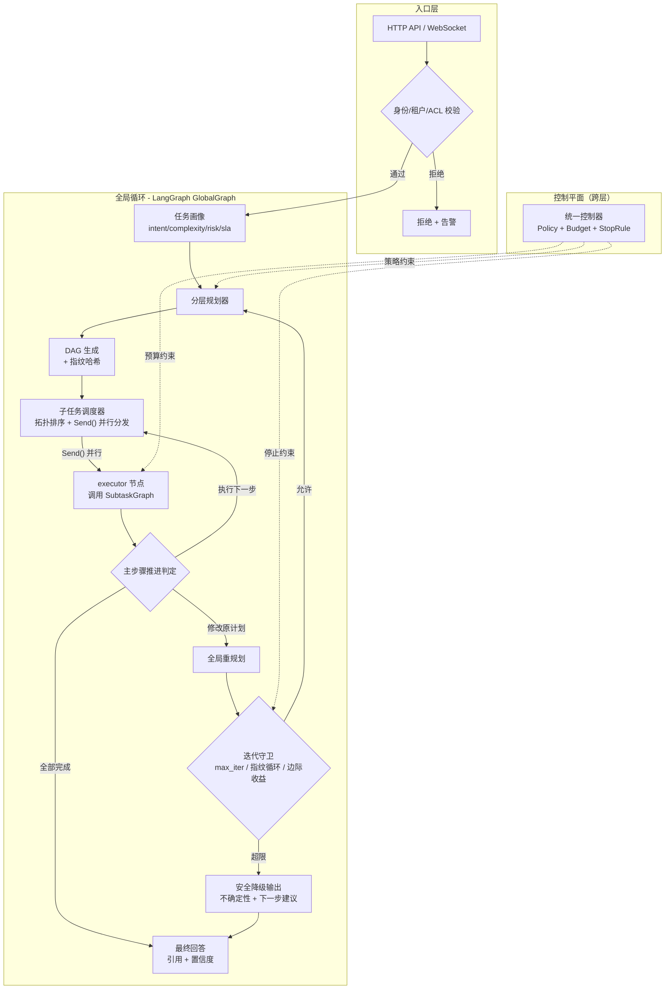
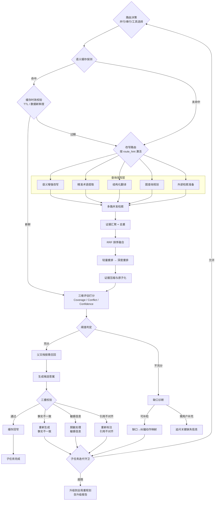
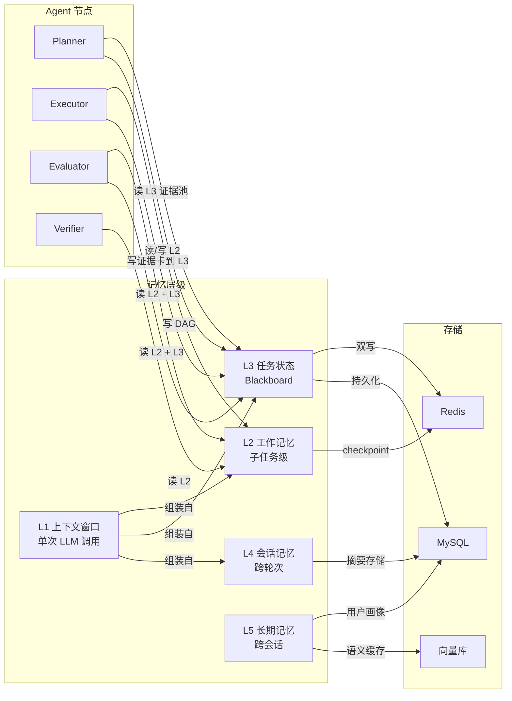
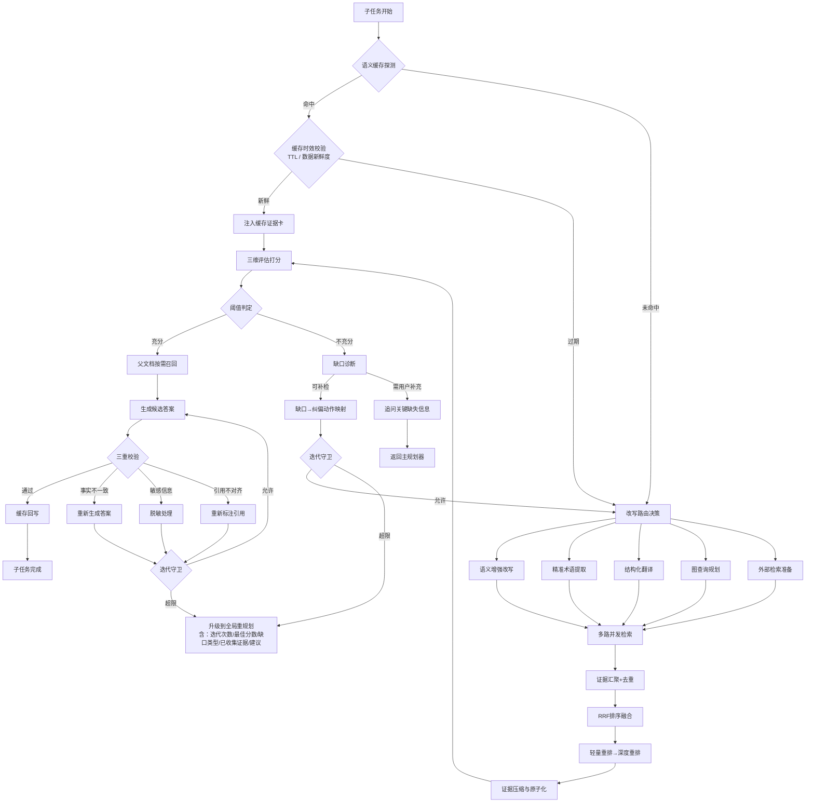
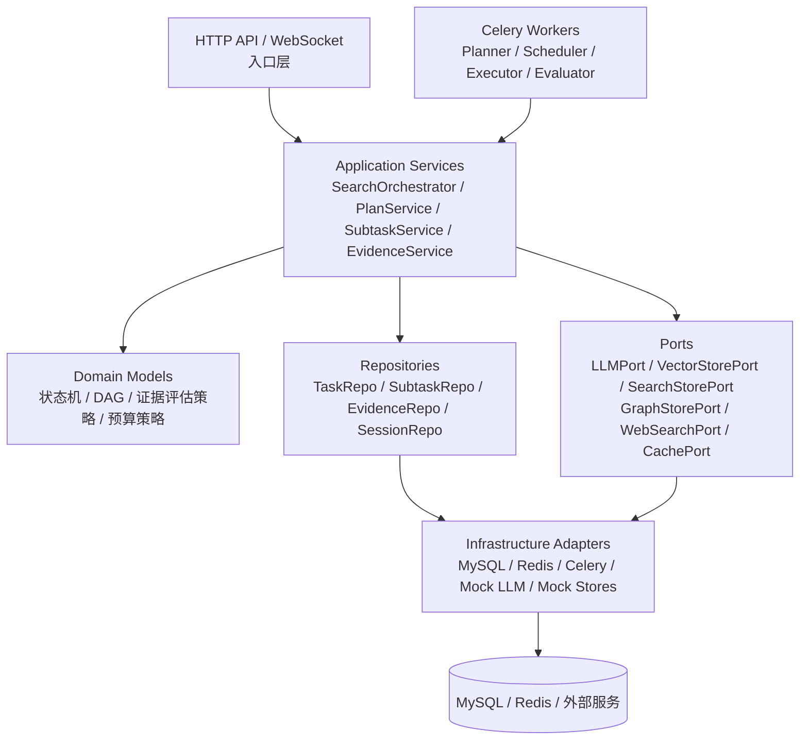

# Agentic RAG 用户深度检索 架构设计规划

## 1. 文档目的

本规划用于指导 `src/learning_common_lib/案例/用户AgenticRAG检索` 目录下后续代码实现，目标是搭建一套企业生产级的 Multi-Agent Deep Search 系统骨架，采用 Plan-Execute-Replan 双循环架构。

本次规划优先解决以下问题：

1. 全局规划层（Planner → DAG → Scheduler → StepGate）如何做状态管理与并发调度。
2. 子任务执行闭环（路由 → 改写 → 多路检索 → 证据评估 → 纠偏）如何做可控迭代。
3. 五层记忆系统（L1~L5）如何分层存储与跨 Agent 共享。
4. 高并发场景下的锁策略、幂等性、超时熔断如何设计。
5. 如何复用当前仓库已有的 SQLAlchemy、Redis/Celery、统一异常处理经验。

配套细化说明见 [技术拆解](./技术拆解.md)，覆盖以下关键技术点：

1. [LangGraph DAG 编排](./技术拆解.md#langgraph-dag)：编排引擎选型、两图架构、State Schema、条件边、并行执行、Checkpointing、与 Celery 分工。
2. [任务状态传递与 Redis 存储](./技术拆解.md#state-redis)：Key 命名规范、全局任务状态、DAG 入度表 Lua 脚本、子任务工作记忆、证据池、预算追踪、事件流、Scheduler 就绪发现。
3. [Celery 高并发适配](./技术拆解.md#celery-concurrency)：定位、首版够用的理由、真实瓶颈、缓解措施、演进路径。
4. [全局循环与子任务循环的交互边界](./技术拆解.md#loop-boundary)：职责划分、升级协议、证据共享、Replan 取消策略。
5. [证据冲突仲裁](./技术拆解.md#conflict-arbitration)：检测时机、仲裁策略、不可调和冲突处理。
6. [Replan 循环检测与收敛保证](./技术拆解.md#replan-convergence)：DAG 指纹、相似度检测、收敛策略、最终兜底。

## 2. 总体结论

推荐采用以下总体方案：

1. **双循环解耦**。全局循环（Global Loop）负责任务分解、DAG 调度、步骤推进判定、全局重规划；子任务循环（Local Loop）负责检索-评估-纠偏，两层独立迭代互不干扰。
2. **MySQL 作为任务状态真理源**。所有 DAG 状态、子任务状态、证据评估结果、预算消耗全部落 MySQL，Redis 仅做热缓存和协调锁。
3. **Redis 作为实时调度总线**。DAG 状态变更事件通过 Redis Stream 发布，Scheduler 订阅消费，实现低延迟调度。
4. **Celery 作为异步执行引擎**。子任务的检索、LLM 调用、证据评估等 CPU/IO 密集操作由 Celery Worker 执行，按任务类型拆队列。
5. **Blackboard 模式做跨 Agent 协调**。所有 Agent 通过读写 L3（任务级状态记忆）来共享证据和状态，而不是直接互传上下文，避免 3-10x token 浪费。
6. **证据卡（Evidence Card）作为统一数据契约**。从多路检索到评估、生成、校验，全链路以结构化证据卡为数据单元。
7. **Port + Adapter 架构抽象外部依赖**。LLM Provider、向量库、ES、图数据库、Web 搜索均通过 Port 接口抽象，首版提供 Mock 实现。
8. **多层超时 + 轻量熔断**。单次 LLM 调用、单路检索、子任务、全局任务分别设置超时，对外部服务维护熔断状态。
9. **全链路可追踪**。request_id → plan_id → subtask_id → retrieval_call_id 四级追踪，关键节点埋点。

## 3. 核心架构概览

### 图1：全局循环（Plan-Execute-Replan）



### 图2：子任务闭环（SubtaskGraph）



### 图3：记忆系统数据流



## 4. 推荐的领域模型

### 4.1 实体拆分

建议拆成以下核心实体：

1. **检索任务** `search_tasks` — 用户发起的一次完整检索请求
2. **执行计划** `task_plans` — Planner 生成的 DAG 计划（支持版本化）
3. **子任务** `subtasks` — DAG 中的每个节点
4. **子任务依赖** `subtask_dependencies` — DAG 边（依赖关系+依赖类型）
5. **证据卡** `evidence_cards` — 原子化证据，跨子任务共享
6. **证据评估记录** `evidence_evaluations` — 每轮评估的三维打分
7. **子任务输出** `subtask_outputs` — 子任务的候选答案与校验结果
8. **会话记录** `sessions` — 会话级情景记忆
9. **会话轮次** `session_turns` — 每轮对话摘要
10. **用户偏好** `user_preferences` — 跨会话长期记忆
11. **语义缓存** `semantic_cache` — 查询级缓存（向量库侧）
12. **预算消耗记录** `budget_ledger` — 细粒度预算追踪

### 4.2 设计原则

1. `search_tasks` 是一次用户请求的生命周期载体，承载全局预算和控制信号。
2. `task_plans` 支持版本化，每次 GlobalReplan 生成新版本，旧版本保留用于循环检测。
3. `subtasks` 归属于某个 plan 版本，状态机独立于全局任务。
4. `evidence_cards` 以 `card_uid` 为全局唯一标识，跨子任务共享，避免重复检索。
5. 子任务之间通过 L3（`search_tasks` + `evidence_cards`）间接通信，不直接传递上下文。

## 5. 表设计建议

### 5.1 `search_tasks`

用途：用户发起的一次完整检索任务，是全局生命周期载体。

关键字段建议：

- `id` bigint pk
- `request_id` varchar(64) unique — 全链路追踪 ID
- `session_id` varchar(64) not null
- `tenant_id` varchar(64) not null
- `user_id` varchar(64) not null
- `original_query` text not null
- `resolved_query` text — 指代消解后的完整查询
- `task_profile_json` json — 任务画像（intent/complexity/risk/sla）
- `status` enum(`PENDING`, `PLANNING`, `EXECUTING`, `COMPLETED`, `FAILED`, `DEGRADED`) not null
- `active_plan_version` int not null default 0
- `budget_json` json not null — 预算配置与消耗快照
- `control_json` json — 控制信号（policy/threshold_profile/stop_reason）
- `final_answer` text — 最终回答
- `final_confidence` decimal(4,3) — 最终置信度
- `final_citations_json` json — 引用列表
- `replan_count` int not null default 0
- `total_llm_tokens` int not null default 0
- `total_retrieval_calls` int not null default 0
- `elapsed_ms` int not null default 0
- `created_at` datetime not null
- `updated_at` datetime not null
- `completed_at` datetime

索引建议：

- `index(session_id)`
- `index(tenant_id, user_id, status)`
- `index(status, created_at)`

### 5.2 `task_plans`

用途：Planner 生成的 DAG 计划，支持版本化以实现 Replan 追踪。

关键字段建议：

- `id` bigint pk
- `task_id` bigint not null
- `plan_version` int not null
- `dag_json` json not null — 完整 DAG 结构快照
- `dag_fingerprint` char(64) not null — DAG 指纹哈希，用于循环检测
- `replan_reason` varchar(512) — 触发重规划的原因
- `created_at` datetime not null

唯一约束建议：

- `unique(task_id, plan_version)`

### 5.3 `subtasks`

用途：DAG 中的每个执行节点。

关键字段建议：

- `id` bigint pk
- `task_id` bigint not null
- `plan_version` int not null
- `subtask_code` varchar(32) not null — 如 ST-001
- `description` text not null
- `task_type` enum(`RETRIEVAL`, `REASONING`, `REFLECTION`) not null
- `route_hint_json` json — Planner 建议的检索路由
- `priority` int not null default 1
- `status` enum(`PENDING`, `READY`, `RUNNING`, `COMPLETED`, `FAILED`, `SKIPPED`) not null
- `iteration` int not null default 0
- `max_iterations` int not null default 3
- `timeout_ms` int not null default 30000
- `final_score` decimal(4,3) — 最终证据评估总分
- `key_findings` text — 压缩摘要
- `evidence_refs_json` json — 引用的证据卡 ID 列表
- `budget_consumed_json` json — 本子任务消耗
- `last_error_code` varchar(64)
- `last_error_message` varchar(1024)
- `worker_id` varchar(128)
- `row_version` bigint not null default 0
- `created_at` datetime not null
- `updated_at` datetime not null
- `started_at` datetime
- `completed_at` datetime

唯一约束建议：

- `unique(task_id, plan_version, subtask_code)`
- `index(task_id, plan_version, status)`
- `index(status, priority)`

### 5.4 `subtask_dependencies`

用途：DAG 边，表达子任务间的依赖关系与依赖类型。

关键字段建议：

- `id` bigint pk
- `task_id` bigint not null
- `plan_version` int not null
- `subtask_code` varchar(32) not null — 当前子任务
- `depends_on_code` varchar(32) not null — 依赖的子任务
- `dependency_type` enum(`HARD`, `SOFT`) not null default `HARD`
- `fallback_strategy` varchar(64) — SOFT 依赖失败时的降级策略

唯一约束建议：

- `unique(task_id, plan_version, subtask_code, depends_on_code)`

### 5.5 `evidence_cards`

用途：原子化证据卡，跨子任务共享的核心数据单元。

关键字段建议：

- `id` bigint pk
- `card_uid` varchar(96) unique not null — 全局唯一标识
- `task_id` bigint not null
- `produced_by_subtask` varchar(32) not null — 产出该证据的子任务
- `claim` text not null — 原子事实断言
- `claim_type` enum(`NUMERIC`, `CAUSAL`, `DESCRIPTIVE`, `TEMPORAL`) not null
- `entities_json` json — 涉及的实体列表
- `source_id` varchar(64) not null — 原始来源标识
- `source_type` enum(`VECTOR_DB`, `ES`, `SQL_DB`, `KNOWLEDGE_GRAPH`, `WEB`) not null
- `reliability_tier` enum(`T1`, `T2`, `T3`) not null — T1=权威系统, T2=内部文档, T3=外部
- `data_freshness` date — 数据截止日期
- `retrieval_score` decimal(4,3) — 重排分数
- `confidence` decimal(4,3) — 单卡置信度
- `corroborated_by_json` json — 佐证来源列表
- `conflicts_with_json` json — 冲突证据卡列表
- `consumed_by_json` json — 消费该证据的子任务列表
- `created_at` datetime not null

索引建议：

- `index(task_id, produced_by_subtask)`
- `index(task_id, claim_type)`

### 5.6 `evidence_evaluations`

用途：每轮证据充分性评估的三维打分记录。

关键字段建议：

- `id` bigint pk
- `task_id` bigint not null
- `subtask_code` varchar(32) not null
- `iteration` int not null
- `coverage_score` decimal(4,3) not null
- `conflict_score` decimal(4,3) not null
- `confidence_score` decimal(4,3) not null
- `total_score` decimal(4,3) not null
- `threshold_used` decimal(4,3) not null
- `verdict` enum(`SUFFICIENT`, `INSUFFICIENT`, `NEED_CLARIFICATION`) not null
- `gap_type` varchar(64) — coverage_gap / conflict_gap / confidence_gap
- `gap_detail` text
- `action_taken` varchar(256) — 纠偏动作描述
- `rips_json` json — Required Information Points 及覆盖状态
- `created_at` datetime not null

唯一约束建议：

- `unique(task_id, subtask_code, iteration)`

### 5.7 `subtask_outputs`

用途：子任务的候选答案与三重校验结果。

关键字段建议：

- `id` bigint pk
- `task_id` bigint not null
- `subtask_code` varchar(32) not null
- `draft_answer` text not null — 候选答案
- `claims_json` json — 从答案中提取的断言列表
- `factual_consistency_score` decimal(4,3) — 事实一致性分数
- `factual_detail_json` json — 每条 claim 的 SUPPORTED/NOT_SUPPORTED/CONTRADICTED
- `sensitive_hits_json` json — 敏感信息命中详情
- `citation_coverage` decimal(4,3) — 引用覆盖率
- `citation_accuracy` decimal(4,3) — 引用准确率
- `verify_verdict` enum(`PASS`, `FAIL_FACTUAL`, `FAIL_SENSITIVE`, `FAIL_CITATION`) not null
- `created_at` datetime not null

唯一约束建议：

- `unique(task_id, subtask_code)`

### 5.8 `sessions` 与 `session_turns`

用途：会话级情景记忆，支持指代消解和跨轮次上下文。

`sessions` 关键字段：

- `id` bigint pk
- `session_id` varchar(64) unique not null
- `user_id` varchar(64) not null
- `tenant_id` varchar(64) not null
- `topic` varchar(256) — 会话主题（自动提取）
- `mentioned_entities_json` json — 跨轮次累积的实体
- `intent_pattern` varchar(128) — 用户意图模式
- `status` enum(`ACTIVE`, `ARCHIVED`) not null
- `created_at` datetime not null
- `updated_at` datetime not null
- `archived_at` datetime

`session_turns` 关键字段：

- `id` bigint pk
- `session_id` varchar(64) not null
- `turn_no` int not null
- `user_query` text not null
- `resolved_query` text — 指代消解后
- `task_id` bigint — 关联的 search_task
- `summary` text — 本轮摘要
- `key_entities_json` json
- `created_at` datetime not null

唯一约束建议：

- `unique(session_id, turn_no)`

## 6. 状态机设计

### 6.1 全局任务状态

`search_tasks.status`：

```
PENDING → PLANNING → EXECUTING → COMPLETED
                 ↑          ↓
                 ←── (replan) ──
                            ↓
                         FAILED
                            ↓
                        DEGRADED
```

- `PENDING`：请求已接收，等待 Planner
- `PLANNING`：Planner 正在生成/重生成 DAG
- `EXECUTING`：DAG 正在调度执行
- `COMPLETED`：所有子任务完成，最终答案已生成
- `FAILED`：不可恢复的失败
- `DEGRADED`：超限降级，返回部分结果

### 6.2 子任务状态

`subtasks.status`：

```
PENDING → READY → RUNNING → COMPLETED
                     ↓
                   FAILED → (触发纠偏或升级)
                     ↓
                   SKIPPED → (被 replan 移除)
```

- `PENDING`：等待前置依赖完成
- `READY`：所有依赖已满足，可被调度
- `RUNNING`：正在执行
- `COMPLETED`：证据评估通过 + 输出校验通过
- `FAILED`：局部纠偏超限，升级到全局
- `SKIPPED`：被 replan 移除或软依赖降级跳过

### 6.3 调度器状态流转规则

```python
# 伪代码：Scheduler 核心逻辑
def schedule_next(task_id, plan_version):
    # 1. 计算入度
    subtasks = get_subtasks(task_id, plan_version)
    for st in subtasks:
        if st.status == 'PENDING':
            deps = get_dependencies(st)
            all_satisfied = all(
                dep.status in ('COMPLETED', 'SKIPPED')
                if dep.type == 'HARD'
                else dep.status in ('COMPLETED', 'SKIPPED', 'FAILED')
                for dep in deps
            )
            if all_satisfied:
                st.status = 'READY'

    # 2. 从就绪队列取任务，按 priority 排序
    ready = [st for st in subtasks if st.status == 'READY']
    ready.sort(key=lambda x: x.priority)

    # 3. 并发度控制
    running_count = count_running(task_id)
    available_slots = MAX_CONCURRENT - running_count

    for st in ready[:available_slots]:
        dispatch_to_celery(st)
        st.status = 'RUNNING'
```

## 7. 子任务执行闭环设计

### 7.1 执行流程

每个子任务在 Local Loop 中经历以下阶段：



### 7.2 改写路由映射

| 缺口类型 | 激活改写 | 检索通道 | 说明 |
|---------|---------|---------|------|
| 语义推理 | QV（HyDE/多查询） | 向量库 | 默认路由，覆盖大部分场景 |
| 术语歧义 | QK（同义词扩展） | ES 全文 | 企业术语、别名、缩写 |
| 数值/统计 | QS（Schema Linking） | SQL/数仓 | 需要精确数值的场景 |
| 多跳关联 | QG（实体关系） | 图数据库 | 关联链路问题 |
| 时效缺口 | QW（时间约束） | Web 搜索 | 内部库无最新信息 |

### 7.3 证据压缩四步流程

1. **去噪**：Cross-Encoder 对每条证据的每个句子与子任务 query 做相关性打分，relevance < 0.3 丢弃
2. **去冗余**：Embedding 聚类（余弦 ≥ 0.85），同簇取信息密度最高的版本，记录被合并来源
3. **原子化**：LLM 将每条证据拆分为不可再分的原子事实（Atomic Claim），每个 claim 只表达一个独立可验证的事实断言
4. **结构化**：封装为标准证据卡 Schema，附带元数据（来源、可靠性层级、时效性、重排分数）

### 7.4 证据充分性评估

三维打分公式：

```
总分 = w1 × Coverage + w2 × Conflict + w3 × Confidence

业务场景权重配置：
  财务/合规类（高精度）：w1=0.4, w2=0.35, w3=0.25, 阈值=0.85
  一般业务咨询：       w1=0.4, w2=0.25, w3=0.35, 阈值=0.70
  探索性分析：         w1=0.5, w2=0.15, w3=0.35, 阈值=0.60
```

各维度计算方式：

- **Coverage** = 已覆盖 RIP 数 / 总 RIP 数（LLM 提取 Required Information Points）
- **Conflict** = 1 - (严重冲突数 × 1.0 + 中等冲突数 × 0.3) / 总证据对数
- **Confidence** = Σ(top-K 卡置信度) / K，其中单卡置信度 = reliability_weight × retrieval_score × freshness_decay

freshness_decay 按数据类型区分：

```python
def freshness_decay(data_type: str, days: int) -> float:
    configs = {
        "financial": {"half_life": 30, "floor": 0.3},
        "policy":    {"half_life": 180, "floor": 0.5},
        "market":    {"half_life": 7, "floor": 0.2},
    }
    cfg = configs.get(data_type, {"half_life": 90, "floor": 0.4})
    return max(cfg["floor"], 2 ** (-days / cfg["half_life"]))
```

### 7.5 输出三重校验

| 校验维度 | 方法 | 阈值 | 不通过处理 |
|---------|------|------|-----------|
| 事实一致性 | Claim extraction + NLI 蕴含检测 | ≥ 0.9 | 标记 NOT_SUPPORTED 的 claim，要求 LLM 重新生成 |
| 敏感信息 | 正则 PII + 关键词黑名单 + ACL 回查 + LLM 兜底 | 0 hit | 自动脱敏或降级输出 |
| 引用对齐 | 检查 [EC-xxx] 标注的覆盖率和准确率 | 均 ≥ 0.95 | 强制 LLM 重新标注引用 |

## 8. 记忆系统设计

### 8.1 五层记忆总览

| 层级 | 名称 | 用途 | 存储 | 生命周期 |
|-----|------|------|------|---------|
| L1 | 上下文窗口 | 当前 LLM 调用的 prompt | 内存 | 单次调用 |
| L2 | 工作记忆 | 当前子任务的证据卡、评估历史、纠偏记录 | 内存 + Redis | 子任务完成后压缩上提 |
| L3 | 任务状态 | DAG 状态、全局证据池、预算消耗 | Redis + MySQL | 任务完成后归档 |
| L4 | 会话记忆 | 本次对话的交互轨迹、已完成子任务摘要 | Redis + MySQL | 会话结束后归档 |
| L5 | 长期记忆 | 用户画像、查询模式、语义缓存 | MySQL + 向量库 + Redis | 永久/TTL 淘汰 |

### 8.2 L1 上下文窗口组装策略

目标：每个 Agent 只看到它需要的最小上下文（≤ 8K tokens）。

```
┌── Agent Context Window ──────────────────────┐
│  [System Prompt]        ~500 tokens           │
│  [Task Brief]           ~300 tokens (从L3)    │
│  [Evidence Cards]       ~3000 tokens (从L2)   │
│  [Iteration Context]    ~500 tokens (仅重试)  │
│  [Conversation Summary] ~500 tokens (从L4)    │
│  [User Query]           ~200 tokens           │
└───────────────────────────────────────────────┘
```

裁剪优先级（超出时按此顺序截断）：Conversation Summary → 低分证据卡 → Iteration Context。

### 8.3 L2 工作记忆持久化策略

关键改进：不等子任务完成才同步，每次迭代结束后增量 checkpoint 到 Redis。

```
Redis Key: subtask:{task_id}:{subtask_code}
Redis Type: Hash
Fields:
  iteration       → 当前迭代次数
  evidence_pool   → JSON(证据卡列表)
  eval_history    → JSON(评估历史)
  budget_consumed → JSON(消耗统计)
  draft_claims    → JSON(候选答案，可为空)
TTL: 1 hour（子任务完成后删除）
```

### 8.4 L3 全局证据池共享机制

```
子任务 A 完成 → 将证据卡写入 evidence_cards 表 + Redis 缓存
子任务 B 开始 → 先从全局证据池检查是否有可复用证据
             → 有 → 直接注入 L2，跳过检索
             → 无 → 正常走检索流程
```

Redis 缓存结构：

```
Redis Key: task:{task_id}:evidence_pool
Redis Type: Hash
Field: {card_uid} → JSON(证据卡摘要)
TTL: 与任务生命周期一致
```

### 8.5 L4 会话记忆首版方案

首版采用滑动窗口 + 渐进式摘要（覆盖 90% 场景），不急于引入向量检索和知识图谱：

1. 保留最近 N 轮原始对话（滑动窗口，N=5）
2. 超出窗口的轮次用 LLM 生成摘要替换原始消息
3. 每轮提取 key_entities，合并到 session_context 用于指代消解

### 8.6 Redis 存储规范总览

所有 Key 统一前缀 `rag:search:`，按功能域分层。完整 Key 命名规范、数据类型和 TTL 策略见 [技术拆解 Section 3.1](./技术拆解.md#state-redis)。

核心 Key 一览：

| 功能域 | Key 模式 | 数据类型 |
|--------|----------|----------|
| 全局任务状态 | `rag:search:task:{task_id}:state` | Hash |
| DAG 入度表 | `rag:search:task:{task_id}:plan:{ver}:indegree` | Hash |
| 子任务工作记忆 | `rag:search:subtask:{task_id}:{code}:memory` | Hash |
| 全局证据池 | `rag:search:task:{task_id}:evidence` | Hash |
| 预算消耗 | `rag:search:task:{task_id}:budget` | Hash |

### 8.7 状态变更事件流

首版采用 **Celery 回调链**（`on_success` → 触发 Scheduler），不引入 Redis Stream。

事件流路径：

1. 子任务 Celery task 执行完毕 → `on_success` 回调触发。
2. 回调中调用 Lua 脚本原子递减 DAG 入度表。
3. 入度变为 0 的子任务被 dispatch 到 Celery 队列。
4. 所有子任务完成后触发 `step_gate` 判定。

选择 Celery 回调而非 Redis Stream 的原因：减少基础设施复杂度，Celery 回调已能满足中小规模调度需求。详细实现见 [技术拆解 Section 3.7](./技术拆解.md#state-redis)。

### 8.8 Scheduler 就绪任务发现机制

Scheduler 的核心是一个 Redis Lua 脚本，实现原子递减入度 + 就绪判定：

1. 子任务完成后，回调传入该子任务的所有下游 code。
2. Lua 脚本对每个下游 code 执行 `HINCRBY -1`。
3. 入度变为 0 的 code 收集到返回列表。
4. 调用方根据返回列表 dispatch 新的 Celery task。

完整 Lua 脚本和流程图见 [技术拆解 Section 3.3 和 3.8](./技术拆解.md#state-redis)。

## 9. 一致性与并发控制设计

### 9.1 并发控制总体策略

| 场景 | 方案 | 说明 |
|------|------|------|
| DAG 状态更新（入度计算） | Redis 原子操作（HINCRBY + Lua） | 多 Worker 并发完成子任务时 |
| 语义缓存写入 | Redis SET NX | 防止并发重复写入 |
| 预算扣减 | Redis HINCRBY | 原子递增 |
| Replan 时热替换 DAG | Redis 分布式锁（短 TTL） | 防止 Scheduler 调度旧 DAG 任务 |
| 子任务状态流转 | MySQL 乐观锁（row_version） | 防止重复执行 |

### 9.2 MySQL 负责什么

1. 子任务状态从 `READY` → `RUNNING` 的原子更新（`WHERE status='READY' AND row_version=?`）
2. 证据卡的持久化写入（唯一约束去重）
3. 全局任务状态的最终一致性保障
4. 评估记录和输出结果的持久化

### 9.3 Redis 负责什么

1. DAG 调度的实时状态（入度计算、就绪队列）
2. 子任务执行的抢占锁（防止同一子任务被多个 Worker 执行）
3. L2/L3 的热数据缓存
4. 预算消耗的实时追踪

锁 Key 建议：

```
rag:search:subtask:{task_id}:{subtask_code}    — 子任务执行锁
rag:search:replan:{task_id}                     — Replan 互斥锁
rag:search:scheduler:leader                     — Scheduler 领导者锁
```

锁策略：短 TTL（30-60s），Worker 长任务需心跳续租，释放前校验 owner token。

### 9.4 幂等性设计

1. 子任务每次迭代生成唯一 `execution_id = {task_id}:{subtask_code}:iter{N}`
2. 检索结果和 LLM 输出以 `execution_id` 为 key 缓存到 Redis
3. Worker 重启时先检查缓存，命中则跳过
4. 证据卡以 `card_uid` 做唯一约束，重复写入自动去重
5. 状态流转使用"期望旧状态 → 新状态"的条件更新

### 9.5 多层超时设计

```
单次 LLM 调用超时：    5-15s（按模型区分）
单路检索超时：         3-10s（按数据源区分）
子任务总超时：         30-60s（含多次纠偏迭代）
全局任务超时：         120-300s（SLA 级别配置）
```

### 9.6 熔断策略

对 LLM Provider、向量库、ES、图数据库、Web 搜索分别维护熔断状态：

1. 连续失败 N 次（默认 3 次）→ 打开熔断，暂停该通道
2. 熔断期间任务不丢弃，使用 Celery countdown 延后重试
3. 熔断窗口（默认 30s）过后进入半开状态，放行一个探测请求
4. 探测成功 → 关闭熔断；探测失败 → 继续熔断

### 9.7 Celery 高并发适配性分析

Celery 在本场景的定位是"异步任务执行引擎"，不是消息队列本身。首版为什么够用：

1. 目标并发度是中小企业级别（QPS 10-100），Celery + Redis Broker 完全没有压力。
2. 当前仓库已有完整的 Celery 模式示例（prefork/gevent/aio 三种 pool），落地路径最短。
3. Celery 的治理能力（重试、路由、Beat、Flower 监控）开箱即用。

真实瓶颈在 prefork 进程开销（每个 worker ~50-100MB）和 Redis Broker 单线程（QPS 10K+ 才触及）。详细分析见 [技术拆解 Section 4](./技术拆解.md#celery-concurrency)。

### 9.8 Pool 选型建议

按任务类型选择不同的 Celery Pool：

| 任务类型 | 队列 | 推荐 Pool | 原因 |
|----------|------|-----------|------|
| LLM API 调用 | `llm_jobs` | gevent | IO 等待为主 |
| 向量检索 / ES 检索 | `retrieval_jobs` | gevent | 网络 IO 为主 |
| 证据压缩 / NLI 推理 | `compute_jobs` | prefork | CPU 密集 |
| 子任务编排 | `orchestrate_jobs` | solo | 轻量调度 |

### 9.9 未来演进路径

1. 当 QPS > 500 或需要更细粒度的异步控制时，考虑 `taskiq`（原生 async）或 `arq`。
2. LangGraph 自身的 async node 可以逐步替代部分 Celery 编排职责。
3. Redis Broker 成为瓶颈时可切换到 RabbitMQ 或 Kafka。
4. K8s 扩展时按 Worker Lane 独立部署 Deployment，通过 HPA 按队列积压量自动扩缩。

## 10. LangGraph 作为 DAG 编排引擎

### 10.1 选型理由

LangGraph 原生支持条件边、状态持久化、并行执行（`Send()`）和 Checkpoint 恢复，这些能力如果手写需要大量基础设施代码。详细对比见 [技术拆解 Section 2.1](./技术拆解.md#langgraph-dag)。

### 10.2 两图架构

采用 GlobalGraph + SubtaskGraph 两层嵌套：

1. **GlobalGraph**：负责 Intake → Planner → Scheduler → StepGate → Replan/Output 的主流程。节点包括 `intake`、`planner`、`scheduler`、`executor`、`step_gate`、`replan`、`loop_guard`、`fallback`、`output`。
2. **SubtaskGraph**：负责 Router → Cache → Rewrite → Retrieval → Eval → Verify/Retry 的局部循环。节点包括 `router`、`cache_probe`、`rewrite`、`retrieve`、`post_process`、`evaluate`、`verify`、`retry`。
3. **嵌套方式**：GlobalGraph 的 `executor` 节点内部调用 `SubtaskGraph.invoke(subtask_state)`。

### 10.3 State Schema 概要

GlobalGraph 和 SubtaskGraph 各自定义 `TypedDict` 状态，所有节点共享同一份状态。关键字段包括任务标识、控制平面参数、DAG 结构、子任务结果、证据池、流程控制信号。完整定义见 [技术拆解 Section 2.3-2.5](./技术拆解.md#langgraph-dag)。

### 10.4 与 Celery 的分工

1. **LangGraph 管编排逻辑**：节点定义、条件路由、状态传递、并行分发、checkpoint。运行在 API 进程或轻量 Worker 中。
2. **Celery 管重型异步任务**：LLM API 调用、向量检索、ES 检索、证据压缩等 IO/CPU 密集操作。运行在独立 Worker 进程中。
3. **交互方式**：LangGraph 节点内部 dispatch Celery task → await result → 更新 State。

详细分工边界和代码示例见 [技术拆解 Section 2.9](./技术拆解.md#langgraph-dag)。

## 11. 模块分层建议



推荐边界：

1. `interface` 层：入参校验、响应封装、SSE/WebSocket 流式推送。
2. `application` 层：编排全局循环和子任务循环，调用仓储，管理预算，触发状态流转。
3. `domain` 层：DAG 拓扑排序、状态机规则、证据评估算法、缺口诊断映射、预算策略。
4. `ports` 层：声明外部能力协议（LLM、向量库、ES、图数据库、Web 搜索、缓存），不出现具体 SDK。
5. `infrastructure` 层：MySQL 仓储、Redis 缓存、Celery 适配器、Mock 实现。
6. `workers` 层：Celery 任务入口，不堆业务逻辑，真正逻辑落在 application 层。

### 11.1 推荐目录结构

```
用户AgenticRAG检索/
├── config/
│   ├── settings.py          # 配置管理
│   └── enums.py             # 枚举定义
├── domain/
│   ├── dag.py               # DAG 拓扑排序、调度算法
│   ├── state_machine.py     # 状态机规则
│   ├── evidence_eval.py     # 证据评估算法（三维打分）
│   ├── gap_diagnosis.py     # 缺口诊断与纠偏映射
│   ├── budget.py            # 预算策略
│   └── replan_guard.py      # Replan 循环检测
├── ports/
│   ├── llm_port.py          # LLM 调用抽象
│   ├── vector_store_port.py
│   ├── search_store_port.py
│   ├── graph_store_port.py
│   ├── web_search_port.py
│   ├── cache_port.py
│   └── task_queue_port.py
├── application/
│   ├── search_orchestrator.py   # 全局循环编排
│   ├── plan_service.py          # Planner 调用与 DAG 生成
│   ├── subtask_service.py       # 子任务执行闭环
│   ├── evidence_service.py      # 证据管理与共享
│   ├── rewrite_service.py       # 查询改写
│   ├── retrieval_service.py     # 多路检索执行
│   ├── verify_service.py        # 输出三重校验
│   └── session_service.py       # 会话记忆管理
├── infrastructure/
│   ├── models.py            # SQLAlchemy ORM 模型
│   ├── repositories.py      # MySQL 仓储实现
│   ├── redis_cache.py       # Redis 缓存与锁
│   ├── celery_adapter.py    # Celery 任务适配器
│   └── mock/
│       ├── mock_llm.py
│       ├── mock_vector_store.py
│       ├── mock_search_store.py
│       ├── mock_graph_store.py
│       └── mock_web_search.py
├── workers/
│   ├── planner_worker.py    # Planner Celery 任务
│   ├── executor_worker.py   # 子任务执行 Celery 任务
│   ├── evaluator_worker.py  # 证据评估 Celery 任务
│   └── scheduler_worker.py  # 调度器 Celery Beat 任务
├── interface/
│   ├── api.py               # FastAPI 路由
│   ├── schemas.py           # 请求/响应 Schema
│   └── websocket.py         # WebSocket 进度推送
├── exceptions.py            # 统一异常体系
└── main.py                  # 应用入口
```

## 12. 可观测性设计

### 12.1 全链路追踪

四级追踪 ID 贯穿全链路：

```
request_id → plan_id → subtask_id → retrieval_call_id
```

所有日志、指标、事件必须携带 `request_id`，子任务级操作额外携带 `subtask_code`。

### 12.2 关键指标埋点

| 指标 | 类型 | 说明 |
|------|------|------|
| `search_task_duration_ms` | Histogram | 全局任务耗时 |
| `subtask_duration_ms` | Histogram | 子任务耗时（按 task_type 分） |
| `subtask_iterations` | Histogram | 子任务纠偏次数 |
| `evidence_eval_score` | Histogram | 证据评估总分分布 |
| `retrieval_latency_ms` | Histogram | 单路检索耗时（按 source_type 分） |
| `llm_tokens_consumed` | Counter | LLM token 消耗 |
| `replan_count` | Counter | 全局重规划次数 |
| `circuit_breaker_open` | Gauge | 熔断器状态（按通道分） |
| `cache_hit_rate` | Gauge | 语义缓存命中率 |

### 12.3 异常告警规则

1. replan_count > 3 → 告警：任务可能陷入循环
2. 某检索通道连续超时 > 5 次 → 告警：通道可能不可用
3. 证据冲突率异常升高（Conflict < 0.7）→ 告警：数据源可能不一致
4. 任务降级率 > 10% → 告警：系统整体质量下降

## 13. API 设计建议

### 13.1 核心接口

```
POST   /api/v1/search                    # 发起检索任务
GET    /api/v1/search/{request_id}        # 查询任务状态与结果
DELETE /api/v1/search/{request_id}        # 取消任务
GET    /api/v1/search/{request_id}/trace  # 查询执行轨迹
WS     /api/v1/search/{request_id}/stream # WebSocket 流式进度
```

### 13.2 请求格式

```json
{
  "query": "对比公司2024年Q3和Q4的营收变化，并分析主要原因",
  "session_id": "SES-20260316-001",
  "options": {
    "sla_level": "standard",
    "threshold_profile": "general",
    "max_latency_ms": 120000,
    "max_llm_tokens": 50000
  }
}
```

### 13.3 响应格式

```json
{
  "request_id": "REQ-20260316-a3f1",
  "status": "COMPLETED",
  "answer": "Q1华东区销售额达2.3亿元，同比增长21.1%...",
  "confidence": 0.92,
  "citations": [
    {"card_uid": "EC-001", "claim": "...", "source_type": "SQL_DB", "reliability": "T1"}
  ],
  "trace": {
    "plan_versions": 1,
    "subtasks_total": 5,
    "subtasks_completed": 5,
    "total_retrieval_calls": 12,
    "total_llm_tokens": 28000,
    "elapsed_ms": 18000
  }
}
```

## 14. 当前仓库可复用经验

### 14.1 MySQL 层

参考：`src/learning_common_lib/mysql_lession/examples/10_fastapi_integration`

复用点：SQLAlchemy 2.x 异步引擎、Repository 模式、Session Factory 生命周期管理。

### 14.2 异常体系

参考：`src/learning_common_lib/python基础/exception教程/templates`

复用点：统一错误码、统一异常基类、对外响应和对内日志字段分离。

### 14.3 异步任务

参考：`src/learning_common_lib/redis_lession/celery教程与Redlock/examples/04_async_worker_tasks`

复用点：按任务类型拆 Worker Lane、Celery prefork 基线、队列路由。

## 15. 实施顺序建议

### 阶段 1：基础骨架

1. 建立目录结构与配置管理
2. 建立枚举、异常体系、数据库连接
3. 建立 SQLAlchemy ORM 模型（search_tasks / task_plans / subtasks / evidence_cards 等）
4. 建立 Port 接口定义 + Mock 实现
5. 建立 Redis 缓存与锁工具

交付标准：模型可初始化，Mock 适配器可独立测试。

### 阶段 2：全局循环

1. 完成 Planner Service（LLM 调用生成 DAG）
2. 完成 DAG 拓扑排序与 Scheduler
3. 完成 StepGate 判定逻辑
4. 完成 GlobalReplan + 循环检测
5. 完成 LoopGuard + Fallback 降级

交付标准：给定一个查询，能生成 DAG 并按依赖顺序调度子任务。

### 阶段 3：子任务闭环

1. 完成查询改写层（QV/QK/QS/QG/QW）
2. 完成多路检索执行与证据汇聚
3. 完成证据压缩与原子化
4. 完成三维评估打分
5. 完成缺口诊断与纠偏重试
6. 完成输出三重校验

交付标准：单个子任务能跑完检索-评估-纠偏-校验全流程。

### 阶段 4：记忆与会话

1. 完成 L2 工作记忆 checkpoint
2. 完成 L3 全局证据池共享
3. 完成 L4 会话记忆（滑动窗口+摘要）
4. 完成 L5 语义缓存
5. 完成 L1 上下文窗口组装与裁剪

交付标准：多轮对话能正确指代消解，跨子任务能复用证据。

### 阶段 5：工程化加固

1. 增加多层超时与熔断
2. 增加全链路追踪与指标埋点
3. 增加并发控制与幂等保障
4. 增加 API 层与 WebSocket 流式推送
5. 增加测试覆盖

交付标准：关键链路有单测与集成测试，故障场景可复现。

## 16. 首版默认业务决策

1. 首版 L4 会话记忆只实现滑动窗口 + 渐进式摘要，不引入向量检索和知识图谱通道。
2. 首版检索通道只实现向量库 + ES 两路，SQL/图数据库/Web 搜索用 Mock 占位。
3. 首版 DAG 最大并行度限制为 3，最大 replan 次数限制为 2，子任务最大迭代次数限制为 3。
4. 首版异步任务固定采用 Celery + Redis Broker，按 `plan_jobs`、`execute_jobs`、`evaluate_jobs` 拆队列。
5. 首版不实现用户偏好记忆（L5），语义缓存用 Redis 简单实现。
6. 首版降级策略：超限时返回已完成子任务的部分结果 + 不确定性说明 + 下一步建议。

## 17. 我建议在实现阶段优先坚持的几个取舍

1. **优先把 DAG 调度和状态机做对**，这是整个系统的骨架，后续所有功能都依赖它。
2. **优先做证据卡标准化**，全链路以证据卡为数据单元，避免各模块自定义数据格式。
3. **优先做幂等和 checkpoint**，子任务中途崩溃必须能恢复，不能从头重跑。
4. **先跑通单子任务闭环，再接全局循环**，自底向上验证。
5. **锁策略以简单可解释为主**，大部分场景 Redis 原子操作即可，不要过早引入 Redlock。
6. **先把 Mock 适配器跑顺**，再替换真实 LLM / 向量库 / ES。
