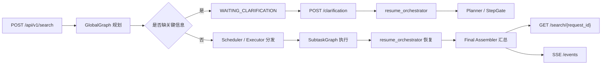
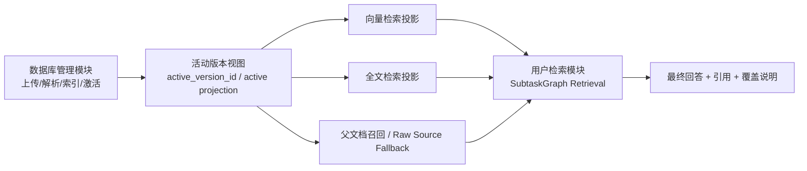
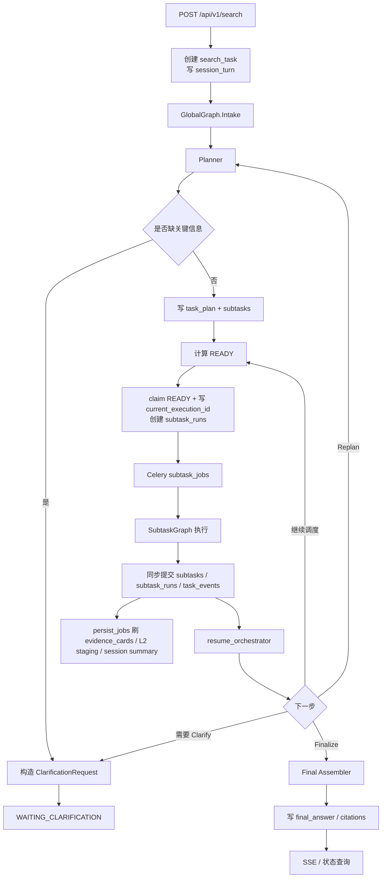
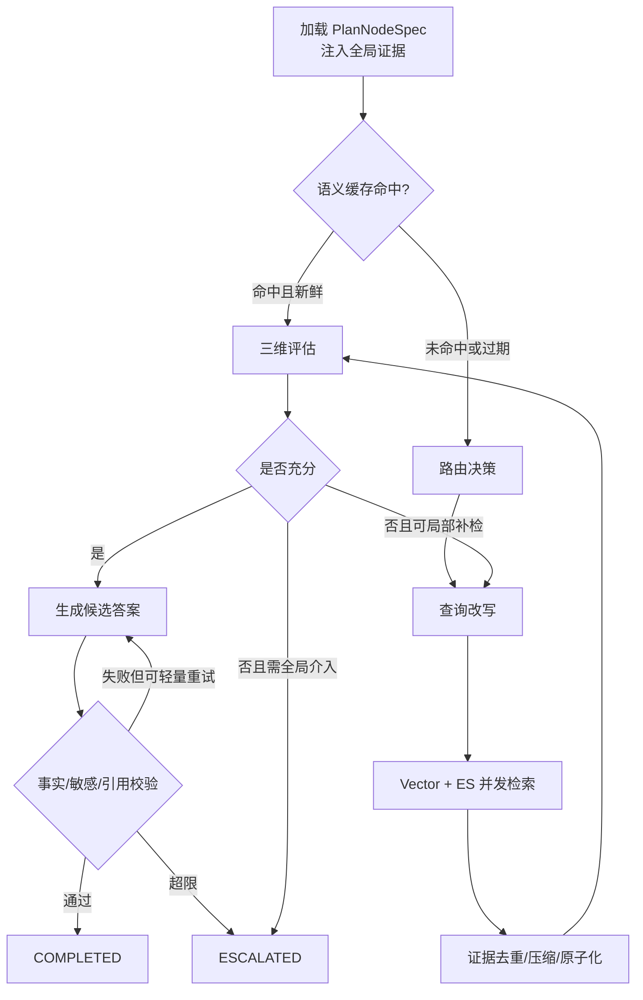

# Agentic RAG 用户深度检索架构设计规划（缩减版）

## 0. 环境
1. Python 3.11，由 uv run 管理运行
2. MySQL 8.0+, 账号：`root`，密码：`123456`
3. redis stack 7.0+, 账号: `default`，密码：`123456`
4. Milvus ES 向量化等均使用模拟数据

## 1. 文档定位

本文件是面向 `src/learning_common_lib/案例/用户AgenticRAG检索` 目录后续实现的缩减版规划。

它不是对 [架构设计规划](./架构设计规划.md) 的摘要，也不是把完整版简单删短，而是重新定义一套首版可落地、可演示、可向完整版平滑升级的实现蓝图。

这份缩减版坚持两个原则：

1. **全链路不能缺块**。从用户请求进入，到 Clarify、规划、调度、子任务执行、证据沉淀、最终汇总、SSE 进度回放，完整模块链路必须保留。
2. **复杂度可以折叠**。首版可以减少表数量、合并 Agent、收窄检索通道、简化记忆层和规则矩阵，但不能把关键状态机和模块边界做成“后面再说”。

如果后续需要恢复到完整版能力，请继续参考：

1. [完整版规划](./架构设计规划.md)
2. [技术拆解](./技术拆解.md)
3. [数据库管理缩减版](../实现AgenticRAG数据库管理/架构设计规划（缩减版）.md)
4. [数据库管理最小可执行 Demo](../实现AgenticRAG数据库管理/最小可执行demo/README.md)

LangGraph 相关编排模式只作为知识点来源，本缩减版默认参考以下示例：

1. `10_multi_agent/01_supervisor_pattern.py`：单控制平面
2. `10_multi_agent/03_plan_execute_replan.py`：Plan-Execute-Replan 主循环
3. `10_multi_agent/04_hierarchical_agents.py`：全局图 + 子图分层
4. `07_subgraph_composition/01_subgraph_as_node.py`：子图作为节点嵌入
5. `11_dynamic_and_parallel/01_send_api_fanout.py`：READY 批次 fan-out
6. `16_agentic_rag_patterns/04_dag_dispatch_pattern.py`：DAG 分发与 claim
7. `10_multi_agent/05_blackboard_pattern.py`：共享黑板状态
8. `05_checkpointing/04_redis_checkpointer.py`：Redis checkpoint 恢复

### 1.1 术语速览

为避免实现阶段不同角色各自理解一套术语，首版统一采用下面的定义：

1. `GlobalGraph`
说明：全局调度图，负责决定下一步是调度、Clarify、Replan 还是 Finalize。

2. `SubtaskGraph`
说明：单个子任务的执行闭环，负责检索、评估、校验和升级。

3. `Evidence Card`
说明：最小可引用事实单元，后续汇总和引用都围绕它展开。

4. `活动知识投影`
说明：数据库管理模块中当前已激活、允许在线检索的版本数据。

5. `fencing`
说明：通过 `execution_id` 拦截旧执行结果污染新计划的机制。

6. `控制面 / 数据面`
说明：控制面负责状态推进和恢复，数据面负责证据正文、大对象和归档。

7. `VectorStore / SearchStore`
说明：前者表示向量检索存储，后者表示全文检索存储；枚举值统一使用 `VECTOR_DB` / `ES`。

## 2. 缩减目标

缩减版只追求下面这件事：

1. 用户提交一个复杂检索请求后，系统能创建任务并立即返回 `request_id`。
2. `GlobalGraph` 能完成任务画像、规划、Clarify、DAG 生成、READY 计算、子任务分发、恢复编排和最终汇总。
3. `SubtaskGraph` 能完成最小闭环：路由、改写、多路检索、证据压缩、证据评估、输出校验、升级。
4. MySQL 能保存控制面真相：任务、计划、子任务、执行尝试、事件流、会话摘要。
5. Redis 能承担 checkpoint、热缓存、L2/L3 暂存和 SSE 回放辅助。
6. Celery 能承担 `orchestrate_jobs`、`subtask_jobs`、`persist_jobs`、`maintenance_jobs` 四条主队列。
7. 最终回答必须带证据引用、覆盖说明和降级说明，不能只是“模型自然语言输出”。
8. 检索侧必须明确依赖数据库管理模块产出的**活动知识投影**，不能绕过版本激活规则直接读历史脏数据。

缩减版不追求的内容：

1. Web / SQL / 图数据库三类真实检索通道落地
2. 多选 Clarify、自由文本追问和长对话工作流
3. `evidence_evaluations`、`subtask_outputs`、`budget_ledger` 等细粒度独立表
4. L5 用户长期偏好记忆
5. 复杂软依赖矩阵、批次级补偿中心、独立结果后端
6. 真正生产级多租户 ACL / RBAC / ABAC 全量能力

### 2.1 首版一屏式链路总览

如果只想先理解首版用户体验和状态推进，请先看这一节，再读第 10 节接口契约，最后读第 6 节数据模型。



首版对调用方的承诺只有 4 件事：

1. 提交后立即返回 `request_id`，不要求同步等待最终答案。
2. 任务如果缺信息，只会进入结构化单选 Clarify，不会进入自由文本对话。
3. 进度变化通过 SSE 推送，快照接口只做兜底和断线补查。
4. 最终结果要么返回完整回答，要么返回带不确定性说明的降级结果，不返回无解释空白页。

## 3. 与数据库管理模块的衔接

`用户AgenticRAG检索` 和 `实现AgenticRAG数据库管理` 是上下游关系，不是两套平行系统。

边界必须固定如下：

1. **数据库管理模块负责知识进入系统**。
说明：上传、解析、切片、索引、激活、删除、Janitor 修复，都属于 `实现AgenticRAG数据库管理` 模块。

2. **用户检索模块负责消费已激活知识**。
说明：检索模块不负责重建知识，不负责写入知识投影，只读取已对外生效的活动版本。

3. **检索入口只认活动版本**。
说明：向量检索、全文检索、父文档回源都必须以数据库管理模块维护的 `active_version_id` 或等价激活约束为准。

4. **检索模块允许最终一致，不允许越权读取**。
说明：当数据库管理模块正在重建或清理版本时，检索侧宁可暂时只看旧活动版本，也不能把 `STAGED` / `SUPERSEDED` / `DELETE_PENDING` 的投影混入在线结果。

5. **首版默认复用数据库管理最小 Demo 的技术骨架**。
说明：MySQL 作为真理源，Redis + Celery 作为异步基座，Mock VectorStore / Mock SearchStore / ObjectStorage 作为外部适配器边界。

6. **首版默认运行在单知识库 `default` 上**。
说明：如果调用方没有显式传入 `kb_code` 或 `scope_json`，检索范围默认是 `default` 知识库下全部活动文档。

推荐把两边的接口关系理解成下面这条链：



## 4. 保留模块与缩减原则

缩减版仍然保留这些模块，但每个模块只承担首版必须的职责：

1. `HTTP API + SSE`
说明：保留异步提交、状态查询、SSE 进度流、Clarify 回答提交。

2. `LangGraph GlobalGraph`
说明：保留 `Intake -> Planner -> Clarify -> Scheduler -> Executor -> StepGate -> Replan / Finalize` 主闭环。

3. `LangGraph SubtaskGraph`
说明：保留 `Router -> Rewrite -> Retrieval -> Eval -> Verify -> Done/Escalate` 子任务闭环。

4. `MySQL 控制面`
说明：保留任务、计划、子任务、执行尝试、事件流、会话摘要。

5. `Redis`
说明：保留 checkpoint、L2/L3 热数据、SSE 回放辅助、短 TTL 锁。


6. `Celery`
说明：保留 4 条主队列，不把子任务再拆成二级 Celery 图。

7. `Evidence Card`
说明：继续作为全链路统一事实单元，不退回“各模块自定义 JSON”。

8. `Session Memory`
说明：保留 L4 滑动窗口摘要和 Clarify 记录，但不做 L5 长期偏好记忆。

本缩减版对 LangGraph 示例的实际映射如下：

| 示例 | 在本模块中的落点 |
| --- | --- |
| `supervisor_pattern` | 只有 `GlobalGraph` 决定下一步动作 |
| `plan_execute_replan` | 全局主循环骨架 |
| `hierarchical_agents` | `GlobalGraph + SubtaskGraph` 两层结构 |
| `subgraph_as_node` | 子图可被父图封装为执行节点 |
| `send_api_fanout` | READY 子任务 fan-out 分发 |
| `dag_dispatch_pattern` | claim / dispatch / collect 批次推进 |
| `blackboard_pattern` | L3 全局证据池共享 |
| `redis_checkpointer` | checkpoint 恢复和线程级状态续跑 |

## 5. 首版主动删减项

这部分是缩减版和完整版的关键差异，不要忽略。

### 5.1 删掉 `subtask_dependencies` 表

首版不单独建依赖边表。

替代方案：

1. 在 `subtasks.depends_on_json` 中直接保存依赖对象列表，固定结构为 `[{code: "ST-001", type: "HARD"}]`。
2. 首版只支持 `HARD` 依赖，不引入 `SOFT` 依赖和 `fallback_strategy`。
3. 如果后续需要复杂依赖图、软依赖降级和图审计，再回到完整版的独立边表设计。

### 5.2 把 `evidence_evaluations` 和 `subtask_outputs` 折叠回 `subtask_runs`

首版不单独建 `evidence_evaluations`、`subtask_outputs` 表。

替代方案：

1. 把三维评估结果写入 `subtask_runs.eval_json`。
2. 把候选答案、校验结果、引用明细写入 `subtask_runs.output_json` 与 `verify_json`。
3. `subtasks.result_snapshot_json` 只保存当前计划节点的最终摘要快照。
4. 如果后续需要精细审计、异步回放和多轮输出对比，再升级成完整版的独立结果表。

### 5.3 不落 `budget_ledger` 和 `evidence_consumptions`

首版不建预算流水表，也不建证据消费关系表。

替代方案：

1. `search_tasks.budget_json` 保存全局预算与累计消耗。
2. `subtasks.budget_slice_json` 保存计划阶段预留预算。
3. `subtask_runs.usage_stats_json` 保存本次执行实际消耗。
4. 证据消费关系首版只保存在 `subtasks.evidence_refs_json` 和 `subtask_runs.output_json` 内。

### 5.4 L5 用户长期记忆不进入首版闭环

首版只保留 `L1 / L2 / L3 / L4`。

替代方案：

1. `sessions` + `session_turns` 足以承接指代消解、Clarify 归档、滚动摘要。
2. 不引入长期偏好提取、向量化会话记忆、跨会话召回。
3. 如果后续要做个性化偏好或长期任务协作，再扩到 L5。

### 5.5 首版只启用两条检索通道

首版真正执行的检索通道只保留：

1. `VectorStore`
2. `SearchStore`

以下通道只保留 Port 和 Mock 占位，不进入首版主链路：

1. `SQL/数仓`
2. `Graph DB`
3. `Web Search`

### 5.6 Clarify 先固定为单选题

首版 Clarify 只支持 `SINGLE_SELECT`。

替代方案：

1. `question`
2. `options[]`
3. `default_option_id`
4. `expires_at`
5. `clarification_source`

首版不做：

1. `MULTI_SELECT`
2. 自由文本追问
3. 连续 Clarify 链式会话

### 5.7 不引入检索侧独立 Outbox 表

首版检索模块不单独新增 `search_outbox_events` 一类表。

替代方案：

1. `executor` 在 MySQL 事务里完成 `READY -> RUNNING` claim，并生成 `execution_id` 与 `subtask_runs`。
2. 事务提交后立即分发 Celery。
3. 如果分发失败，直接把当前 `subtask_run` 标记为失败并追加 `task_events`，再恢复 `GlobalGraph` 重新判定。
4. 因为这里不引入 Outbox，所以 `maintenance_jobs` 必须承担补偿职责：扫描 `CLAIMED` / `DISPATCHED` 超时未启动的执行实例，执行重发、失败标记或恢复编排。
5. 这里不走 Outbox 的原因是首版检索模块更强调控制面推进而不是跨系统双写投影；真正的数据双写问题已在数据库管理模块解决，但必须用维护任务补足“事务已提交、消息未发出”的恢复缺口。

## 6. 缩减后的最小数据模型

缩减版建议只保留 8 张核心表。

说明：

1. 为了保持基本租户隔离能力，缩减版仍在大多数执行子表保留 `tenant_id`。
2. 为了保持数据模型收敛，不再在子表全面冗余 `user_id`；用户维度统一通过 `task_id -> search_tasks` 获取。

### 6.1 `search_tasks`

用途：用户一次完整深度检索任务的主生命周期载体。

关键字段建议：

- `id` bigint pk
- `request_id` varchar(64) unique
- `session_id` varchar(64) not null
- `tenant_id` varchar(64) not null
- `user_id` varchar(64) not null
- `kb_code` varchar(64) not null default `default`
- `scope_json` json — 检索范围约束（文档集合 / 标签 / 时间范围等）
- `original_query` text not null
- `resolved_query` text
- `task_profile_json` json
- `status` enum(`PENDING`, `PLANNING`, `EXECUTING`, `WAITING_SUBTASKS`, `WAITING_CLARIFICATION`, `FINALIZING`, `COMPLETED`, `FAILED`, `DEGRADED`)
- `active_plan_version` int not null default 0
- `budget_json` json not null
- `control_json` json
- `final_answer` text
- `final_confidence` decimal(4,3)
- `final_citations_json` json
- `coverage_summary_json` json
- `last_error_code` varchar(64)
- `last_error_message` varchar(1024)
- `replan_count` int not null default 0
- `clarification_count` int not null default 0
- `preplan_clarification_used` int not null default 0
- `postexec_clarification_used` int not null default 0
- `row_version` bigint not null default 0
- `created_at`
- `updated_at`
- `completed_at`

索引建议：

- `index(session_id)`
- `index(tenant_id, user_id, status)`
- `index(status, created_at)`

说明：

1. `control_json` 统一承载 `waiting_reason`、`clarification_request`、`clarification_source`、`fallback_reason` 等控制面元数据。
2. 首版仍然保留 `replan_count`、`clarification_count`，因为它们直接影响状态机收敛。
3. 失败态快照中的 `error_code`、`error_message` 默认从 `search_tasks.last_error_code`、`search_tasks.last_error_message` 读取，不要求调用方从最近事件中自行拼装。

### 6.2 `task_plans`

用途：Planner 每次生成的 DAG 计划版本。

关键字段建议：

- `id` bigint pk
- `tenant_id` varchar(64) not null
- `task_id` bigint not null
- `plan_version` int not null
- `parent_plan_version` int
- `status` enum(`ACTIVE`, `SUPERSEDED`, `ABANDONED`) not null
- `dag_json` json not null
- `dag_fingerprint` char(64) not null
- `replan_reason` varchar(512)
- `reused_subtasks_json` json
- `created_at`

唯一约束建议：

- `unique(task_id, plan_version)`
- `index(tenant_id, task_id, plan_version, status)`

说明：

1. 首版 `dag_json` 直接保存完整 DAG 快照，不再拆成节点表 + 边表 + 变更表多层模型。
2. `dag_fingerprint` 仍然必须保留，用于 Replan 循环检测。
3. 同一 `task_id` 任一时刻只允许一个 `status=ACTIVE` 的计划版本；Replan 事务内必须同时完成旧版 `SUPERSEDED` 与新版 `ACTIVE` 切换。

### 6.3 `subtasks`

用途：计划中的每个执行节点。

关键字段建议：

- `id` bigint pk
- `tenant_id` varchar(64) not null
- `task_id` bigint not null
- `plan_version` int not null
- `subtask_code` varchar(32) not null
- `description` text not null
- `task_type` enum(`RETRIEVAL`, `REASONING`, `REFLECTION`) not null
- `depends_on_json` json — 固定结构 `[{code: "ST-001", type: "HARD"}]`
- `route_hints_json` json
- `acceptance_criteria_json` json
- `budget_slice_json` json
- `priority` int not null default 1
- `status` enum(`PENDING`, `READY`, `RUNNING`, `COMPLETED`, `FAILED`, `SKIPPED`) not null
- `iteration` int not null default 0
- `max_iterations` int not null default 2
- `timeout_ms` int not null default 30000
- `current_execution_id` varchar(96)
- `final_score` decimal(4,3)
- `key_findings` text
- `evidence_refs_json` json
- `result_snapshot_json` json
- `last_error_code` varchar(64)
- `last_error_message` varchar(1024)
- `row_version` bigint not null default 0
- `created_at`
- `updated_at`
- `started_at`
- `completed_at`

唯一约束建议：

- `unique(task_id, plan_version, subtask_code)`
- `index(tenant_id, task_id, plan_version, status)`
- `index(status, current_execution_id)`

说明：

1. `depends_on_json` 折叠了完整版的 `subtask_dependencies`，首版虽然只允许 `HARD` 依赖，但结构上仍保留 `type` 字段，避免后续升级时重新迁移 JSON 形状。
2. `result_snapshot_json` 只保留当前计划节点的最终摘要，不保留每轮详细结果。
3. `current_execution_id` 必须在 claim 时和 `status=RUNNING` 一起写入，用于 stale result fencing。
4. 首版 Scheduler 固定采用“小 DAG + 全量加载 `depends_on_json` 后在内存计算 READY”的策略，不做增量入度表持久化。

### 6.4 `subtask_runs`

用途：记录每次 claim、分发、执行、校验和升级，是首版最重要的执行实例表。

关键字段建议：

- `id` bigint pk
- `tenant_id` varchar(64) not null
- `task_id` bigint not null
- `plan_version` int not null
- `subtask_code` varchar(32) not null
- `execution_id` varchar(96) unique not null
- `attempt_no` int not null
- `status` enum(`CLAIMED`, `DISPATCHED`, `RUNNING`, `VERIFYING`, `COMPLETED`, `FAILED`, `ESCALATED`, `STALE_IGNORED`) not null
- `worker_id` varchar(128)
- `owner_token` varchar(96)
- `route_used_json` json
- `usage_stats_json` json
- `eval_json` json
- `verify_json` json
- `output_json` json
- `escalation_json` json
- `data_plane_ref_json` json
- `data_plane_flush_status` enum(`PENDING`, `FLUSHING`, `FLUSHED`, `FAILED`) not null default `PENDING`
- `error_code` varchar(64)
- `created_at`
- `started_at`
- `finished_at`

唯一约束建议：

- `unique(task_id, plan_version, subtask_code, attempt_no)`
- `index(tenant_id, task_id, execution_id)`
- `index(status, finished_at)`

说明：

1. `eval_json` 折叠 `coverage/conflict/confidence/total_score/gap_type`。
2. `verify_json` 折叠 `factual/sensitive/citation` 三重校验结果。
3. `output_json` 折叠草稿输出、最终候选答案和引用明细。
4. `data_plane_ref_json` 用于挂 Redis staging key 或 evidence batch ref，支撑 `persist_jobs` 异步刷库。
5. `usage_stats_json` 至少记录 `llm_tokens`、`retrieval_calls`、`elapsed_ms`、`cache_hits`，不只记录检索统计。

### 6.5 `evidence_cards`

用途：全链路统一事实单元，也是跨子任务复用的核心数据结构。

关键字段建议：

- `id` bigint pk
- `card_uid` varchar(96) unique not null
- `tenant_id` varchar(64) not null
- `task_id` bigint not null
- `plan_version` int not null
- `produced_by_subtask` varchar(32) not null
- `claim` text not null
- `claim_type` enum(`NUMERIC`, `CAUSAL`, `DESCRIPTIVE`, `TEMPORAL`) not null
- `source_id` varchar(64) not null
- `source_type` enum(`VECTOR_DB`, `ES`, `SQL_DB`, `KNOWLEDGE_GRAPH`, `WEB`) not null
- `source_locator_json` json — 必须能定位到 `kb_code/document_id/version_id/chunk_uid`
- `reliability_tier` enum(`T1`, `T2`, `T3`) not null
- `data_freshness` date
- `retrieval_score` decimal(4,3)
- `confidence` decimal(4,3)
- `corroborated_by_json` json
- `conflicts_with_json` json
- `payload_json` json
- `created_at`

索引建议：

- `index(tenant_id, task_id, plan_version, produced_by_subtask)`
- `index(tenant_id, task_id, plan_version, source_type)`

说明：

1. 虽然首版只真正启用 `VECTOR_DB` 和 `ES`，但 `source_type` 仍保留完整版枚举，方便后续扩展。
2. `payload_json` 用于保留句段、实体、引用位置等结构化细节。
3. `source_locator_json` 是与数据库管理模块活动版本约束对齐的关键字段，不能只把版本线索散落在自由结构里。

### 6.6 `task_events`

用途：append-only 审计事件流，用于恢复、回放、SSE 和问题定位。

关键字段建议：

- `id` bigint pk
- `tenant_id` varchar(64) not null
- `task_id` bigint not null
- `plan_version` int
- `subtask_code` varchar(32)
- `execution_id` varchar(96)
- `event_type` varchar(64) not null
- `payload_json` json
- `created_at`

最低要求覆盖事件：

- `task_submitted`
- `plan_activated`
- `subtask_claimed`
- `subtask_dispatched`
- `subtask_started`
- `subtask_completed`
- `subtask_failed`
- `subtask_dispatch_failed`
- `subtask_escalated`
- `subtask_stale_ignored`
- `task_waiting_subtasks`
- `clarification_requested`
- `clarification_received`
- `clarification_default_applied`
- `task_waiting_clarification`
- `task_replanned`
- `task_degraded`
- `task_failed`
- `task_completed`

说明：

1. 首版 SSE 直接以 `task_events.id` 作为事件 ID。
2. 断线续传以 `Last-Event-ID` 为准，不依赖 Worker 内存回调。

### 6.7 `sessions`

用途：会话级短中期记忆。

关键字段建议：

- `id` bigint pk
- `session_id` varchar(64) unique not null
- `tenant_id` varchar(64) not null
- `user_id` varchar(64) not null
- `topic` varchar(256)
- `mentioned_entities_json` json
- `rolling_summary` text
- `status` enum(`ACTIVE`, `ARCHIVED`) not null
- `created_at`
- `updated_at`

说明：

1. 首版 `rolling_summary` 就是 L4 的核心载体，不引入额外摘要表。

### 6.8 `session_turns`

用途：保存查询轮次、Clarify 题目和用户选择。

关键字段建议：

- `id` bigint pk
- `session_id` varchar(64) not null
- `task_id` bigint
- `role` enum(`USER`, `ASSISTANT`, `SYSTEM`) not null
- `turn_type` enum(`QUERY`, `CLARIFY_REQUEST`, `CLARIFY_REPLY`, `SUMMARY`, `ANSWER`) not null
- `content` text not null
- `clarification_source` varchar(32)
- `question_type` varchar(32)
- `options_json` json
- `default_option_id` varchar(64)
- `expires_at` datetime
- `selected_option_id` varchar(64)
- `answer_origin` enum(`USER`, `DEFAULT_APPLIED`)
- `summary_json` json
- `created_at`

说明：

1. 首版 Clarify 只支持单选，因此只保留 `selected_option_id`。
2. 如果后续扩展到多选 Clarify，再增加 `selected_option_ids_json`。
3. `role` 固定约束如下：用户原始查询写 `USER`，Clarify 请求写 `SYSTEM`，Clarify 回复写 `USER`，系统滚动摘要写 `SYSTEM`，最终自然语言回答写 `ASSISTANT`，对应 `turn_type=ANSWER`。

## 7. 缩减后的模块职责

### 7.1 `SearchCommandService`

负责：

1. 接收 `POST /api/v1/search`
2. 创建 `search_tasks`
3. 初始化 `sessions` / `session_turns`
4. 启动 `GlobalGraph`
5. 处理 `POST /api/v1/search/{request_id}/clarification`

### 7.2 `GlobalGraphService`

负责：

1. 维护 `GlobalState`
2. 执行 `Intake -> Planner -> Clarify -> Scheduler -> Executor -> StepGate -> Replan / Finalize`
3. 读写 checkpoint
4. 恢复等待态任务

### 7.3 `PlanService`

负责：

1. 查询画像
2. DAG 生成
3. DAG 指纹哈希
4. Replan 差异摘要
5. `PlanNodeSpec` 生成

### 7.4 `RunService`

负责：

1. READY 计算
2. claim 子任务
3. 生成 `execution_id`
4. 创建 `subtask_runs`
5. 分发 Celery
6. `resume_orchestrator` 恢复编排

### 7.5 `SubtaskGraphService`

负责：

1. 读取 `PlanNodeSpec`
2. 路由与改写
3. 向量检索与全文检索
4. 证据压缩与 Evidence Card 生成
5. 三维评估
6. 三重校验
7. 升级报告输出

### 7.6 `EvidenceService`

负责：

1. 证据卡标准化
2. L3 全局证据热池维护
3. 冲突摘要生成
4. 父文档按需召回
5. `persist_jobs` 的大 payload 刷库

### 7.7 `ProgressService`

负责：

1. `task_events` 追加
2. SSE 推送
3. 断线回放
4. `GET /api/v1/search/{request_id}` 快照查询

### 7.8 `SessionService`

负责：

1. 会话滚动摘要
2. 指代消解上下文
3. Clarify 请求归档
4. Clarify 回复归档

### 7.9 `MaintenanceService`

负责：

1. 扫描 `CLAIMED` / `DISPATCHED` / `RUNNING` 超时执行实例
2. 修复“事务已提交但消息未发出”的分发缺口
3. Redis 热缓存与 checkpoint 一致性巡检
4. Clarify 超时后自动应用默认项并恢复任务
5. 生成必要的 `task_events` 并触发 `resume_orchestrator`

## 8. 缩减版全链路数据流

### 8.1 提交 -> 规划 -> 分发 -> 汇总



链路说明：

1. `GlobalGraph` 是唯一控制平面，只有它可以决定继续调度、Clarify、Replan 或 Finalize。
2. `resume_orchestrator` 只负责恢复，不负责自己做 READY 判定。
3. `persist_jobs` 与 `resume_orchestrator` 必须并行触发，不允许让数据面刷库成为恢复编排的前置依赖。
4. `persist_jobs` 只负责数据面刷库，不负责推进状态机；`StepGate` 读取的是 Redis L3 热池或 `latest_result_ref`，不是等待 `evidence_cards` 刷库完成。

### 8.2 Clarify 恢复链路

Clarify 在缩减版里仍然是完整链路，不是“后续增强项”。


固定规则：

1. `clarification_source=PREPLAN` 时恢复到 `Planner`
2. `clarification_source=STEP_GATE` 时恢复到 `StepGate`
3. 用户显式提交单选答案；若在 `expires_at` 前未提交，则系统自动应用 `default_option_id`
4. 同一 Clarify 请求只接受一次有效提交；重复提交返回当前任务快照，不重新推进状态机
5. `GET /api/v1/search/{request_id}` 在 `WAITING_CLARIFICATION` 状态下必须原样返回 `clarification_request`
6. `POST /api/v1/search/{request_id}/clarification` 只接受 `selected_option_id`
7. `selected_option_id` 非法时返回 400，不隐式回退默认项

### 8.3 子任务执行闭环



首版收窄规则：

1. `Retrieval` 只真正启用 `Vector + ES`
2. `Verify` 默认只回到 `Draft -> Verify` 支路，不重新全量检索
3. `Escalate` 只能输出 `EscalationReport`，不能直接触发 Clarify

外显行为说明：

1. 子任务局部重试期间，全局任务状态保持 `EXECUTING`
2. 子任务升级为 `ESCALATED` 时，必须追加 `task_events.subtask_escalated`
3. 如果 `StepGate` 决定进入 Clarify，任务快照中的 `status` 立即切为 `WAITING_CLARIFICATION`

### 8.4 与数据库管理模块的知识读取链

检索模块消费知识的顺序必须固定：

1. 先读数据库管理模块维护的活动版本约束
2. 再按活动版本过滤向量检索结果
3. 再按活动版本过滤全文检索结果
4. 如果需要父文档扩展，优先基于版本内的 parent/child metadata 做父文档召回；对象存储只作为 raw source fallback
5. 最终引用必须能追溯到活动版本知识来源

这意味着：

1. 不能直接读取历史版本投影
2. 不能绕过 `active_version_id`
3. 不能在检索模块内自行决定“哪个文档版本更可信”

### 8.5 Replan 与旧结果 fencing

Replan 后必须允许旧 Worker 继续回写审计数据，但不能污染新计划：

1. `subtasks.current_execution_id` 是首版 fencing 主键
2. Worker 回写时必须同时校验 `task_id + plan_version + subtask_code + execution_id`
3. 如果 `execution_id` 已失活，则该次回写只能写 `subtask_runs.status=STALE_IGNORED` 和 `task_events`
4. 旧结果不能直接推进新计划的 `StepGate`

### 8.6 缩减版记忆分层

缩减版虽然没有保留完整版全部记忆设计，但记忆链路本身不能消失。

首版固定为 4 层：

1. `L1`：当前 LLM 调用上下文
说明：只存在于单次 Prompt 组装过程，不持久化。

2. `L2`：子任务工作记忆
说明：保存当前子任务的候选证据、评估历史、重试上下文，优先放 Redis staging，并在 `subtask_runs` 中留下引用。
**需要完成**: L2 应该是 Redis 里的子任务工作记忆。它可以丢，丢了最多重跑子任务，不应该被当成最终真相。L2 原始工作记忆只放 Redis；L2 产出的“提升后结果”同步到 MySQL 真相表，同时可选地同步到 L3 Redis 热池

3. `L3-Control / L3-Evidence`
说明：控制面状态放 MySQL + Redis 热缓存，全局证据摘要放 Redis 热池，归档后进入 `evidence_cards`。
**需要完成**: L3 Redis 应该是热副本，不是首要真相源；它必须可以从 MySQL 重建。

4. `L4`：会话记忆
说明：通过 `sessions.rolling_summary` 和 `session_turns` 保存跨轮次摘要、Clarify 记录和指代消解上下文。

首版不进入主链路的内容：

1. L5 长期偏好记忆
2. 会话向量召回
3. 图谱化用户偏好建模

## 9. 缩减版保留的关键规则

### 9.1 单控制面原则不能退化

1. 只有 `GlobalGraph` 决定下一步动作。
2. `resume_orchestrator` 不单独推进 READY。
3. Celery callback 不直接链式触发下游子任务。

### 9.2 MySQL 仍然是控制面真理源

1. `search_tasks`、`task_plans`、`subtasks`、`subtask_runs`、`task_events` 必须同步提交 MySQL。
2. Redis 只能做缓存、checkpoint 和 staging。
3. Redis 丢失后必须能从 MySQL 重建活跃任务的热状态。

### 9.3 `subtask_runs` 和 `current_execution_id` 必须保留

1. 计划节点状态和执行尝试状态必须拆开。
2. `current_execution_id` 是旧结果 fencing 的核心。
3. 不能只靠 `subtasks.status` 一列表达全部执行语义。

### 9.4 Evidence Card 不能退化成自由 JSON

1. 全链路统一以证据卡为事实单元。
2. 最终回答引用必须继承自证据卡。
3. 不允许 Final Assembler 重新杜撰引用。

### 9.5 Clarify 只能由 GlobalGraph 触发

1. 子任务只能上报 `needs_user_input`
2. 只有 `Planner` 或 `StepGate` 可以发起 Clarify
3. 首版每个任务最多 2 次 Clarify

### 9.6 检索只能消费活动知识版本

1. 检索过滤条件必须包含活动版本约束
2. 父文档回源也必须走活动版本
3. 历史版本只允许给运维排查，不允许进入在线结果

### 9.7 同步控制面 + 异步数据面

1. 控制面推进不能依赖 `persist_jobs`
2. `persist_jobs` 只处理 evidence 大 payload、会话摘要等重 I/O 数据
3. `subtask_runs.data_plane_flush_status` 必须能表达刷库成功或失败

### 9.8 GlobalGraph 不能阻塞等待 Worker 结果

1. 分发后进入 `WAITING_SUBTASKS`
2. Worker 完成后通过新的恢复调用继续执行
3. 不允许在图内做 `.get()` 或等价阻塞等待

### 9.9 首版资源与收敛基线固定

1. 最大并发子任务数：`3`
2. 最大 Replan 次数：`2`
3. 单子任务最大局部重试次数：`2`
4. Clarify 最大次数：`2`
5. 单子任务默认超时：`30000ms`

### 9.10 SSE 必须基于 `task_events`

1. 进度事件以 `task_events` 为准
2. SSE 断线后按 `Last-Event-ID` 回放
3. 不能只推内存态事件

### 9.11 `maintenance_jobs` 是首版必需队列

1. 负责 stuck-run reaper
2. 负责 Redis 热缓存重建
3. 负责 checkpoint / MySQL 活跃任务一致性巡检
4. 负责 Clarify 超时默认项应用

### 9.12 首版不单独引入检索侧 Outbox 的补偿前提

1. `subtask_runs` 必须明确区分 `CLAIMED -> DISPATCHED -> RUNNING`
2. `maintenance_jobs` 必须扫描 `CLAIMED` / `DISPATCHED` 超时未启动实例
3. 若未观察到 `subtask_dispatched` / `subtask_started` 事件，则执行重发、失败标记或恢复推进
4. 没有这组补偿前提时，不能宣称“首版可以不使用检索侧 Outbox”

## 10. 缩减版接口与契约

### 10.1 核心 API

首版只保留这 4 个对外接口：

1. `POST /api/v1/search`
说明：异步提交搜索请求，返回 `request_id`

2. `GET /api/v1/search/{request_id}`
说明：返回任务快照、当前状态、最终回答或等待原因

3. `GET /api/v1/search/{request_id}/events`
说明：SSE 事件流，支持断线回放

4. `POST /api/v1/search/{request_id}/clarification`
说明：提交 Clarify 单选答案

### 10.1.1 最小请求/响应示例

`POST /api/v1/search` 请求：

```json
{
  "session_id": "sess_001",
  "query": "请帮我整理公司近 90 天差旅报销规则的变化",
  "kb_code": "default",
  "scope_json": null
}
```

补充约束：

1. `tenant_id`、`user_id` 不从请求体显式传入，统一由鉴权中间件、网关或 demo 注入层提供。
2. `kb_code` 默认是 `default`，调用方不传时由服务端补默认值；当前最小 demo 只接受 `default`。
3. `scope_json` 可为空；为空时表示搜索该知识库下全部活动文档。
4. 当前实现只识别 `document_ids`、`external_doc_keys`、`version_ids` 三个 `scope_json` 键。

异步提交成功响应：

```json
{
  "code": "OK",
  "message": "success",
  "data": {
    "request_id": "req_001",
    "status": "PENDING",
    "snapshot_url": "/api/v1/search/req_001",
    "events_url": "/api/v1/search/req_001/events"
  }
}
```

等待 Clarify 的任务快照：

```json
{
  "code": "OK",
  "message": "success",
  "data": {
    "request_id": "req_001",
    "status": "WAITING_CLARIFICATION",
    "active_plan_version": 1,
    "clarification_request": {
      "question": "请选择你关心的时间范围",
      "question_type": "SINGLE_SELECT",
      "options": [
        {"id": "opt_30d", "label": "近 30 天"},
        {"id": "opt_90d", "label": "近 90 天"}
      ],
      "default_option_id": "opt_90d",
      "clarification_source": "PREPLAN",
      "expires_at": "2026-03-20T12:00:00Z",
      "reason_code": "missing_time_range"
    }
  }
}
```

已完成快照：

```json
{
  "code": "OK",
  "message": "success",
  "data": {
    "request_id": "req_001",
    "status": "COMPLETED",
    "final_answer": "......",
    "final_citations": ["EC-001", "EC-008"],
    "coverage_summary": {
      "covered": ["报销上限", "票据要求"],
      "uncovered": []
    }
  }
}
```

`POST /api/v1/search/{request_id}/clarification` 请求：

```json
{
  "selected_option_id": "opt_90d"
}
```

`POST /api/v1/search/{request_id}/clarification` 响应约定：

1. 首次有效提交：返回 `200 OK`，响应体返回最新任务快照，调用方随后继续消费 SSE 或轮询快照。
2. 重复提交：返回 `200 OK` 与当前任务快照，不重复推进状态机。
3. 任务已不在 `WAITING_CLARIFICATION`：返回 `409 Conflict`，响应体是 `{code, message, data: null}`。
4. `selected_option_id` 非法：返回 `400 Bad Request`。

首版要求所有接口在响应中返回可直接驱动前端的最小字段，不要求调用方自行拼装下一步 URL。

### 10.1.2 SSE 事件最小格式

```json
{
  "id": 12345,
  "event": "subtask_completed",
  "data": {
    "request_id": "req_001",
    "status": "EXECUTING",
    "plan_version": 1,
    "subtask_code": "ST-001",
    "message": "子任务完成",
    "ts": "2026-03-20T12:00:00Z"
  }
}
```

固定规则：

1. 首版必须推送 `heartbeat`
2. 终态事件至少包括 `task_completed`、`task_degraded`、`task_failed`
3. SSE 断线后按 `Last-Event-ID` 回放未消费事件
4. `GET /api/v1/search/{request_id}` 只负责状态快照，不替代事件流
5. `heartbeat` 固定使用 `event: heartbeat`，`data` 只包含 `request_id` 与时间戳，且不改变任何业务状态。

### 10.2 公共契约

`SearchSubmitRequest`

```python
{
    "session_id": "sess_001",
    "query": "请比较最近 90 天差旅规则变化",
    "kb_code": "default",
    "scope_json": None,
}
```

`PlanNodeSpec`

```python
{
    "subtask_code": "ST-001",
    "description": "检索企业内部制度中关于差旅报销的最新规则",
    "task_type": "RETRIEVAL",
    "depends_on": [{"code": "ST-000", "type": "HARD"}],
    "route_hints": ["vector", "search"],
    "acceptance_criteria": {
        "min_sources": 2,
        "need_citations": True,
    },
    "budget_slice": {
        "llm_tokens": 2000,
        "retrieval_calls": 6,
    },
}
```

`SubtaskResultEnvelope`

```python
{
    "task_id": 1001,
    "plan_version": 1,
    "subtask_code": "ST-001",
    "execution_id": "exec_...",
    "status": "COMPLETED",
    "result_ref": {"subtask_run_id": 3001},
    "evidence_card_refs": ["EC-001", "EC-002"],
    "escalation_report": None,
}
```

`EscalationReport`

```python
{
    "reason": "needs_user_input",
    "suggested_global_action": "clarify",
    "best_score": 0.58,
    "gap_type": "user_input_gap",
    "message": "时间范围缺失，无法判断应使用哪一版规则",
}
```

`ClarificationRequest`

```python
{
    "question": "请选择你关心的时间范围",
    "question_type": "SINGLE_SELECT",
    "options": [
        {"id": "opt_30d", "label": "近 30 天"},
        {"id": "opt_90d", "label": "近 90 天"},
    ],
    "default_option_id": "opt_30d",
    "clarification_source": "PREPLAN",
    "expires_at": "2026-03-20T12:00:00Z",
}
```

`FinalAnswerInput`

```python
{
    "completed_subtasks": ["ST-001", "ST-002"],
    "global_evidence_refs": ["EC-001", "EC-008"],
    "conflict_summary": None,
    "uncovered_points": ["缺少外部最新市场数据"],
    "degraded_reason": None,
}
```

`TaskSnapshotResponse`

```python
{
    "request_id": "req_...",
    "status": "WAITING_CLARIFICATION",
    "waiting_reason": "CLARIFICATION",
    "active_plan_version": 1,
    "progress_summary": {
        "total_subtasks": 3,
        "completed_subtasks": 1,
        "running_subtasks": 0,
        "waiting_subtasks": 2,
        "current_phase": "WAITING_CLARIFICATION",
    },
    "final_answer": None,
    "clarification_request": {...},
}
```

状态到字段可见性约定：

| 状态 | 必有字段 |
| --- | --- |
| `PLANNING` / `EXECUTING` / `WAITING_SUBTASKS` | `status`、`active_plan_version`、`progress_summary` |
| `WAITING_CLARIFICATION` | `status`、`active_plan_version`、`clarification_request` |
| `COMPLETED` / `DEGRADED` | `status`、`final_answer`、`final_citations`、`coverage_summary` |
| `FAILED` | `status`、`error_code`、`error_message` |

### 10.3 最小 Port 约束

首版建议固定以下 Port：

1. `VectorStorePort`
方法：`search(query, top_k, filters)`

2. `SearchStorePort`
方法：`search(query, top_k, filters)`

3. `LLMPort`
方法：`generate(prompt, structured_schema=None, timeout_s=None)`

4. `KnowledgeProjectionReadPort`
方法：`resolve_active_scope(kb_code, scope_json)` / `build_retrieval_filters(task_id)` / `load_parent_document(locator)`

5. `ObjectStorageReadPort`
方法：`get(storage_key)`

6. `TaskQueuePort`
方法：`dispatch(task_name, payload, queue_name)`

7. `CheckpointPort`
方法：`get_checkpointer()` / `aclose()`

8. `SessionStorePort`
方法：`load_session(session_id)` / `append_turn(...)`

### 10.4 最小 State 约束

首版建议把 LangGraph 状态严格收敛在最小控制字段上，不把大对象直接塞进 graph state。

`GlobalState` 最小字段集合建议：

```python
{
    "task_id": 1001,
    "request_id": "req_...",
    "session_id": "sess_...",
    "original_query": "...",
    "resolved_query": "...",
    "active_plan_version": 1,
    "global_iteration": 1,
    "budget": {"llm_tokens": 4000, "retrieval_calls": 12},
    "replan_count": 0,
    "clarification_count": 0,
    "waiting_reason": "NONE",
    "clarification_source": None,
    "historical_fingerprints": [],
    "latest_result_ref": {"execution_id": "exec_..."},
    "pending_resume_execution_id": None,
    "clarification_ref": None,
    "next_action": "schedule",
}
```

`SubtaskState` 最小字段集合建议：

```python
{
    "task_id": 1001,
    "plan_version": 1,
    "subtask_code": "ST-001",
    "execution_id": "exec_...",
    "task_type": "RETRIEVAL",
    "query": "...",
    "route_hints": ["vector", "search"],
    "iteration": 1,
    "max_iterations": 2,
    "global_evidence_refs": ["EC-001"],
    "working_evidence_refs": [],
    "next_action": "retrieve",
}
```

固定约束：

1. Graph State 只保存控制字段和外部引用。
2. 证据正文、大块检索结果、候选答案正文不直接进入 State。
3. 大 payload 统一放 Redis staging 或 MySQL 表，再由引用回读。
4. `search_tasks.status` 仍然是全局任务状态的真理源；Graph State 中如保留 `status`，只视为运行态镜像，不作为权威状态。

## 11. 缩减版目录建议

建议在当前目录下采用以下收敛结构：

```text
用户AgenticRAG检索/
├── api/
├── application/
├── domain/
├── ports/
├── infrastructure/
├── workers/
├── AI_Agent指令.md

...

├── 技术拆解.md
├── 架构设计规划.md
└── 架构设计规划（缩减版）.md
```

说明：

1. 目录风格继续对齐完整版的 `application / domain / ports / infrastructure` 分层。
2. Worker 入口保持瘦身，真正业务逻辑仍然下沉到 `application`。
3. Mock 适配器建议直接复用数据库管理最小 Demo 的实现方式和命名风格。
4. `KnowledgeProjectionReadPort` 的实现建议直接复用数据库管理模块已经存在的活动版本与投影查询约束，不在搜索侧重新发明一套元数据视图。

## 12. 缩减版实施顺序

### 阶段 1：最小骨架

目标：

1. 建立 8 张核心表
2. 建立 `POST /search` 和 `GET /search/{request_id}`
3. 建立 `task_events` + SSE 基础推送
4. 建立 Mock `VectorStore/SearchStore/ObjectStorage/LLM`

测试要求：

1. ORM CRUD 单测
2. 状态枚举与唯一约束单测
3. API 提交与快照查询单测

### 阶段 2：全局循环

目标：

1. 落 `GlobalGraph`
2. 完成 Planner -> Scheduler -> Executor -> Resume -> StepGate
3. 跑通 `subtask_runs` claim / fencing
4. 跑通 Replan 和 WAITING_SUBTASKS

测试要求：

1. READY 计算单测
2. `execution_id` stale fencing 单测
3. Replan 指纹收敛单测
4. 恢复编排单测
5. `CLAIMED -> DISPATCHED -> RUNNING` 状态推进单测

### 阶段 3：子任务闭环

目标：

1. 落 `SubtaskGraph`
2. 跑通 Vector + ES 两路检索
3. 生成 Evidence Card
4. 跑通评估与三重校验
5. 跑通 `persist_jobs`

测试要求：

1. 子任务局部重试单测
2. Evidence Card 结构单测
3. `persist_jobs` 幂等单测
4. `ESCALATED` 升级协议单测

### 阶段 4：Clarify、会话和工程化加固

目标：

1. 跑通 `WAITING_CLARIFICATION`
2. 跑通 `session_turns`
3. 跑通 SSE 断线回放
4. 跑通 Redis 热缓存重建
5. 完成最小运维接口与 `maintenance_jobs`

测试要求：

1. Clarify 恢复路径测试
2. 默认项超时应用测试
3. SSE `Last-Event-ID` 回放测试
4. Redis 故障回退测试
5. `maintenance_jobs` 对孤儿 `CLAIMED` / `DISPATCHED` 任务的修复测试

## 13. 企业级 Demo 最小验收场景

缩减版至少要通过以下场景：

1. 普通复杂检索请求能返回 `request_id`，并在 SSE 中看到 `task_submitted -> plan_activated -> subtask_completed -> task_completed`。
2. 查询信息不足时，任务进入 `WAITING_CLARIFICATION`，用户提交单选答案后能恢复执行并产出最终回答。
3. 单个子任务证据不足时，能在子图内完成一次局部补检，再正常完成。
4. 子任务超限后能输出 `EscalationReport`，由 `StepGate` 统一决定 Replan 或 Clarify。
5. Replan 发生后，旧 Worker 的回写结果会被标记为 `STALE_IGNORED`，不会污染新计划。
6. Redis 热缓存丢失后，系统能依据 MySQL 活跃任务重建 checkpoint 相关热状态。
7. 最终回答引用只来自 Evidence Card，且能给出已覆盖 / 未覆盖信息点。
8. 检索结果严格受活动版本约束，不会混入数据库管理模块中未激活或已淘汰版本的数据。
9. 前端或调用方只依赖 `POST /search`、`GET /search/{request_id}`、SSE、`POST /clarification` 四个接口，即可完整驱动提交、进度展示、澄清补充和最终结果展示，无需读取内部表或推断隐藏状态。

## 14. 什么时候需要升级回完整版

出现以下情况时，应从本缩减版升级回完整版架构：

1. 需要真正落地 `SQL / Graph / Web` 三类检索通道
2. 需要 `SOFT` 依赖、依赖降级和独立依赖边审计
3. 需要把 `evidence_evaluations`、`subtask_outputs` 从 `subtask_runs` 中拆出来做精细审计
4. 需要多选 Clarify、自由文本追问和更复杂的人机协作流程
5. 需要 `budget_ledger`、`evidence_consumptions` 这类细粒度运营审计表
6. 需要 L5 用户长期偏好记忆
7. 需要更严格的 ACL、RBAC、ABAC 和跨租户隔离策略
8. 需要把 `persist_jobs`、SSE、会话记忆和恢复编排拆成更细的独立子系统

## 15. 首版默认业务决策

为了避免实现阶段反复争论，缩减版直接固定以下默认决策：

1. 首版异步提交是默认模式，`POST /api/v1/search` 不等待最终答案。
2. 首版 DAG 最大并发度固定为 `3`。
3. 首版最大 Replan 次数固定为 `2`。
4. 首版单子任务最大局部重试次数固定为 `2`。
5. 首版 Clarify 固定为单选题，且最多触发 `2` 次。
6. 首版检索主通道固定为 `Vector + ES`。
7. 首版最终输出必须包含引用与覆盖摘要。
8. 首版 SSE 是进度主通道，状态查询接口只做兜底快照。
9. 首版默认只搜索 `default` 知识库下的全部活动文档；更细范围通过 `scope_json` 扩展。
10. 首版用户可感知降级策略固定为：返回已完成子任务的部分结果、未覆盖信息点、不确定性说明以及下一步建议，不返回空白页或无解释失败。
